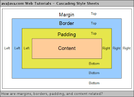

#Feuille de style `CSS`
##Introduction
Nous avons appris les principales balises du HTML, ce qui nous permet de créer une page web "brute" avec des liens mais dépouillée, sans aucune décoration.v La mise en forme du texte se fait à l'aide des "feuilles de style" et du langage `css`. (Cascade Style Sheets).  
Il y a deux façons de procéder :

- écrire les instructions de style dans la page html, avec la balise `<style>`
- ou traiter les styles dans un fichier séparé, ce qui est de loin préférable, car avec un seul fichier on peut modifier la présentation de centaines de pages `html`!

Voici un exemple de base: base1_style.html L'ouvrir dans un éditeur de texte, et le tester dans un navigateur. C'est écrit en noir sur fond blanc, à par les liens qui sont en bleu et soulignés. 
```html
<body>
	<h1>LE LANGAGE CSS</h1>
	<h2>Gérer les couleurs et les fonds</h2>
	<p>Le langage css permet de mettre en forme les textes html<br/>
	On peut agir sur les couleurs et la disposition des textes.</p>
	 <p>On peut faire ressortir une belle équation: 2x + 5 = 9</p> 
	 <p>Voici une liste de langages:
	<ul>
		<li>Python</li>
		<li>PHP</li>
		<li>Javascript</li>
		<li>XHTML</li>
		<li>C++</li>
	<ul>
	</p>
	<h2>Une liste de liens</h2> 
	<p> 
	<ol> 
		<li><a href="base1_style.html">Cliquer ici</a></li><br/> 
		<li><a href="base1_style.html">Cliquez ici</a></li><br/> 
		<li><a href="base1_style.html">Cliquez ici</a></li><br/> 
		<li><a href="base1_style.html">Cliquez ici</a></li><br/> </ol> 
	</p>
</body>
</html> 

```

##Couleurs et fonds
On commence d'abord par ajouter le lien vers la feuille de style entre les balises `<head>` et `</head>`.  
```html
<link rel="stylesheet" href="monstyle.css" />
```
On crée un nouveau fichier dans l'éditeur: **"monstyle.css"**.(Choisissez Cascade Style Sheets File) et sauvegarder dans le même dossier que la page html.  
On commence par changer la couleur du fond   
```css
body { 
	background-color: yellow;
	}
```
Le style appliqué à la balise <body> est écrit entre accolades, avec un point-virgule à la fin de chaque instruction. Il est plus lisible de pratiquer une indentation, et de passer à la ligne après chaque instruction.
Enregistrer votre fichier, et actualisez la page dans le navigateur! Ainsi vous voyez rapidement l'effet de votre commande.  
Il existe des couleurs prédéfinies (red, black, …) et on peut aussi utiliser le [code rgb](https://htmlcolorcodes.com/fr/).  

```CSS
background-color: rgb(250,250,0);
```
On peut aussi utiliser une image de fond (en général de taille petite, qui se répète …..)  
```CSS
background-image: url("fond.jpg"); 
background-repeat : repeat ;
```
L'image doit être dans le même dossier que le fichier css, ou dans un sous dossier auquel cas il faut indiquer le chemin (exemple : "images/fond.jpg") .  

La couleur des textes est donnée par la propriété `color `.  
```CSS
h1 {
   color:blue;
} 
```
Tous les titres h1 seront en bleu.  
On peut aussi agir sur la couleur d'arrière plan :
```CSS
h1 {
   color:blue; 
   background-color:white ;
} 
```

##Mise en forme des textes  
`font-family` permet d'indiquer, par ordre de préférence, la police désirée.
Puisque tous les utilisateurs n'ont pas forcément les mêmes polices que nous, il faut toujours que la liste contienne des polices classiques, et même une police "générique" (serit ou sans-serif). Exemple de code css :
```CSS
h1 {
       font-family:arial, verdana, sans-serif ;
}
``` 
Tous les titres `h1` seront écrits en arial, sinon en verdana, ….
`font-style` possède 2 options : `normal` et `italic`
`font-weight` possède 2 options : `normal` et `bold` (écriture en gras)
`font-size` permet de préciser la taille de la police. Cette taille peut être exprimée de plusieurs façons : en px, pt, % et em. px et pt sont des mesures absolues, il vaut mieux choisir % ou em qui indiquent une taille relative à la taille normale choisie par l'utilisateur.

!!! example "Exemple de code `css` : ""
		```CSS
		p {
		       font-size:120%;
		}
		a {
		       font-size : 2em;
		}
		```
Les caractères des paragraphes ont une taille égale à 120% de la taille normale, les caractères des liens sont doublés.  
On peut regrouper plusieurs propriétés dans la commande unique `font`.  
```CSS
h1 {
        font : bold 30px verdana,sans-serif;
}
```
`text-align` permet de préciser la position du texte, les valeurs étant left, right, center, justify.
`text-decoration` a 3 options : underline, overline et line-through
!!! example "exemple :"
		```CSS
		h2 {
        text-align:center ; text-decoration:underline;
		}		
		```
Les titres h2 seront centrés et soulignés. 

##Les liens
On peut modifier l'aspect des liens selon leurs états : inactifs, survolés par la souris ou visités. Voici un code css qui écrit les liens en rouge, en bleu sur fond blanc lorsque la souris passe dessus, en noir lorsqu'ils ont été visités. 
```CSS
a : {color:red;} 
a : hover {color:blue;background-color:white;}
a : visited {color:black;}
```

##les identifiants
Il existe 2 types d'identifiants pour appliquer un style à une partie précise d'un document : l'identifiant id, qui ne concerne qu'un élément unique, l'identifiant class, qui peut s'appliquer à plusieurs éléments.  

Exemple : on veut écrire en gras, plus gros et en bleu le paragraphe : 
```html
<p>On peut faire ressortir une belle équation: 2x + 5 = 9</p>
```
 Dans le code html, dans la balise ouvrante de paragraphe on ajoute `id="equation"`,
 ```html
 <p id="equation">On peut faire ressortir une belle équation: 2x + 5 = 9</p>
 ```
 Dans le fichier `css `on ajoute
 ```CSS
 #equation{color:blue; font-weight:bold;} 
 ```

!!! note "remarque"
		dans le fichier `css`, devant le nom de l'`id` on ajoute un dièse devant le nom de la `class` on ajoute un point.

Voici un code qui va mettre une partie des liens en vert sur fond blanc lorsqu'ils sont inactifs, en blanc sur fond vert lorsqu'ils sont survolés par la souris, en noir sur fond blanc lorsqu'ils ont été visités.

!!! cite "Codes"
		=== "Html"
		```html
		<a class="beau_lien" href="base1_style.html">Cliquer ici</a>
		```

		=== "css"
		```css
		.beau_lien{color:green;background-color:white;} 
		.beau_lien : hover {color:white;background-color:green;} 
		.beau_lien : visited {color:black;background-color:white;}  
		```

#Partie 2 : construction d'un projet
##Document de travail
Voici le document html de base pour ce chapitre (base2_style.html). Copiez le dans un éditeur de texte, et ouvrez le dans un navigateur.

```html
<!DOCTYPE html >
<head> 
<title> Travail sur les feuilles de style </title> 
<meta charset = "utf-8"/> 
<link rel="stylesheet" href="monstyle2.css" />
</head> 
<body> 
	<div id="haut_de_page">PRESENTATION DES BLOCS EN CSS</div> <div id="menu"> 
		<p>MENU<br/> 
		<ul> 
			<li>Entrée</li> 
			<li>Plat</li> 
			<li>Dessert</li> 
		</ul> 
		</p> 
	</div> 
	<div id="contenu"> 
		<h2>Un exemple de mise en page</h2> 
		<p>Grâce aux instructions de positionnement absolu et relatif,
		        on peut placer les blocs DIV où l'on veut!<br/> 
		On peut appliquer des bordures, des fonds, des couleurs,...à chaque DIV. 
		</p>
		<p>Si des informations sont plus importantes, on peut les faire ressortir.<br/>
		Pour faire de belles pages web, <span class="special">il faut absolument utiliser       
		les 2 languages HTML et CSS.</span>
		</p>
	</div>
	<div id="bas_de_page">
	<p>En bas de la page on peut mettre des informations diverses.<br/> 
	<span class="special">Téléphone: 3,14 et des poussières</span> </p>
	</div>
 
</body> 
</html>  

```

Il comporte 4 blocs `DIV `et 2 blocs `SPAN`.
On va peu à peu effectuer la mise en page en CSS et donc créer le fichier monstyle2.css, qui est déclaré entre les balises `<head>`. 

##Les blocs
Pour la mise en page, on dispose de deux balises html qui délimitent des blocs qui peuvent être gérés par la feuille de style : span et div.

###La balise span

<span> une balise de bloc en ligne, qui est surtout utilisée pour modifier une partie d'un texte : couleur, police, fond, ….. Exemple : on veut que des parties de texte ressortent (balises <span>). Dans le fichier base2_style.html il y en a 2 avec l'identifiant de "class" "special". On veut que le texte soit en rouge et en gras. On ajoute dans le fichier css: 
```CSS
.special {
               color : red;font-weight:bold;
}	
```
Sauvegardez et actualisez la page dans le navigateur.
###La balise div
`<div>` et `</div>` permettent de délimiter des blocs contenant du texte, des images,...  
Ces blocs peuvent ensuite être disposés comme on le désire dans la page. Bien sûr, pour ce faire, ils doivent disposer de l'un des 2 identifiants `id` ou `class`.  
Dans l'exemple il y en a 4. Commençons par mettre une bordure autour de chaque DIV, pour bien contrôler par la suite les instructions de positionnement.

```CSS
#haut_de_page{border: 4px solid black;}
#menu{border: 4px solid black;}
#contenu{border: 4px solid black;} #bas_de_page{border: 4px solid black;}
```

##Les dimensions
On peut définir les dimensions des DIV ( valable aussi pour p, h1, h2, …) avec width et height, qui peuvent être définis en pixels ou en pourcentage (du conteneur parent). On va rétrécir le DIV "menu":  
```CSS
#menu{border: 4px solid black; width:150px;}  
```

##les marges
Il y a 2 types de marges, les marges externes (margin) et les marges internes (padding).
Code css: On peut choisir les 4 côtés par margin-left, top, bottom ou right. Ajoutons une marge interne de 10px aux DIV "contenu" et "menu": 
<div id="center">
	
</div>

```CSS
#menu{border: 4px solid black;width:150px;padding:10px;}    
```

Et une marge externe supérieure de 20px au DIV "bas_de_page":  
```CSS
#bas_de_page{border: 4px solid black;margin-top:20px;}    
```

##Le positionnement absolu
Agrandissons un peu le titre (hauteur du DIV 70px), augmentons la taille des caractères: 50px, centrons le titre et ajoutons une marge interne de 10px.  
```CSS
#haut_de_page{border: 4px solid black;text-align:center; font-size:50px;height:70px;padding:10px;}
```
Positionnons: le haut de page à (10px,10px) par rapport au coin supérieur gauche de la page, le menu à (10px,120px) du haut (on tient compte de la hauteur du titre).  
On ajoute dans `#haut_de_page`  
```css
position:absolute;top:10px;left:10px; 
```
Et dans `#menu`  
```CSS
position:absolute;top:120px;left:10px;  
```
Actualisez, et constater que le DIV contenu est superposé aux 2 précédents!  !
Il faut lui aussi le positionner, en tenant compte de la largeur du menu:  
```CSS
position:absolute;top:120px;left:170px;
```
Et maintenant c'est le bas de page qui se mélange!  
On ajoute par exemple, dans `#bas_de_page`:  

Ce mode de disposition est assez "rigide" et s'applique mal aux diverses résolutions d'écran.  

##Le positionnement flottant

C'est un mode de positionnement assez pratique, qui s'adapte bien à toutes les tailles d'écran, mais il est parfois délicat à maîtriser. voir [tutoriels sur le Net.](https://openweb.eu.org/articles/initiation_float)

##Le positionnement` inline-block`.
Il existe deux types de balises, `inline` et `block`. Les balises inline, se placent les unes à côté des autres (en ligne) et les balises de type block se placent les unes en dessous des autres.
Balises inline: `a, strong, em, img,span`...
Balises block: `h1, p,div`,...
On dispose d'une instruction de conversion: display qui peut prendre 4 valeurs: inline, block, inline-block et none.
`inline`: éléments d'une même ligne qui se placent les uns à côté des autres.
`block`: se placent les uns en dessous des autres, dimensionnables.
`inline-block`: blocs placés les uns à côté des autres et dimensionnables. none: pas d'affichage.
Reprenez votre fichier **monstyle2.css** et effacez tous les positionnements absolus, il reste:  
```CSS
.special{color:red;font-weight:bold;}
#haut_de_page{border: 4px solid black;text-align:center;fontsize:50px;height:70px;padding:10px;}
#menu{border: 4px solid black;width:150px;padding:10px;}	
#contenu{border: 4px solid black;padding:10px;}
#bas_de_page{border: 4px solid black;margin-top:20px;} 
```
On transforme les DIV "menu" et "contenu" en inline-block en ajoutant : 
```CSS
display:inline-block; 
```
Observez le résultat. L'alignement se fait sur le bas des DIV. On peut le modifier avec :  
```CSS
vertical-align:top;  
```
Vous pouvez ensuite ajouter des marges pour que les DIV soient plus espacés, ajouter des couleurs de fond, et au final faire quelque chose de beau!

##Les images
On rencontre 3 types de fichiers images dans les pages web: jpeg, gif et png.
Le jpeg est bien adapté aux photos (bonne qualité, faible poids). Le gif est réservé aux icones (256 couleurs) et surtout aux gif animés. Il gère la transparence Le png est donc destiné aux autres images et gère la transparence.
La taille des images doit être adaptée à ce que l'on désire et réduite au maximum pour réduire les temps de chargement. Evitez de mettre une image 4000*3000!!!
Si vous voulez afficher une grande photo, créez une vignette (200*150 par exemple) qui servira de lien vers la grande photo. (Fréquent sur le Net avec les plans des pistes des stations par exemple) Il faut donc souvent travailler les photos avec un logiciel d'image.
Sous Windows on peut utiliser « photofiltre » ou "the gimp" qui sont libres et gratuits.
Au niveau html, la balise auto-fermante  doit être située dans un paragraphe <p>
Ne pas oublier l'attribut "alt" qui affiche un texte alternatif, pour les non voyants, ou s'il y a un problème d'affichage. Voici un code correct`.

```html
<p>Voici une belle photo de jambon de Bayonne:<br/>
</p>
```
On peut faire "flotter" une image dans un paragraphe. Le texte va alors "entourer" l'image qui peut être placée en haut à gauche ou à droite. Le code CSS est alors `img {float:left;}`.  
(Ce code va alors s'appliquer à toutes les images. Si on veut sélectionner il faut ajouter un identifiant id ou class).   


##Remarques
Dans le fichier CSS on peut associer les identifiants. 
```CSS
#menu a {color:green;} 
```
Cette coloration ne va affecter que les liens situés dans le DIV "menu".  
On peut aussi affecter une propriété à plusieurs identifiants :   
```CSS
#menu, #autrediv {color : red ;}
```
Ici, les identifiants menu et autrediv seront colorés en rouge.
Ces deux chapitres d'introduction au CSS omettent bien des notions! N’y figurent pas la gestion des tableaux, des différentes bordures, la vidéo, ….
Pour approfondir il vous faudra acheter un livre récent (tout bouge très vite!) sur la création WEB avec HTML5 et CSS3, ou de consulter les très nombreux tutoriels dont le célèbre "SITE DU ZERO".  
N’oubliez pas de vérifier votre code avant la mise en ligne. Ce n’est pas obligatoire mais forteent conseillé.  
[validation W3C](https://jigsaw.w3.org/css-validator/)