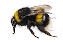
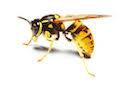
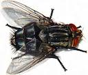
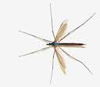
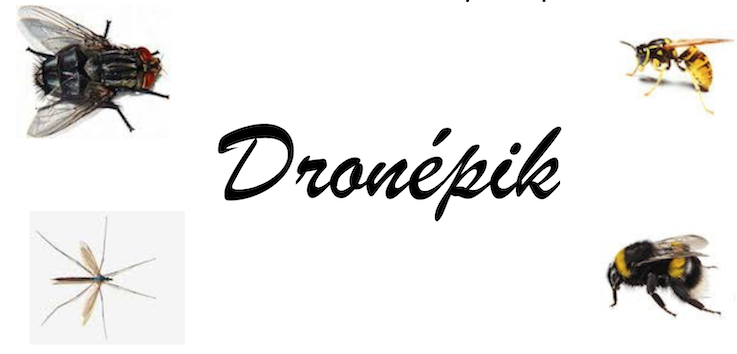

# Les Formulaires
## Quelques éléments de formulaires
### Le bouton


!!! example "Exemple"

	<form>
	 <input type="button" style="margin:5px; padding:5px;  background-color : lightblue; border : solid 2px blue; border-radius : 5px;"  value="tester" onclick="testBidon()">
	</form>
	<div id="casecouleur"> Un élément de formulaire fondamental : le bouton</div>

!!! caution "Code"

	=== "html"

		```html
		<input type="button" value="tester"  onclick="testBidon()"> 
		```

	=== "javascript"

		```JS
		function testBidon(){
    				document.getElementById("casecouleur").style.backgroundColor='aqua';
    		}
		```

### Boutons radio
Il faut donner le même nom aux boutons radios mais des `id` différents
!!! example "Exemple"

	<form>
	1<input type="radio" name="testRad" value="1" id="radio1">
	2<input type="radio" name="testRad" value="2" id="radio2">
	3<input type="radio" name="testRad" value="3" id="radio3">
	4<input type="radio" name="testRad" value="4" id="radio4">
	<input type="button" style="margin:5px; padding:5px;  background-color : lightblue; border : solid 2px blue; border-radius : 5px;" value="tester" onclick="testRadio()">
	</form>
	<div id="texteRadio" class="rajout"></div>

!!! caution "Code"

	=== "html"
		```html
			  1 <input type="radio" name="testRad" value="1" id="radio1">
			  2 <input type="radio" name="testRad" value="2" id="radio2">
			  ...
			  <div id="texteRadio"></div>
			<input type="button" value="tester" onclick="tesRadio()"> 
		```

	=== "javascript"
		```js
		function testRadio(){
			var aecrire="Le bouton radio sélectionné est le "; 
			if (document.getElementById('radio1').checked) aecrire+=1;
			if (document.getElementById('radio2').checked) aecrire+=2;
			if (document.getElementById('radio3').checked) aecrire+=3;
			if (document.getElementById('radio4').checked) aecrire+=4;
			document.getElementById('texteRadio').innerHTML=aecrire;
			}
		```

Le contenu de la variable `contenu` est écrit dans une balise dont l'`id` est `texteRadio` initialement vide.

!!! faq  "A faire"
	Compléter et tester le code pour ajouter les deux boutons radio manquant.

### Cases à cocher

!!! example "Exemple"

	<form>
	<div id="casesACocher">
		<input type="checkbox" name="testCase" value="Case 1" id="case1">Case 1   <br>  
		<input type="checkbox" name="testCase" value="Case 2" id="case2"> Case 2  <br>  
		<input type="checkbox" name="testCase" value="Case 3" id="case3">Case 3<br>
		<input type="button" style="margin:5px; padding:5px;  background-color : lightblue; border : solid 2px blue; border-radius : 5px;" value="tester" onclick="testCases()">
	<div id="texteCases" class="rajout"></div>
	</div>
	</form>


!!! caution "Code"

	=== "html"
		```html
			<form>
				<div id="casesACocher">
					<input type="checkbox" name="testCase" value="Case 1" id="case1">Case 1   <br>  
					...
					<input type="button" value="tester" onclick="...">
					<div></div>
				</div>
			</form>
		```

	=== "javascript"
		```js
		function testCases(){
			var aecrire="vous avez coché ";
			if (document.getElementById('case1').checked) aecrire+=" la case 1, ";
			if (document.getElementById('case2').checked) aecrire+=" la case 2, ";
			if (document.getElementById('case3').checked) aecrire+=" la case 3, ";
			document.getElementById('texteCases').innerHTML=aecrire;
			}
		```

!!!  faq "A faire"
	Compléter le code HTML pour ajouter les deux cases manquantes, le bouton de validation et le bloc pour récupérer le résultat.
 Remarque 1 : ici le choix a été de faire apparaître la légende (Case 1) après le bouton donc après la balise.  
 Remarque 2 : il faut donner le même nom aux cases à cocher mais des id différents.
	
### Sélection


!!! example "Exemple"

	<form>
	<div id="MenuDeroulant">
	<select>
		<option name="selection" value="..." id="rien">....</option>
		<option name="selection" value="mot 1" id="mot1">mot 1</option>
		<option name="selection" value="mot 2" id="mot2">mot 2</option>
	</select>
	<input type="button" style="margin:5px; padding:5px;  background-color : lightblue; border : solid 2px blue; border-radius : 5px;" value="tester" onclick="testMenu()">
	</div>
	</form>
	<div id="texteMenu" class="rajout"></div>

!!! caution "Code"

	=== "html"
		```html
		<select >
			<option name="selection" value="..." id="rien" >....</option >
			<option name="selection" value="mot 1" id="mot1" > mot 1 </option > 
			<option name="selection" value="mot 2" id="mot2"> mot 2 </option >
		</select >
		```

	=== "javascript"
		```js
		function testMenu(){
		var aecrire="vous avez sélectionné ";
		if (document.getElementById('mot1').selected) aecrire+="le mot 1";
		if (document.getElementById('mot2').selected) aecrire+="le mot 2";
		document.getElementById('texteMenu').innerHTML=aecrire;
		}
		```
		
!!! faq "A faire"
	Récupérer et modifier le code pour créer votre propre liste déroulante et récupérer le résultat.

	
Remarque 1 : ici le choix a été de faire apparaître une première légende vide (…) pour l'affichage par défaut (qui est la première balise `option`).  
Remarque 2 : il faut donner le même nom aux balises `option` mais des id différents.	
exemple :  on teste quel mot a été sélectionné `selected` ; on rajoute alors ce mot dans le texte (aecrire) à afficher dans le bloc d'identifiant "texteMenu".
	
### Récupération de texte 
!!! example "Exemple"

	<form>
	<div id="zoneTexte">
	Entrez votre texte : <input type="text" value="" id="saisie">
	<input type="button" style="margin:5px; padding:5px;  background-color : lightblue; border : solid 2px blue; border-radius : 5px;" value="tester" onclick="testSaisie()">
    </div>
	</form>
	<div id="texteSaisie" class="rajout"></div>

!!! caution "Code"

	=== "html"
		```html
			Entrez votre texte : <input type="text" value="" id="saisie" >
		```

	=== "javascript"
		```js
		function testSaisie(){
		var aecrire="vous avez écrit ";
		aecrire+=document.getElementById('saisie').value;
		document.getElementById('texteSaisie').innerHTML=aecrire;
		}
		```
		

Remarque : il existe d'autres balises permettant de récupérer un texte plus long.
exemple : on récupère le texte entré `value` ; on rajoute alors ce texte dans le texte (aecrire) à afficher dans le bloc d'identifiant "texteSaisie".

---
### Remarques
Le choix a été fait ici de focaliser sur la construction du formulaire pour récupérer des données et non pas sur la transmission de ces données. La transmission des données fera l'objet d'un cours ultérieur.  

Seuls quelques éléments de formulaires et leur utilisation basique ont été présentés dans ce cours. Pour approfondir, il existe de nombreuses ressources en ligne. 

!!! note "En voici quelques unes "

	- les éléments de base pour bien concevoir son formulaire sur <a href="https://developer.mozilla.org/fr/docs/Web/Guide/HTML/Formulaires/Mon_premier_formulaire_HTML">developer.mozilla.org</a> (ne pas tenir compte de l'attribut <span class="methode">method</span> de la balise <span class="methode"> &lt; form &gt;</span> : cet attribut sera vu ultérieurement avec la notion de client-serveur)
    - un memento des éléments de formulaire et de leurs attributs sur <a href="https://www.toutjavascript.com/savoir/savoir06_1.php3">toutjavascript.com</a>
    - fonctionnalités avancées sur <a href="https://openclassrooms.com/fr/courses/1916641-dynamisez-vos-sites-web-avec-javascript/1919022-les-formulaires">Openclassroom</a>

## Application

Vous êtes en charge du site de commande pour la commercialisation d'un mini-drone.
A vous de construire le formulaire sur la page de commande et de compléter la page d'accusé de réception accessible après validation du formulaire. Les données entrées dans le formulaire devront être récapituler en dessous lors de la validation de celui-ci.
Pour plus de clareté vous essayerez de faire "disparaitre" le formulaire grâce à la propritété css "hidden".
Vous créerez un formulaire de commande et en cliquant sur un bouton VALIDER, le script doit récuprer les données
entrées par l'utilisateur puis écrire un paragraphe récapitulif en dessous du formulaire. Faites preuve de créativité.

[commande.html](../src/commande.html)  
[feuille de style](../src/style_achat.css)  
  
  
  
  
  


!!! hint "navigation"

    - <a href="https://openclassrooms.com/fr/courses/1916641-dynamisez-vos-sites-web-avec-javascript/1918968-les-evenements">openclassrooms.com</a>
    - <a href="https://developer.mozilla.org/fr/docs/Apprendre/JavaScript/Building_blocks/Evènements">developer.mozilla.org</a>
    - <a href="https://www.pierre-giraud.com/javascript-apprendre-coder-cours/addeventlistener-gestion-evenement/">Pierre Giraud</a>
	- <a href="https://www.alsacreations.com/article/lire/578-La-gestion-des-evenements-en-JavaScript.html">alsacreations.com</a>

<script>

// pour enregistrer en local
     
var contenu="";
    function enregistrer()
{
    localStorage.setItem('monTexte', JSON.stringify(contenu));	
}
    
// la fonction du bouton de la première ligne du tableau
    function testBidon()
    {
        document.getElementById("casecouleur").style.backgroundColor='aqua';
    }


// la fonction qui écrit quel bouton radio a été sélectionné
		function testRadio()
		{
			var aecrire="Le bouton radio sélectionné est le ";
			if (document.getElementById('radio1').checked) aecrire+=1;
			if (document.getElementById('radio2').checked) aecrire+=2;
			if (document.getElementById('radio3').checked) aecrire+=3;
			if (document.getElementById('radio4').checked) aecrire+=4;
			document.getElementById('texteRadio').innerHTML=aecrire;
		}
		
		// la fonction qui écrit quelle(s) case(s) a (ont) été sélectionnée(s)
		function testCases()
		{
			var aecrire="vous avez coché ";
			if (document.getElementById('case1').checked) aecrire+=" la case 1, ";
			if (document.getElementById('case2').checked) aecrire+=" la case 2, ";
			if (document.getElementById('case3').checked) aecrire+=" la case 3, ";
			document.getElementById('texteCases').innerHTML=aecrire;
		}
		
		// la fonction qui écrit quel mot a été sélectionné
		function testMenu()
		{
			var aecrire="vous avez sélectionné ";
			if (document.getElementById('mot1').selected) aecrire+="le mot 1";
			if (document.getElementById('mot2').selected) aecrire+="le mot 2";
			document.getElementById('texteMenu').innerHTML=aecrire;
		}
		
		// la fonction qui réécrit le texte saisi
		function testSaisie()
		{
			var aecrire="vous avez écrit ";
			aecrire+=document.getElementById('saisie').value;
			document.getElementById('texteSaisie').innerHTML=aecrire;
		}

</script>
		