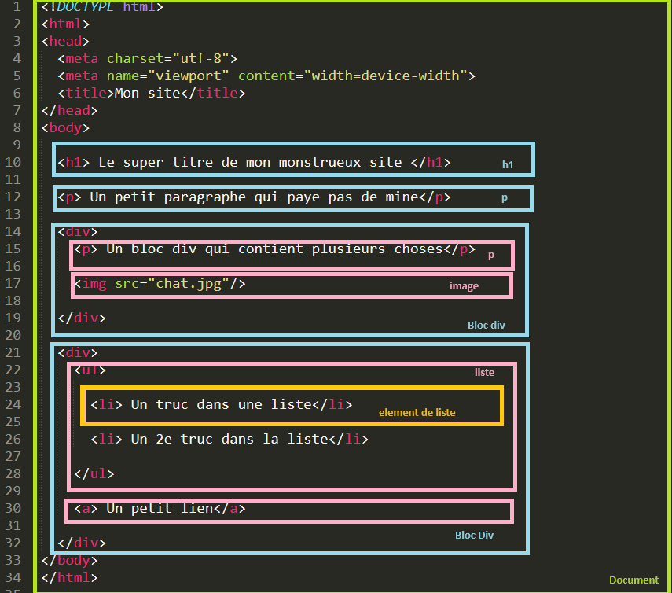
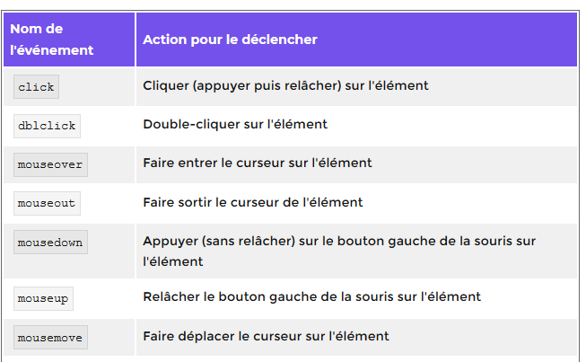

# Rendre le site dynamique avec JavaScript
## Première approche
!!! info "Javascript ?"  
	Javascript, souvent raccourci en JS, est un langage de programmation interprété, tout comme Python. Il est une des briques angulaire de HTML 5, avec HTML et CSS.
	A chaque fois qu'une page fait plus que simplement afficher du texte et des images - un contenu statique, copmme par exemple afficher des animations, des cartes interactives, des menus déroulants, etc, il y a de bonnes chances pour que ce soit un script JavaScript qui en soit la raison.
	Un tutoriel complet sur Javascript est disponible sur [MDN Web Docs](https://developer.mozilla.org/fr/docs/Learn/JavaScript/First_steps/What_is_JavaScript). Vous y trouverez de nombreuses explications absentes de ce cours.


En exemple pour l'utilisation de Javascript, nous allons voir comment modifier le texte d'un pargraphe en un clic.

!!! warning "Une petite erreur dans la vidéo"
	Dans cette vidéo, le code JS enfermé dans les balises `<script>` et `</script>` sont à placer **AVANT** la balise `</body>` et non après.
 

<iframe src="//video.toutatice.fr/video_priv/12970/fd9462474a58b36c03c0d879b49335902aa126082f0b910f8d9b8221a0c22d06/?is_iframe=true&size=240" width="640" height="360" style="padding: 0; margin: 0; border:0" allowfullscreen ></iframe>

## Avant d'aller plus loin... Parlons du DOM.
Arrétons nous sur le DOM qui est le modèle de document d'un fichier HTML. Il faut voir les bloc HTML comme des boites imbriquées les unes dans les autres.
Voici un code HTML :
```HTML
<!DOCTYPE html>
<html>
<head>
  <meta charset="utf-8">
  <meta name="viewport" content="width=device-width">
  <title>Mon site</title>
</head>
<body>	

  <h1> Le super titre de mon monstrueux site </h1>

  <p> Un petit paragraphe qui paye pas de mine</p>
  
  <div>
    <p> Un bloc div qui contient plusieurs choses</p>

    

  </div>
  
  <div>
    <ul> 

      <li> Un truc dans une liste</li>

      <li> Un 2e truc dans la liste</li>

    </ul>

    <a> Un petit lien</a>

  </div>
</body>
</html>
```

On pourrait le représenter par ces blocs : *Cliquer sur les blocs pour voir ce qu'ils contiennent*

<div id="animDOM">
<div id="document"  style="display:block;"> <p>DOCUMENT</p>
	<div id="titre"  style="display:block;"> TITRE H1
		<div id="titreChild" style="display:none;"> "Le super titre de mon monstrueux site"</div>
	</div>
	<div id="para" style="display:block;">Paragraphe p 
		<div id="paraChild" style="display:none;"> "Un petit paragraphe qui paye pas de mine"</div>
	</div>


<div id="div1" style="display:block;"><p> Un bloc DIV</p>

	
		<div id="para2" style="display:none;">Paragraphe p 
		<div id="para2Child" style="display:none;"> " Un bloc div qui contient plusieurs choses"</div>
	</div>
		

		<div id="image" style="display:none;"> Image
		</div>

</div>
<div id="div2" style="display:block;"><p>Un autre bloc DIV</p>
	<div id="liste" style="display:none;"><p>Une liste</p>
		<div id="eltlist1" style="display:none;"> Element de liste
			<div id="Contenteltlist1" style="display:none;"> "Un truc dans une liste"</div>
		</div>
		<div id="eltlist2" style="display:none;"> Element de liste
			<div id="Contenteltlist2" style="display:none;"> "Un truc dans une liste"</div>
		</div>
	</div>
	<div id='lien' style="display:none;"> Un lien
		<div id="lienContent" style="display:none;"> " Un petit lien"</div>
</div>
</div>
</div></div>


Voici les blocs dans le code HTML : 


On voit que le `body` contient 4 blocs, un titre `h1` un pararagraphe, deux blocs `div`. Le premier boc `div` contient un paragraphe et une image et le second une liste et un lien. Chaque paragrahe, lien ou élément de liste contient un contenu sous forme de texte.  
Si on veut modifier un élément (son contenu ou son style) ou le supprimer il faut accéder à l'élément et en modifier les propriétés. Si on veut ajouter un élément, il faut entrer dans le bloc parent et ajouter un bloc (par exemple si on veut accéder un 3eme élément dans la liste il faut accéder à la liste et insérer un élément). 

!!! note "Accéder à un élément (un bloc)"
	On accède à un élément du DOM en utlisant la requete suivante : `document.querySelector(selecteur)` ou le selecteur peut-etre un type d'élément, un `id` ou une `class`.  
	- `document.querySelector("a")` : accèdera au premier lien rencontré dans le Document (balise `a`)  
	- `document.querySelector(".maClasse")` : accèdera au premier élément de `class="maClasse"`  
	- `document.querySelector("#monID")`: accèdera à l'élémént de `id="monID"`  


!!! info "Plusieurs éléments"
	S'il y a plusieurs liens dans la page et que l'on veut les atteindre tous, on utilisera `mesLiens=document.querySelectorAll("a")` qui renvoie une liste. `mesLiens`est une liste contenant les infos de chaque lien.   
	Comme en python `mesLiens[2]` est le 3e lien de la page.


!!! tip "En plus...""
	Il y a d'autres méthodes que `querySelector` pour sélectionner un élément que vous pouvez trouver [ici](https://developer.mozilla.org/fr/docs/Web/API/Document/getElementById). On choisira d'atteindre les éléments par l'Id, la classe, le nom, ...


!!! question "Dessiner un DOM"
	**1** Utiliser le fichier créé grâce à la vidéo et dessiner le DOM correspondant. Ajouter une liste et un bloc DIV comme enfant de BODY. Le bloc DIV sera parent de deux nouveaux paragraphes.  
	**2** Modifier le graphes et écrire la structure HTML **à la main** sur une feuille.


##  Modifier un élément du DOM
Pour modifier un élément du DOM, on va le stocker dans une variable (attention à bien en choisir le nom) puis on utilisera `textContent` pour modifier le contenu et `style` pour modifier une propriété CSS.

### Modifier le texte
```javascript
let paragrahe=document.querySelector("p"); //element est donc une variable contenant le premier paragraphe et les balises correspondant
paragraphe.textContent="Bonjour tout le monde";// On remplace le conetnu du texte par celui-ci
paragraphe.textContent+="Bonjour tout le monde";//on ajoute le texte à celui existant
```

### Modifier les propriétés CSS
On utlisera la commande `style` suivi de la propriété CSS que l'on souhaite modifier puis on modifie la valeur.
```javascript
paragraphe.style.color="red"; // on change la couleur en rouge
```
!!! warning "Camelcase"
	Attention, le JS ne supporte pas les `-` on utilisera le CamelCase pour les propriétés dont le nom en comporte un :
	```javascript
	paragraphe.style.backgroundColor="grey";// pour modifier la propriété CSS background-color
	```

## Les évènements
### Evènements liés à la souris
Dans l'exemple précédent l'évènement est déclenché par le  clic de la souris sur l'élément. Mais il y a plein d'actions possibles.

!!! question "Tester ceci" 
	**3** Tester ce code et chercher les éléments qui déclenchent le changement.
	<p class="codepen" data-height="350" data-theme-id="dark" data-default-tab="html,result" data-user="muriel722" data-slug-hash="xxZPJyx" style="height: 350px; box-sizing: border-box; display: flex; align-items: center; justify-content: center; border: 2px solid; margin: 1em 0; padding: 1em;" data-pen-title="flash">
	  <span>See the Pen <a href="https://codepen.io/muriel722/pen/xxZPJyx">
	  flash</a> by muriel722 (<a href="https://codepen.io/muriel722">@muriel722</a>)
	  on <a href="https://codepen.io">CodePen</a>.</span>
	</p>
	<script async src="https://static.codepen.io/assets/embed/ei.js"></script>


!!! question "Questions"
    **4** L'évènement `mouseout` détecte le fait que la souris quitte la zone. Modifier le code pour que le paragraphe reprenne sa forme originale lorsque la souris quitte la zone.  

Voici ce que l'on peut faire d'autre :

</p>

### Evènements liés au clavier
Tester ceci :

!!! success "Code"  

    === "html"
		```html
		<!DOCTYPE html>
		<body>
		  <p>Taper sur une touche</p>
		  <p id="aremplir3"></p>
		  <script src="index.js"></script>
		</body>
		```

    === "javascript"
     	```js
		var texte0 = " ; elle correspond au caractère ";
		var zone3 = document.querySelector("#aremplir3");
		var texte3 = "vous avez frappé la touche de code ";
		document.addEventListener("keypress", function(e) {
		zone3.textContent =
		  texte3 + e.keyCode + texte0 + String.fromCharCode(e.keyCode);
		});
		```


!!! question "Questions"
    **5** Que font les fonctions `keyCode` et `String.fromCharCode(e.keyCode)`?  
    **6** Remplacer `keypress` par `keydown` puis `keyup`. Quelles sont les différences (notamment en terme d'affichage)?  

## Ajouter un élément
### Création de l'élément
On va crée un nouveau lien, d'id `monLien` dont le texte est 'Mon super site' et l'url "https://mbachelier1.github.io/site_1NSI/index.html".
```javascript
let nvLien = document.createElement('a');
nvLien.title='Mon super site';
nvLien.href="https://mbachelier1.github.io/site_1NSI/index.html";
nvLien.id="monLien";
```
Puis on le place dans le bloc parent (ici le premier paragraphe) :
```JS
document.querySelector('p').appendChild(nvLien);
```


## Travailler proprement
### Séparer les fichiers.
Nous avons vu que l'on pouvait mettre le javascript entre les balises `script` dans le code HTML. De la même façon que le CSS, ce n'est, de manière générale pas conseillé. A partie de maintenant vous ouvrirez 3 fichiers séparés dans le même dossier et on ajoutera la ligne sivante dans l'en-tête du fichier `HTML` :
```HTML
<script src="mon_fichier.js"> </script>
```

### L'inspecteur d'objet
L'inspecteur d'objet permet d'avoir accès à une console javascript, fort utile pour aider au déboggage de code.

Celle-ci est disponible une fois l'inspecteur d'objet ouvert :


!!! info "Remarque"
	Vous activerez l'onglet "journaux" pour avoir accès aux messages de la console.


!!! question "Prise en main de la console `js`""
    Ouvrez la console javascript de votre navigateur, sur une page au choix.
    Tapez le code suivant :
	```javascript
	function plop(){
	    console.log("Plop !");
	    }
	```
	Exécutez la fonction plop :
	```javascript
	plop();
	```
	Que se passe-t-il ?

	Tapez maintenant le code suivant :
	```javascript
	let cible = document.querySelector("h1");
	cible.addEventListener('click', plop);          
	```
	Cherchez la première balise `h1` de la page et cliquez sur cet élément. Que se passe-t-il ?
	Tapez le code suivant :
	```javascript
	    cible.addEventListener('mouseover', plop);
	```
    Comment faire pour déclencher l'écriture dans la console à partir de cet événement ?

!!! note "Utilisation de `console.log()`"
	Il est parfois difficile de voir comment s'exécute un code javscript. L'utilisation de `console.log(message);` dans votre code, avec comme message une chaîne de caractère explicative, est parfois un bon moyen de vérifier qu'un bloc de code est exécuté par javascript.


<script>
	//Affichage du bloc Document
	let elt=document.querySelector("#document > p");
	console.log(elt);
	elt.addEventListener("click",function(e)
	{
	if (document.querySelector("#titre").style.display=="block")
		{document.querySelector("#titre").style.display="none";}
	else {document.querySelector("#titre").style.display="block";}
	if (document.querySelector("#para").style.display=="block")
		{document.querySelector("#para").style.display="none";}
	else {document.querySelector("#para").style.display="block";}
		if (document.querySelector("#div1").style.display=="block")
		{document.querySelector("#div1").style.display="none";}
	else {document.querySelector("#div1").style.display="block";}
		if (document.querySelector("#div2").style.display=="block")
		{document.querySelector("#div2").style.display="none";}
	else {document.querySelector("#div2").style.display="block";}
});
	//Affichage du contenu du titre
	let elt2=document.querySelector("#titre");
	console.log(elt2);
	elt2.addEventListener("click",function(e){
	if (document.querySelector("#titreChild").style.display=="block")
		{document.querySelector("#titreChild").style.display="none";}
	else {document.querySelector("#titreChild").style.display="block";}})
	//Affichage du contenu du paragrahe
	let elt3=document.querySelector("#para");
	console.log(elt3);
	elt3.addEventListener("click",function(e){
	if (document.querySelector("#paraChild").style.display=="block")
		{document.querySelector("#paraChild").style.display="none";}
	else {document.querySelector("#paraChild").style.display="block";}})
	//Affichge du contenu de div1
	let elt4=document.querySelector("#div1 > p");
	console.log(elt4);
	elt4.addEventListener("click",function(e){
	if (document.querySelector("#para2").style.display=="block")
		{document.querySelector("#para2").style.display="none";}
	else {document.querySelector("#para2").style.display="block";}
if (document.querySelector("#image").style.display=="block")
		{document.querySelector("#image").style.display="none";}
	else {document.querySelector("#image").style.display="block";}})
	// Affichage du paragraphe de div 1
	let elt5=document.querySelector("#para2");
	console.log(elt5);
	elt5.addEventListener("click",function(e){
	if (document.querySelector("#para2Child").style.display=="block")
		{document.querySelector("#para2Child").style.display="none";}
	else {document.querySelector("#para2Child").style.display="block";}})
	//Affichage de div2
	let elt6=document.querySelector("#div2 > p");
	console.log(elt6);
	elt6.addEventListener("click",function(e){
	if (document.querySelector("#liste").style.display=="block")
		{document.querySelector("#liste").style.display="none";}
	else {document.querySelector("#liste").style.display="block";}
if (document.querySelector("#lien").style.display=="block")
		{document.querySelector("#lien").style.display="none";}
	else {document.querySelector("#lien").style.display="block";}})
	//Affichage du contenu de la liste
	let elt7=document.querySelector("#liste >p");
	console.log(elt7);
	elt7.addEventListener("click",function(e){
	if (document.querySelector("#eltlist1").style.display=="block")
		{document.querySelector("#eltlist1").style.display="none";}
	else {document.querySelector("#eltlist1").style.display="block";}
	if (document.querySelector("#eltlist2").style.display=="block")
		{document.querySelector("#eltlist2").style.display="none";}
	else {document.querySelector("#eltlist2").style.display="block";}})
	let elt8=document.querySelector("#eltlist1");
	console.log(elt8);
	elt8.addEventListener("click",function(e){
	if (document.querySelector("#Contenteltlist1").style.display=="block")
		{document.querySelector("#Contenteltlist1").style.display="none";}
	else {document.querySelector("#Contenteltlist1").style.display="block";}})
	let elt9=document.querySelector("#eltlist2");
	console.log(elt9);
	elt9.addEventListener("click",function(e){
	if (document.querySelector("#Contenteltlist2").style.display=="block")
		{document.querySelector("#Contenteltlist2").style.display="none";}
	else {document.querySelector("#Contenteltlist2").style.display="block";}})
	// Affichage du contenu du lien
	let elt10=document.querySelector("#lien");
	console.log(elt10);
	elt10.addEventListener("click",function(e){
	if (document.querySelector("#lienContent").style.display=="block")
		{document.querySelector("#lienContent").style.display="none";}
	else {document.querySelector("#lienContent").style.display="block";}})
   </script>
   <style>
#animDOM{color: black;
 	font-family: verdana;
 	width : 70%}
 /*style bloc 1er niveau*/
 #document{
 	border : 1px solid black;
 	border-radius: 5px;
 	padding :1%;
 	background-color:  #f2f4f4 ;

 }
 /*Style des blocs de 2e niveau*/
 #titre, #para, #div1, #div2{
 	margin-left: 30px;
 	border : 1px solid blue;
 	border-radius: 5px;
 	padding :1%;
 	margin : 1%;
 	background-color:  #aed6f1 ;}
  /*Style des blocs de 3e niveau*/
#titreChild, #paraChild, #para2, #image, #liste, #lien
{ 	margin-left: 30px;
 	border : 1px solid red;
 	border-radius: 5px;
 	padding :1%;
 	margin : 1%;
 background-color:   #fadbd8 ;}
/* Style des blocs de 4E niveau*/
#lienContent, #para2Child, #eltlist1, #eltlist2
{ 	margin-left: 30px;
 	border : 1px solid green;
 	border-radius: 5px;
 	padding :1%;
 	margin : 1%;
 background-color:   #a3e4d7  ;}
/*style element 5e niveau*/
 #Contenteltlist2, #Contenteltlist1
{ 	margin-left: 30px;
 	border : 1px solid orange;
 	border-radius: 5px;
 	padding :1%;
 	margin : 1%;
 background-color:  #fcf3cf  ;}
 </style>