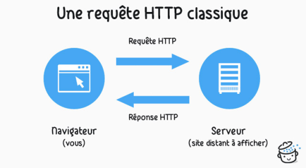
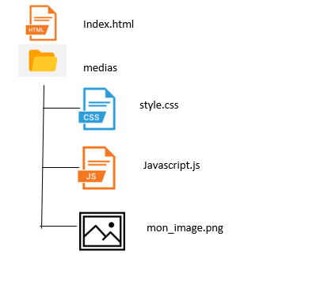
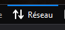
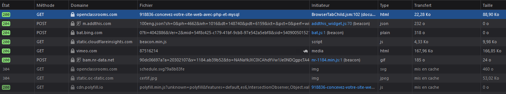
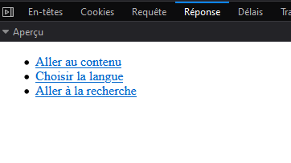
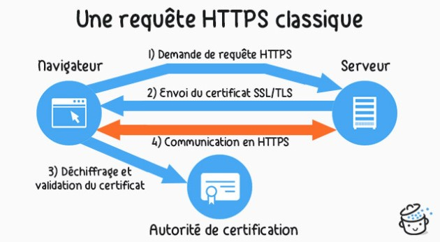

<!doctype html>
<html lang="fr">
<head>
  <meta charset="utf-8">
  <title>PROTOCOLE HTTP</title>
  
  <link rel="stylesheet"  href="src/prism.css" />
	<link rel="stylesheet" href="src/main.css"/>
  
</head>
<body>
	<h1>Communication Client - Serveur</h1>
	
Les réponses aux questions sont à rédiger sur le <a href="doc reponse.docx">document réponse</a>. Ce document fera office de cours attention à bien expliquer les réponses si nécessaire.

	<h2>Protocole HTTP</h2>
	
La navigation sur le web se fait suivant le modèle client-serveur :
		<ul><li>	le client effectue des requêtes.</li>
			<li>	le serveur répond à ces requêtes.</li>
		</ul>

	Lorsque vous naviguez sur internet :

	
<ul>
			<li>	Le client est votre navigateur web (Mozilla Firefox par exemple).</li>
			<li>	Le serveur est un logiciel qui tourne sur un ordinateur en général dédié à cela.</li>
	</ul>

		
<h3>Communication client serveur expliquée simplement</h3>

	
<iframe title="vimeo-player" src="https://player.vimeo.com/video/138623558" width="640" height="360" frameborder="0" allowfullscreen ></iframe>
		

		
<h3>Serveur Web</h3>

	
<iframe title="vimeo-player" src="https://player.vimeo.com/video/138623583" width="640" height="360" frameborder="0" allowfullscreen></iframe>

	<h3>Requêtes HTTP</h3>
	
A chaque fois qu'un navigateur a besoin d'un fichier hébergé sur un serveur web, le navigateur demande (on dit qu'il envoie une requête) le fichier via HTTP. 
	Quand la requête atteint le bon serveur web (matériel), le serveur HTTP (logiciel) renvoie le document demandé, également grâce à HTTP.
	

	
	
Pour publier un site web, on peut utiliser un serveur web statique ou un serveur web dynamique. 
		<ul>
			<li> Un serveur web statique est composé d'un ordinateur (matériel) et d'un serveur HTTP (logiciel). Il est appelé « statique » car le serveur envoie les fichiers hébergés « tels quels » vers le navigateur. C'est ce type de fichiers que l'on a codé précédemment en HTML / CSS et JavaScript.</li>
			<li>	Un serveur web dynamique possède d'autres composants logiciels, certains qu'on retrouve fréquemment, dont un serveur d'applications et une base de données. Il est appelé « dynamique » car le serveur d'applications met à jour les fichiers hébergés avant de les envoyer au navigateur via HTTP.</li></ul>

	
Par exemple, afin de produire la page web que vous voyez sur votre navigateur, le serveur d'applications serveur peut utiliser un modèle HTML et le remplir avec des données. Ainsi, des sites comme MDN ou Wikipédia ont des milliers de pages mais il n'existe pas un document HTML réel pour chacune de ces pages. En fait, il y a quelques modèles (ou gabarits) HTML qui sont utilisés avec une gigantesque base de données. Cette organisation permet de mieux mettre à disposition le contenu et de maintenir plus efficacement le site.
	

	

	<iframe title="vimeo-player" src="https://player.vimeo.com/video/138623678" width="640" height="360" frameborder="0" allowfullscreen></iframe>

	
1. Pour charger sur votre navigateur un site dont l'arborescence est fournie ci-dessous, combien de reqêtes minimum le client devra-t-il faire?

	
	<h3>Analyser les requêtes</h3>
	
L'outil développeur de Firefox permet d'analyser les reqêtes et les réponses. En appuyant sur F12, on voit aparaître la fenêtre et en clqiuant sur l'onglet "réseau" la liste des requêtes apparait :
	 

	
	
On peut cliquer sur une requête pour en avoir le détail :

	
	
Examiner les rquêtes du site <a href="http://perdus.com/">http://perdus.com/</a>

	
2.	Combien de requêtes sont faites ?

	
3.	Combien de réponses ?

	
Le code 200 est un code de réponse par le serveur. Vous connaissez surement le code 404.

	
4.	Que signifient les codes 200 et 404 à votre avis ?

 
	
Examiner les requêtes de l'accès à la page <a href="http://portail.lyc-la-martiniere-diderot.ac-lyon.fr/srv1/html/theme5/mascotte.html">
	http://portail.lyc-la-martiniere-diderot.ac-lyon.fr/srv1/html/theme5/mascotte.html</a>

	
5.	Combien de requêtes semblent avoir lieu ?

	
6.	L'image est elle stockée sur le même serveur que le site ?

	
7.	Les requêtes sont elle sécurisées ?

	<h3>Réponses HTTP</h3>
	
8.	Quels sont les types de fichiers échangés ?

	
9.	Quelles sont les tailles de l'image et du fichier javascript ?

<h2>HTTPS</h2>
	
L'HyperText Transfer Protocol Secure (HTTPS : « protocole de transfert hypertextuel sécurisé ») est la combinaison du HTTP avec une couche de chiffrement.
		HTTPS permet au visiteur de vérifier l'identité du site web auquel il accède, grâce à un certificat d'authentification émis par une autorité tierce, réputée fiable (et faisant généralement partie de la liste blanche des navigateurs internet). Il garantit théoriquement la confidentialité et l'intégrité des données envoyées par l'utilisateur (notamment des informations entrées dans les formulaires) et reçues du serveur. Il peut permettre de valider l'identité du visiteur si celui-ci utilise également un certificat d'authentification client. 
		HTTPS est généralement utilisé pour les transactions financières en ligne : commerce électronique, banque en ligne, courtage en ligne, etc.
		Il est aussi utilisé pour la consultation de données privées, comme les courriers électroniques, par exemple.

		<h3>Principe</h3>
		

		Le protocole est identique au protocole web HTTP, mais avec un ingrédient supplémentaire dit TLS qui fonctionne à peu près comme suit :

		<ul><li>	le client — par exemple le navigateur Web — contacte un serveur — par exemple Wikipédia — et demande une connexion sécurisée, en lui présentant un certain nombre de méthodes de chiffrement de la connexion ;</li>
		<li>	le serveur répond en confirmant pouvoir dialoguer de manière sécurisée et en choisissant dans cette liste une méthode de chiffrement et surtout, en produisant un certificat garantissant qu'il est bien le serveur en question et pas un serveur pirate déguisé. Ces certificats électroniques sont délivrés par une autorité tierce dans laquelle tout le monde a confiance (un peu comme un notaire dans la vie courante).</li>
		<li>	Le certificat contient aussi une clef publique qui permet de crypter un message pour le rendre uniquement déchiffrable par le serveur qui a émis cette clef (grâce à une clé privée, que seul le serveur détient) ; cela permet au client d'envoyer de manière secrète une clef de chiffrement symétrique qui permettra le chiffrement des échanges entre le serveur et le client.</li></ul>
		
En bref : serveur et client se sont reconnus, ont choisi une manière de chiffrer la communication et se sont passés de manière chiffrée une clef de chiffrement symétrique pour dialoguer de manière secrète.

		
		<h2>Les cookies</h2>
		
<a href="https://www.dailymotion.com/video/x16lt53">vidéo cookies</a>

		
10.	A quoi peuvent servir les cookies ?

		
11.	Peut on choisir les cookies que l'on souhaite utiliser ?

		
12.	Pourquoi certaines requêtes doivent être chiffrées ?

		<h2>Méthodes GET et POST</h2>
		
Il y a deux manières de transmettre des données d'un formulaire ou d'une barre de recherche, la méthode GET et la méthode POST. Vous allez essayer par vous même en ouvrant <a href="ex_form.html">cette page.</a>

		
 13. Une fois les données du formulaire remplies, cliquer sur la méthode GET et chercher où sont les données du formulaire. 
			

Indice
Elles sont visibles sur la page.

		
 14. Une fois les données du formulaire remplies, cliquer sur la méthode POST et chercher où sont les données du formulaire.
			

Indice
Utiliser l'outil développeur

		
15. Commenter la sécurisation des deux méthodes.

  
 </body>
</html>

