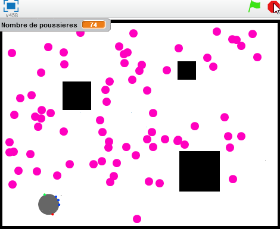

# Projets Robotique
## Trafic routier
Le but est de programmer plusieurs robots de façon à simuler un trafic routier.  

Il faudra :  
- faire avancer les robots en suivant une route  
- définir des règles de circulation  
- éviter les collisions
- créer les routes

<iframe width="560" height="315" src="https://www.youtube.com/embed/cV4ZRwwuIH8" title="YouTube video player" frameborder="0" allow="accelerometer; autoplay; clipboard-write; encrypted-media; gyroscope; picture-in-picture; web-share" allowfullscreen></iframe>

## Aspirateur Robot
Créer une interface sous scratch qui ressemble à ceci :

!!! warning "Objectif :"
	 Optimiser le programme du robot pour aspirer toutes les poussières le plus efficacement possible !

**Etape 1 :** Déplacement du robot.
Créer le robot et l'interface puis le programmer pour qu'il se dépace et rebondisse sur les bords.  

**Etape 2 :** Modifier le programme pour qu'il évite les meubles. S'il touche un meuble, il change de direction puis continue d'avancer.  

**Etape 3 :** Ramasser les poussières
Ajouter des poussières et les faire disparaitre lorsque le robot les touche.  

Faire apparaître le mouton de poussière aléatoirement.  

Faire apparaître autant de moutons de poussière aléatoirement que l'utilisateur entre en début de simulation.  

Faire retourner le robot à sa base quand il est plein. On simulera l'aspiration de 40 moutons de poussières puis se vide.  

Pour vérifier qu'il est bien passé partout, on ajoutera une représentation de la trajectoire .  

!!! success "Améliorations :"

	Optimiser le programme pour l'aspiration la plus efficace possible de 40 moutons.  
	Revenir à sa base lorsqu'il est déchargé puis repartir une fois chargé. On simulera la décharge au bout de 60s et la charge dure 10s.  