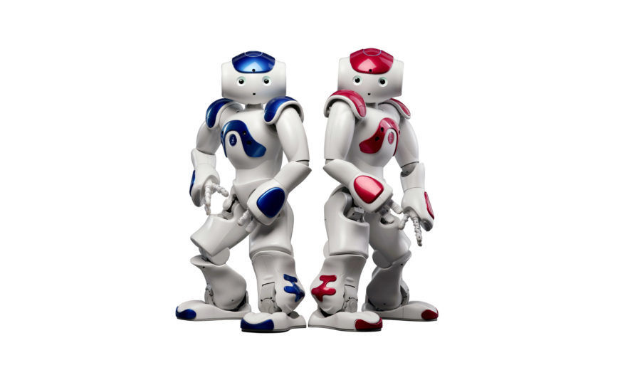
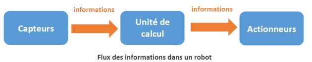
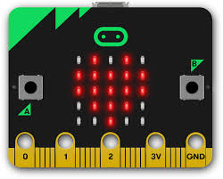
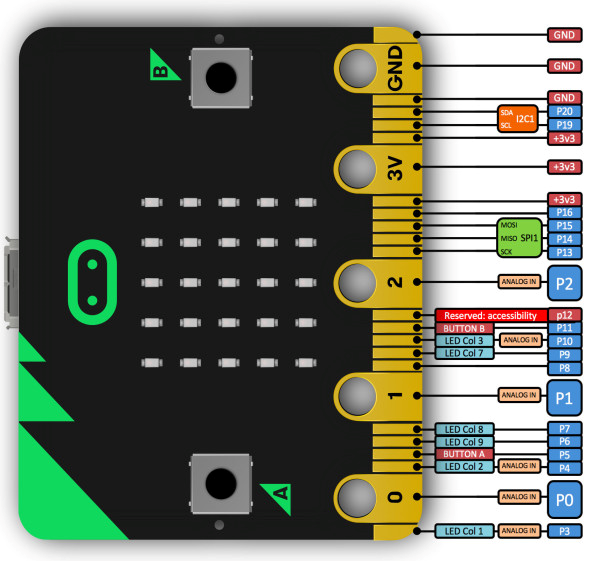
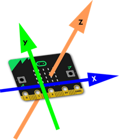
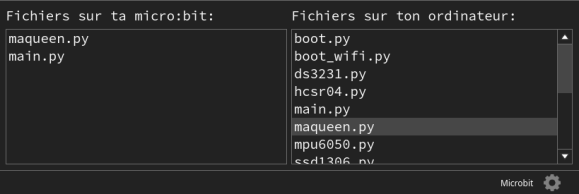

# Introduction à la robotique

## Les robots
Nous allons nous intéresser aux interfaces Homme-Machine (IHM). Une IHM permet à un utilisateur d'interagir avec une machine, la souris et le clavier sont des exemples d'IHM, mais il en existe bien d'autres (par exemple les écrans tactiles des smartphones). Par "machine", on entend bien évidemment "ordinateur", comme dans le cas du duo clavier-souris, mais pas seulement. En effet, les "machines" peuvent aussi être des objets connectés, des systèmes embarqués ou encore des robots. Nous allons justement nous intéresser ici à cette dernière catégorie : les robots.  

### Qu'est-ce qu'un robot ?

!!! quote "D'après Wikipédia :"
	*« Un robot est un dispositif mécatronique (alliant mécanique, électronique et informatique) accomplissant automatiquement soit des tâches qui sont généralement dangereuses, pénibles, répétitives ou impossibles pour les humains, soit des tâches plus simples mais en les réalisant mieux que ce que ferait un être humain. »*
  
Le mot robot a été utilisé pour la première fois par l'écrivain tchécoslovaque Karel Čapek dans sa pièce de théâtre "Rossum's Universal Robots" en 1920, il a pour origine le mot russe "rabota" qui signifie travail, corvée. La notion de robot a été ensuite développée par l'écrivain américano-russe Isaac Asimov dans son recueil de nouvelles "Les Robots" (1950).  

Les robots peuvent être décomposés en trois éléments distincts : capteurs, unité de calcul et actionneurs.  
  
- Les capteurs sont utilisés pour « percevoir » le milieu environnant. Le robot utilise ces capteurs pour produire des données sur sa localisation et sur ce qu'il fait. Différents capteurs peuvent être utilisés pour détecter des conditions différentes, y compris la luminosité, la température, les collisions, les ultrasons, les ondes infrarouges ... la liste est longue ! Pensez aux différents sens que possèdent les humains et comment un robot peut les dupliquer. Les capteurs sont considérés comme entrées de données, car les données qu'ils produisent sont envoyées vers le cerveau du robot.  

- L'unité de calcul est constituée d'un ordinateur de bord que le robot utilise pour traiter les informations en provenance de ses capteurs. Cela peut être aussi petit que quelques circuits intégrés ou aussi grand qu'un ordinateur personnel. La capacité de calcul requise par le robot dépend du niveau de complexité des tâches requises.  

La dernière composante distincte d'un robot, ce sont ses actionneurs. Les « actionneurs » sont des « pièces qui font des choses ». Ceux-ci peuvent être des moteurs dans les roues, ou des moteurs qui font bouger des bras. Ça pourrait également être des pistons hydrauliques ou des vérins pneumatiques. Les actionneurs sont une forme de sortie, tout comme les lampes et les haut-parleurs. L'ordinateur du robot ordonne ces sorties de faire des tâches différentes.  

- De manière générale, les capteurs fournissent des informations à l'ordinateur qui prend des décisions et qui dit aux moteurs ce qu'ils doivent faire.  



Au niveau IHM, il est possible d'interagir avec le robot avec une simple télécommande : l'opérateur donne des ordres au robot par l'intermédiaire de cette télécommande ("aller à gauche", "avancer de 3 mètres", "prendre un objet avec une pince"...), par exemple, les robots qui interviennent dans des milieux dangereux (centrale nucléaire) sont télécommandés à distance par des opérateurs. Il est aussi possible d'interagir avec un robot non pas directement, mais en le programmant afin de lui donner une certaine autonomie. La programmation consiste à donner au robot la marche à suivre en fonction des situations rencontrées : "si le capteur X détecte quelque chose alors arrête les moteurs". C'est plutôt cette voie que nous empruntons lors des activités expérimentales.  

### Pourquoi avons nous besoin des Robots ?

Les robots sont utilisés dans la société pour plusieurs raisons, chacun correspondant à un besoin particulier. La question peut également être posée ainsi : « Quels sont les avantages réalisés en utilisant des robots dans certaines situations ? » Les robots sont généralement utilisés pour faire des tâches ennuyeuses, sales ou dangereuses. Dans un cadre industriel, l'utilisation de robots permet d'effectuer des tâches répétitives avec une grande précision. Les robots peuvent généralement effectuer des tâches simples beaucoup plus rapidement que les humains. Cela conduit à une productivité accrue et à un meilleur contrôle de la qualité des marchandises. Certains types de robots, en particulier ceux qui ont besoin de ramasser et de déposer des objets fragiles, sont si précis qu'ils peuvent manipuler des objets et effectuer des déplacements en s'arrêtant à l'endroit prévu avec une précision correspondant à l'épaisseur d'un cheveu. Les robots médicaux bénéficient de cette précision et permettent aux médecins d'opérer sur des patients qui sont dans une autre ville ou à l'autre bout du monde. Les robots d'exploration et les robots militaires sont conçus pour éloigner les personnes des situations dangereuses. Les opérateurs du robot peuvent le conduire dans des zones dangereuses et utiliser les capteurs et les caméras à bord pour recueillir des informations. Ceci est particulièrement utile pour les missions de recherche et de sauvetage dans les zones sinistrées, où il peut être dangereux pour l'homme d'aller à la recherche de survivants. Les robots de divertissement représentent une autre catégorie et offrent beaucoup de plaisir et d'intérêt pour les gens. Les situations amusantes dans lesquelles sont impliqués les robots peuvent facilement être vues à la télévision. La gamme de sophistication va des robots humanoïdes très complexes comme ASIMO et NAO, aux jouets comme RoboSapien © et le système Mindstorms de LEGO ®. Les robots ménagers tels que le robot aspirateur Roomba © de la société iRobot ont été les premiers à être commercialisés comme robots domestiques avec les versions ultérieures qui ont été développées pour laver les planchers et nettoyer les gouttières. Le rêve d'un robot majordome qui ramasse nos vêtements et fait nos corvées n'est pas loin.  

### Les lois de la Robotique
  
Les Trois lois de la robotique, formulées par l'écrivain de science-fiction Isaac ASIMOV, sont des règles auxquelles tous les robots « positroniques » qui apparaissent dans ses romans doivent obéir. Exposés pour la première fois en 1942 ces lois sont :  

!!! warning ""

    Un robot ne peut porter atteinte à un être humain, ni, en restant passif, permettre qu'un être humain soit exposé au danger ;  

    Un robot doit obéir aux ordres qui lui sont donnés par un être humain, sauf si de tels ordres entrent en conflit avec la première loi ;  

    Un robot doit protéger son existence tant que cette protection n'entre pas en conflit avec la première ou la deuxième loi.  

Isaac ASIMOV (1920-1992), était un écrivain américano-russe (naturalisé américain en 1928) et un professeur de biochimie à l'Université de Boston, surtout connu pour ses oeuvres de science-fiction et ses livres de vulgarisation scientifique. Dans plusieurs de ces ouvrages il introduit les 3 lois de la robotique.

Pour pallier aux insuffisances de ces lois dans certaines circonstances, l'écrivain Roger MacBride Alen à énoncé les nouvelles lois de la robotique :

!!! warning "Améliorations"
    Un robot ne peut porter atteinte à un être humain.  
    Un robot doit coopérer avec les êtres humains, sauf si une telle coopération est en contradiction avec la Première Loi.  
    Un robot doit protéger son existence, si cette protection n'est pas en contradiction avec la Première ou la Deuxième Loi.  
    Un robot peut agir à sa guise, hormis si ses actions sont en contradiction avec la Première, la Deuxième ou la Troisième Loi.  

!!! question "Questions"
	Répondre aux questions suivantes d'après les documents  
    1. Qu'est-ce qu'une IHM ?  
    2. Au niveau IHM, quels sont les deux modes d'action permettant d'interagir avec un robot ?  
	3. Citez quelques applications des robots.  
	4. Quels éléments principaux constituent un robot ?  
	5. Qui a introduit les lois de la robotique ?  

## Utilisation d'une carte programmable
### Installation et utilisation du logiciel MU

Nous allons utiliser la carte programmable micro :bit. Elle se programme par blocs en utilisant l'éditeur en ligne makecode ou en python en utilisant le logiciel Mu téléchargeable [ici](https://codewith.mu/en/download).    

Elle contient un certain nombre de capteurs (température, accéléromètre, compas) ainsi qu'une matrice de LED permettant d'afficher des messages lumineux.  



### Les modes

L'éditeur Mu peut s'adapter à plusieurs contextes en fonction des cartes qu'on lui connecte. Il peut même être utilisé pour coder en Python directement sur l'ordinateur, même si on utilise pas de carte microbit. Les fonctionnalités d'une carte à l'autre peuvent varier donc l'éditeur se met dans un mode spécifique à la carte qui est connectée.  

Cliquer sur l'icône    

L'éditeur permet de :

- taper nos programmes et les envoyer sur la carte pour s'exécuter  

- transférer des fichiers vers et depuis la carte  

-  accéder à la console interactive MicroPython (REPL)  

- tracer des graphiques  

- vérifier la syntaxe de nos programmes  

!!! tip "Complément :"

	Les fichiers se trouvent dans le dossier mu_code dans votre répertoire personnel.

### Créer son premier programme

Cliquer sur  puis commencer à taper votre programme , comme par exemple :

```python
from microbit import *

display.show("Hello World")
```
Flasher le programme après avoir connecté la carte. Ceci revient à transférer le programme sur la carte et sera exécuté automatiquement.

Le REPL  est l'équivalent de la console shell dans Thonny. On peut écrire des lignes de commandes qui s’exécuteront directement sur la carte sans flasher (on ne peut pas flasher si le REPL est ouvert).

Tester par exemple :

```python 
display.show("Hello world!!")
```

### Simulateur

La plupart des exemples donnés ci-dessous pourront fonctionner dans le simulateur python se trouvant [ici](https://create.withcode.uk/).

Tapez votre code puis validez par CTRL-ENTREE. Si votre code commence par

```from microbit import *```

l'exécution du code provoquera l'affichage d'une carte microbit virtuelle qui exécutera votre programme comme sur une vraie carte. Ce simulateur vous permet d'accéder également aux capteurs internes de la carte (accéléromètre, boussole, température...).  

Pour finir avec cette introduction, voici un schéma qu'il est toujours utile d'avoir sous la main car il présente le brochage de la carte et l'affectation des entrées-sorties.  



## La matrice LED
### Allumer et eteindre l'écran

 Les commandes `display.on()` et `display.off()` permettent d'allumer et d'éteindre l'écran. Éteindre l'écran peut être utile lorsqu'on veut récupérer les broches d'entrée sortie associées à la matrice de LED (broches 3,4,5,7,9,10).  

 Les commandes `display.is_on()` et `display.is_off()` permettent de tester l'état de l'écran.  

 Ne pas confondre ces commandes avec `display.clear()` qui se contente d'éteindre les pixels de l'écran.  

!!! example "Exemple :"
	Tapez les lignes suivantes dans le REPL pour constater l'effet. Le rallumage de l'écran remet ce dernier dans l'état ou il était. Il n'a donc pas été effacé.  
	```python
	>>> display.show(1)
	>>> display.off()
	>>> display.on()
	```

### Afficher du texte

```python
from microbit import *
while True:
    display.scroll('Hello, World!')
    display.show(Image.HEART)
    sleep(2000)
```

### Afficher une image préenregistrée
`dir(Image)` permet d'accéder à la liste des images préenregistrées
```python
from microbit import *

while True:
    display.show(Image.HAPPY)
    sleep(1000)
    display.show(Image.DUCK)
    sleep(1000)
    display.show(Image.GHOST)
    sleep(1000)
```
### Affichage d'une image personnalisée :
Chaque chiffre représente un pixel dont l'allumage va de 0 à 9 :  
Chaque ligne entre guillemets représente une ligne de la matrice.
```python
from microbit import *

display.show(Image('00300:'
                   '03630:'
                   '36963:'
                   '03630:'
                   '00300'))
```
### Afficher/Lire les pixels

`display.get_pixel()` et `display.set_pixel()`

`display.get_pixel(x, y)` retourne l'illumination du pixel situé à la colonne x et la ligne y sous forme d'un entier de 0 (éteint) à 9 (complètement allumé)  

`display.set_pixel(x, y, value)` allume le pixel situé à la colonne x et la ligne y avec une illumination value de 0 (éteint) à 9 (complètement allumé)  

Tester le programme de dégradé :  
```python
from microbit import *

for x in range(5):
    for y in range(5):
        display.set_pixel(x,y,(x+y)%9)

```

!!! tip "Arret"
	Pour arrêter l'animation lorsqu'elle est jouée en tâche de fond, il suffit de faire un `display.clear()`.

### Détection du seuil de luminosité

```python
from microbit import *

while True:
    if display.read_light_level() < 100:
        display.show(Image.HEART)
    else: display.clear()
    sleep(2000)
```

## Les boutons
### Action lorsque l'on appuie sur un bouton :
```python
from microbit import *
while True:
    if button_a.is_pressed():
        display.show(Image.HAPPY)

    if button_b.is_pressed():
        display.show(Image.SAD)

```
La méthode précédente permet de faire une action une seule fois au moment où le bouton est pressé. Si on remplace par `button_a.was_pressed()` l'image reste affichée.

### boutons tactiles

Les broches 0, 1 et 2 sont - en théorie - tactiles. On peut détecter lorsqu'on les touche.  

Voici un exemple de code mettant en œuvre la détection de toucher sir la broche pin0. Vous pourrez ainsi vous faire votre propre idée par vous-même.  

```python
from microbit import *
while True:
    if pin0.is_touched():
        display.show(Image.HAPPY)
    else:
        display.show(Image.SAD)
```
## Les capteurs
### Capteur de température
**Lire la température**
La méthode `temperature()` permet de récupérer la valeur de température mesurée par le capteur. Ce capteur est peu fiable, puisque la carte chauffe à l'utilisation.
```python
from microbit import *

while True:
    if button_a.was_pressed():
        display.scroll(temperature())
```

**Tracer une courbe d'évolution de température dans mu**
Dans l'exemple ci-dessous, nous allons faire un relevé de température toutes les secondes et afficher la température dans la zone graphique de Mu.  
```python
from microbit import *

while True:
    print((temperature(),))
    sleep(1000)
```

!!! tip "complément :"
	Vous pouvez bien sûr agir sur le paramètre de la fonction sleep pour afficher la température toutes les minutes ou toutes les heures.

## Accéléromètre
Il existe de même `accelerometer.get_y()` et `accelerometer.get_z()` selon les axes ci-dessous .
{align: right}

```python
from microbit import *

while True:
    reading = accelerometer.get_x()
    if reading > 20:
        display.show(">")
    elif reading < -20:
        display.show("<")
    else: display.show("-")
```

### Détecter des gestes

L'accéléromètre sait aussi interpréter les données d'accélération en gestes prédéfinis. Observez le code ci-dessous :
```python
from microbit import *

while True:
    if accelerometer.was_gesture('shake'):
        display.show(Image.SILLY)
        sleep(2000)
    if accelerometer.was_gesture('face up'):
        display.show(Image.HAPPY)
    if accelerometer.was_gesture('left'):
        display.show('<')
    if accelerometer.was_gesture('right'):
        display.show('>')
```

### Gestes prédéfinis

Les gestes reconnus sont : up, down, left, right, face up, face down, freefall, 3g, 6g, 8g, shake

Comme pour les boutons :
- les gestes sont accumulés dans une pile que l'on peut interroger par `accelerometer.get_gestures()`  
- on peut détecter si un geste (par exemple une secousse) a eu lieu par `accelerometer.was_gesture("shake")`  
- on peut détecter si un geste est en cours par `accelerometer.is_gesture("up")`  

## La boussole

La carte microbit est équipée d'un magnétomètre pouvant servir de boussole. Son utilisation comme pour le reste de ses capteurs est très simple : on calibre le compas par `compass.calibrate()` puis on interroge le compas par `compass.heading()`. Essayez ces deux commandes dans le REPL.  

Pour savoir si le compas est déjà calibré, utilisez la méthode `compass.is_calibrated()`.  

Voici comment en quelques lignes réaliser une boussole !  
```python
from microbit import *

while True:
    if button_a.was_pressed():
        display.scroll(str(compass.heading()))
``` 

**Autres fonctions du magnétomètre**  

La méthode `compass.get_field_strength()` renvoie la force du champ magnétique. Cela permet de détecter la présence d'un aimant.  

Cette force peut être décomposée selon les axes x, y et z : `compass.get_x() compass.get_y()` et `compass.get_z()`.  


## Le robot Maqueen
Le robot Maqueen micro:bit est un robot très bon marché (autour de 20€) contrôlé par la carte micro:bit. Il est petit, maniable et facile d'utilisation. Il possède beaucoup de fonctionnalités :
- capteurs de suivi de ligne  
- LEDs  
- 4 LED RVB neopixel pour éclairage d'ambiance 
- capteur de distance ultrason  
- buzzer pour effets sonores   
- moteurs à engrenage contrôlables séparément par i 2c  
- alimentation par pack de 3 piles AAA  
- capteur infrarouge permettant au robot d'être    
A l'origine, ce robot se programme par blocs. Il a été développé un module python permettant de le programmer facilement sous Python également.  

### Installation du module pilote maqueen sous Python
**Si vous l'installez chez vous**

Pour installer le module sur Mu-editor :  

téléchargez le module [maqueen.zip](../src/maqueen.zip) et décompressez-le dans votre dossier mu_code.  

Dans Mu, cliquez sur l'icône  

Si vous avez copié le fichier maqueen.py dans le dossier mu_code, vous devriez le voir apparaître coté ordinateur. glissez-le sur la carte micro:bit. Vous devriez obtenir quelque chose du genre :



**Si vous travaillez au lycée**
Vous n'avez pas accès au répertoire mu_code, nous allons donc faire précéder tous les programmes ci-dessous par le contenu du fichier `maqueen.py`. Le copier et le coller dans l'éditeur Mu :

```python
#bibliothèque
import microbit
import time
import machine
import music

class Maqueen():
    def __init__(self,addr=0x10):
        """Initiaisation robot
        addr : adresse i2c. 0x10 par defaut"""
        self.addr=addr
        self._vitesse=0 # vitesse entre 0 et 100

    def getVitesse(self):
        return self._vitesse

    def setVitesse(self, v):
        self._vitesse=v

    def moteurDroit(self, v=None):
        if v==None:
            v=self._vitesse
        sens=0 if v>=0 else 1 # sens moteur
        vit=abs(v)*255//100   # vitesse moteur 0..255
        microbit.i2c.write(self.addr,bytearray([2,sens, vit]))

    def moteurGauche(self, v=None):
        if v==None:
            v=self._vitesse
        sens=0 if v>=0 else 1 # sens moteur
        vit=abs(v)*255//100   # vitesse moteur 0..255
        microbit.i2c.write(self.addr,bytearray([0,sens, vit]))

    def avance(self,v=None):
        if v != None:
            self._vitesse=v
        self.moteurDroit()
        self.moteurGauche()

    def recule(self):
        self.moteurDroit(-self._vitesse)
        self.moteurGauche(-self._vitesse)

    def stop(self):
        microbit.i2c.write(self.addr,bytearray([0,0,0]))
        microbit.sleep(1)
        microbit.i2c.write(self.addr,bytearray([2,0,0]))

    def distance(self):
        """Calcule la distance à l'obstacle en cm
        pin1 : Trig
        pin2 : Echo"""
        microbit.pin1.write_digital(1)
        time.sleep_ms(10)
        microbit.pin1.write_digital(0)

        microbit.pin2.read_digital()
        t2 = machine.time_pulse_us(microbit.pin2, 1)

        d = 340 * t2 / 20000
        return d

    def son_r2d2(self):
        tune=["A7:0", "G7:0", "E7:0","C7:0","D7:0","B7:0","F7:0","C8:0","A7:0","G7:0","E7:0","C7:0","D7:0","B7:0","F7:0","C8:0"]
        music.play(tune)

    def son_bip(self):
        for i in range(2):
            freq=2000
            while freq>1000:
                music.pitch(int(freq),10)
                freq*=0.95
            freq=1000
            while freq<3000:
                music.pitch(int(freq),10)
                freq*=1.05

#fin bibliothèque
#début du programme

```
### Méthodes fournies par le module
`avance(vitesse)` : avance en ligne droite. vitesse est un nombre entre 0 et 100. Ce paramètre est optionnel. Si non spécifié, c'est la dernière vitesse spécifiée lors de avance() ou setVitesse() qui sera utilisée.  

`recule()` : fait marche arrière.  

`stop()` : stoppe les moteurs  

`moteurDroit(vitesse)` : fait tourner la roue droite.  

`moteurGauche(vitesse)` : fait tourner la roue gauche.  

`getVitesse() `: renvoie la vitesse paramétrée par setVitesse() ou avance()  

`setVitesse()` : change la valeur de la vitesse utilisée par avance, recule, moteur  

`distance() `: renvoie la distance (en cm) lue par le capteur ultrason  

`son_r2d2()` et `son_bip()` : effets sonores  

!!! tip "Complément : Accès aux autres fonctions du robot"
    Sur le circuit imprimé du robot figurent les adresses des broches pour les LEDs et capteurs de ligne. les voici pour rappel :  
    - LEDs rouges : 8 (gauche) et 12 (droite). Ex : `pin8.write_digital(1)`  
    - Neopixel : pin15  
    - capteurs de ligne : pin13 (gauche) et pin14 (droite). ex : `pin13.read_digital()`  
    - infrarouge : pin16  
    ```python
    # Exemple d'éclairage d'ambiance vert avec les neopixels
    from microbit import *
    from neopixel import NeoPixel
    np=NeoPixel(pin15,4)
    for i in range(4):
        np[i]=(0,255,0)
    np.show()

    # np.clear() pour eteindre les neopixels
    
    ```
Autre exemple, si une ligne est franchie, les LED 13 et 14 détecte du noir :
```python
if pin14.read_digital() == 0 and pin13.read_digital() == 0 :# pin 14 est la diode de droite et 13 celle de gauche
        # detection de franchissement de ligne
        mq.son_bip()
```

### Utilisation du module
Voici un exemple concret vous permettant de tester le module depuis le REPL afin de vous assurer que tout fonctionne. Je vous conseille de tester cela avec le robot sur le dos pour éviter qu'il parte avec un fil à la patte !
!!! note "Attention"
Ceci n'est valable que si vous avez installé la bibliothèque chez vous

```python
    >>> from maqueen import Maqueen

    >>> mq=Maqueen()

    >>> mq.distance() # permet de vérifier le module ultrason

    >>> mq.avance(10)

    >>> mq.stop()

    >>> mq.moteurDroit()

    >>> mq.moteurGauche(-10)

    >>> mq.stop()
    ```


### Exemple de mini-projet : le robot éviteur d'obstacle
Le principe est très simple : On avance tant que le capteur de distance ne détecte pas d'obstacles.  

Si un obstacle très proche est détecté, on recule pendant 2 secondes et on tourne pendant 1 seconde  

Si un obstacle est détecté à moins de 2 cm, on introduit de l'aléatoire avec trois comportements possibles : on recule et on tourne, on tourne ou on tourne sur place.  

pour illustrer le fonctionnement du capteur de ligne, on émet un bip à chaque fois qu'une ligne est franchie (joint de carrelage par exemple).  

Voici le programme de démonstration. Vous pouvez le modifier à loisir pour changer le comportement du robot.  

```python
from microbit import *
from maqueen import Maqueen
from random import randint

mq=Maqueen()
mq.setVitesse(50)
while True:
    mq.avance()
    # LED rouge de devant droite
    # LED rouge de devant gauche
    d=mq.distance()
    if d<5 or d>2000:      # obstacle très proche
       ...
    elif d<20:             # obstacle proche
        ...
    if pin14.read_digital() == 0 and pin13.read_digital() == 0 :
        ...
```
