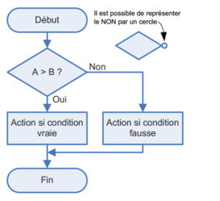
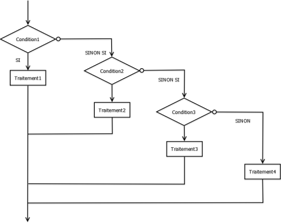
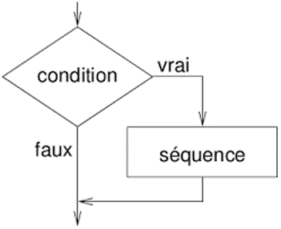
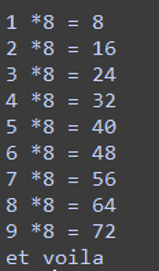
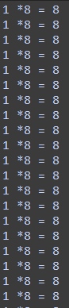

# Boucles et structues conditionnelles

## Structures conditionnelles `if... else`
On n'exécute certaines instructions que si une condition est remplie. Et d'autres instructions si ele ne l'est pas.
  
```python
heure=21
if heure>=23 : #la condition est que la vriable heure est supérieure ou égale à 23
	print("Vas te coucher") # ne s'éxécute que si la condition est remplie
else : # dans tous les autres cas. On ne met pas de condition à un else
	print("Tu peux rester un peu devant la télé!") # s'exécute si la condition n'est pas remplie
```
!!! info "Remarque"
	Le bloc `else` n'est pas obligatoire, s'il n'est pas là et que la condition n'est pas remplie, il ne se passe rien. 

## Structures imbriquées `if...elif...else...`

On utilise cette structure si on a plusieurs conditions à tester. Ici le choix n'est pas binaire.  

 
```pseudocode
SI A>B:
	affiche 'A est plus grand que B'
SINON SI A=B :
	affiche 'A est égal à B'
SINON :
	affiche 'A est plus petit que B'
```

En python :
```python
if A>B:
	print("A est plus grand que B")
elif A==B: #elif contraction de else if
	print("A est égal à B")
else :
	print("A est plus petit que B")
```

## Multiples conditions
On peut avoir des cas ou deux conditions doivet être remplies ou que l'une ou l'autre le soit. On utilise alors les mots clés `and` et `or`.

```python
if A>B and C>D:
	print('les deux conditions sont remplies')

if A>B or C>D:
	print('une des deux conditions est remplie')

```

## Boucle Tant que ... : `While`
On va tester une condition, puis exécuter une série d'instruction tant que cette condition est vraie.  

```pseudocode
TANT QUE condition est vraie :
	on répète les instructions du bloc
Instructions à exécuter lorsque la condition n'est plus remplie

```
```python
compteur=1
while compteur<10:# tant que la variable compteur est inférieure à 10
	print(compteur,'*8=',compteur*8)
	compteur=compteur+1 # on agente compteur de 1
print('et voilà') # ceci ne s'exécute que lorsque compteur vaut 10
```



!!! danger "Boucles infinies"
	Dans le programme précédet si j'oublie d'augmenter la variable `compteur` elle vaudra toujours 1 et ne sera donc jamais égale à 10. la boucle va alors se répéter indéfiniment.  
	```python
	compteur=1
	while compteur<10:# tant que la variable compteur est inférieure à 10
		print(compteur,'*8=',compteur*8)
		 # j'oublie d'incrémenter compteur
	print('et voilà') # ceci ne s'exécute que lorsque compteur vaut 10
	```
	

## Boucle pour un certain nombre d'éléments : `For`
Pour éxécuter une série d'instructions un nombre de fois déterminé à l'avance, on utilise le mot clé `for` qui signifie POUR.

Par exemple on veut répéter 10 fois une certaine instruction :
!!! example "répéter 10 fois"
	=== "pseudocode"
		```pseudocode
		POUR i allant de 0 à 9: 
			afficher 'Bonjour'

		```
	=== "en python"
		```python
			for i in range (0,10):
				print('Bonjour')
		```
A chaque boucle i change de valeur à partir de 0 jusque 9. à la premiere boucle i prend la valeur0, à la deuxieme 1, à la troisième 2, ... à la dixième 9.

!!! note "Remarque"
	`for i in range(8)` : i prendra succéssivement les valeurs de 0 à 7 (par defaut si on ne précise pas la première valeur ça sera 0).  
	`for i in range(1,8)` : i prendra succéssivement les valeurs de 1 à 7.    
	`for i in range(1,10,2)` : i prendra succéssivement les valeurs de 1 à 9 avec un pas de 2 (1,3,5,7,9).  

On peut ainsi récupérer la valeur de i à chaque boucle et s'en servir pour faire un calcul ou un affichage. Tester ce code.  
```python
for i in range (5): # pour i allant de 0 à 4
	print(i) # on affiche la valeur de i
```

??? note "Pour les éléments d'une liste ou d'une chaine de caractères"  
	=== "code"
	```python
	chaine='bonjour'
	for lettre in chaine:
		print(lettre)
	#à chaque boucle la variable lettre change de valeur et prendra dans l'ordre les valeurs de 'b', 'o', 'n', ...

	L=[2,5,9,18]
	for element in L:
		print(element)
	#à chaque tour la variabel element prend une nouvelle valeur de la liste
	``` 

	=== "console" 
	```python
	>>>
	b
	o
	n
	j
	o
	u
	r
	2
	5
	9
	18	
	```