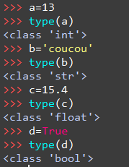

# Bien démarrer en programmation
## Afficher et entrer une valeur
Deux instructions importantes lorsqu’on apprend à programmer en Python :  

`Print()`: permet d’afficher quelque chose dans la console  


`input()`: permet de récupérer une entrée au clavier 

## Les variables
{align=left}Une variable est composée d’un nom (ou identificateur) et d’une valeur enregistrée en mémoire. Le nom utilisé doit être représentatif de son rôle dans le programme.
<br>
<br>
<br>

!!! danger "Attention"
	Attention à nommer ses variables de façon cohérente. Ne pas appeler `age` une variable contenant un prénom.  
	On évite :   
	

## Types de variables
Le type d'une variable définit l’ensemble des valeurs qui peuvent lui être affectées ainsi que les opérations et les fonctions utilisables.
On peut utiliser la commande `type()` pour connaitre le type d’une variable.


!!! example "Voici ce que cela donne"
	


## Les instructions
Une instruction est une commande qui doit être exécutée par la machine.
  

L’instruction FAIRE peut être une affectation ou une expression :  
FAIRE y ← 1 affecte 1 à la variable y (déclare la variable si elle n’existe pas en Python uniquement)  
FAIRE a = 2+y effectue le calcul 2+y et l’affecte à la variable a  

## Expressions mathématiques
### Expressions de base:
  

{align=left}
Modulo : reste de la division  
Division entière : quotient de la division  

*Calcul sur les chaines de caractères :*
La concaténation est interprétable entre deux variables de type string.  
‘infor’+’matique’ donnera le résultat ‘informatique’.  
La multiplication * est une concaténation d’une même variable répétée plusieurs fois. "info"*3=’infoinfoinfo’  

### Les booléens :
Les booléens permettent de faire des comparaisons  
{align=left} {align=float} 

### Autres opérations mathématiques :
Si cela ne suffit pas, il faut utiliser le module `math` qui contient les autres opérations. Cependant il n'est pas disponible d'office, il faut l'importer.
```python
from math import *
```


