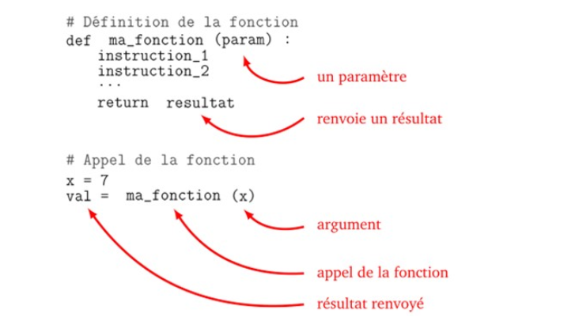

# Fonctions et spécifications
## Créer une fonction
Pour ne pas répéter plusieurs fois la même série de calculs dans un programme, on peut définir une fonction qui à chaque fois qu'on l'éxécutera, répètera les instrucions qu'elle contient.  

!!! example "Le prof d'EPS"
	Pour ne pas répéter plusieurs fois les consignes de courses, un prof d'EPS définit la fonction *courir_sur(distance,eleve)* distance pourra changer de valeur en fonction des élèves (100m, 200m ou 400m).

	La fonction courir_sur(distance,eleve) consiste à :

	- élève s'échauffe en trotinnant sur 3 tours de piste
	- élève reprend son soufle et s'étire
	- élève se rend sur la ligne de départ
	- quand le starter retentit élève court le plus vite poussible sur distance
	- élève vient annoncer son temps au professeur.

	Une fois la fonction définie le prof n'a plus qu'à dire à certains élèves *courir_sur(100m,Juliette)* ou *courir_sur(200m,Arthur)* sans avoir à répéter les consignes.  
	La valeur de distace et le nom de l'élève sont appelés `paramètre` ou `argument`de la fonction, et la valeur retournée (le temps) dépend à la fois du paramètre distance mais aussi de l'élève.

!!! warning "Attention"
	Si le professeur explique la fonction aux élèves mais que jamais il ne l'utilise, personne ne courra. Il faut `appeler`la fonction pour qu'elle s'éxécute.

Une fonction en informatique est une portion de code réalisant un tâche bien précise et qui pourra être utilisée une ou plusieurs fois dans la suite du programme.


Les fonctions informatiques acquièrent tout leur potentiel avec :

•	une entrée, qui regroupe des variables qui servent de paramètres  

•	 une sortie , qui est un résultat renvoyé par la fonction (et qui souvent dépendra des paramètres d’entrée).  
En python pour définir une fonction on utilise le mot clé `def` suivi du nom de la fonction et des paramètres. Pour la valeur calculée on utilisera le mot clé `return`. 

!!! example "Exemple"

	```python
	def calcule_cube(a):
		cube=a*a*a
		return cube
	```
		
  	Cette fonction calcule le cube d’un nombre, par exemple calcule_cube(2), le nombre 2 remplacera a dans le calcul. L'exécution n’affiche rien mais envoie la valeur 8. Si on vaut afficher la valeur, il faudra ajouter `print(calcule_cube(2))`. 

	**Remarque:** ce code seul "ne fait rien", il définit une fonction seulement... tant qu'elle n'est pas utilisée, rien ne se passe

	Si on ajoute dans le code les lignes ci-desous, alors la fonction est utilisée et elle calcule le cube de 2 puis la somme 3^3 + 4^3.

	```python
	print(calcule_cube(2))
	x=3
	y=4
	z=calcule_cube(x)+calcule_cube(y)
	print(z)
	```
De façon générale, la strucutre à respectée est celle-ci :


Et sous forme de code : 
```python
def ma_fonction(arg1,arg2): 
# ma_fonction va utiliser deux arguments arg1 et arg2 qui pourront avoir des valeurs différetes à chauqe appel
	resultat=arg1+arg2 #on additionne les deux paramètres
	return resultat # on retourne le résultat
#on exécute la fonction
a=ma_fonction(2,3) # a prend la valeur du résultat de la fonction soit 5
b=ma_fonction('coucou','toi') #b prend la valeur du résultat soit 'coucoutoi'
#on affiche les résultats
print(a)
print(b)
```


!!! note "Remarque"
	on peut exécuter la fonction avec un `print(ma_fonction(2,3))` qui affichera le résultat mais ne le retiendra pas. Si on écrit simplement `ma_fonction(2,3)` la fonction sera exécutée mais le résultat ne sera pas affiché ni mémorisé.

Une fonction peut avoir plusieurs paramètres et renvoyer plusieurs résultats :
```python
def somme_produit(a,b):
  """Calcule la somme et le produit de deux nombres"""
  s=a+b
  p=a*b
  return s,p

print(somme_produit(6,7))
```

!!! note "Remarques"

	•	Il peut y avoir plusieurs paramètres en entrée.

	•	Il peut y avoir plusieurs résultats en sortie.

	•	Très important! Il ne faut pas confondre afficher et renvoyer une valeur. L’affichage (par la commande print() ) affiche juste quelque chose à l’écran. 

	La plupart des fonctions n’affichent rien, mais renvoient une valeur (ou plusieurs).  

	C’est beaucoup plus utile car cette valeur peut être utilisée ailleurs dans le programme.

	•	Dès que le programme rencontre l’instruction return , la fonction s’arrête et renvoie le résultat. Il peut y avoir plusieurs fois l’instruction return dans une fonction mais une seule sera exécutée. On peut aussi ne pas mettre d’instruction return si la fonction ne renvoie rien.


## Fonction sans valeur de retour et/ou sans arguments
Une fonction qui ne renvoie pas de valeur est appelée **procédure** elle a une simple fonction d'affichage. 


<iframe id="inlineFrameExample"
    title="Inline Frame Example"
 	width="100%"
    height="400"
    src="https://console.basthon.fr/?script=eJxNjsEOwiAMhu8kvEPNDrB40Xgz7rI3abay1QxYGOjri0zFnpq_7fe12dBt8MCFUoCRIFD0KUgxkgE0hocZJwJtfWyvUkCuNbCLJZBCit-OVr1393yrSt4ULoYpWXJx5w3erjF79BfF3WlvnjMvBHy7fAbVw21NuOPj-f8JZdjx4S2s6Bd9STp5">
</iframe>
La fonction `compteur()` sans argument s'éxécutera toujours de la même façon. 

!!! warning "Affichage de la valeur"
	Si on uilise l'instruction `print(compteur())` le programme retournera `None`. En effet, l'instruction `print` pour une fonction a pour effet d'afficher la valeur retournée par l'instruction `return`, or ici il n'y en a pas.

## Portée d'une variable
Une variable est appelée **locale** lorsqu'elle n'est utilisée que dans la fonction. Le programme principal ne reconnait pas la variable. Si elle est définie dans tout le programme elle est appelée variable **globale**.  
```python
def vol_sphere(r):
	cube=r*r*r
	vol=4*cube*3.14/3
	return vol

v=vol_sphere(3)
print(cube)
```


La variable `cube` est définie DANS la fonction et n'est donc pas reconnu par le programme principal. v est définie dans le programme principale, elle sera reconnue partout, c'est une variable globale.

!!! danger "Attention aux confusions"
	```python
	a=15
	def calcul(nb):
		a=12
		return nb+a
	print(calcul(2)) #renvoie le calcul fait avec a=12
	print(a) #renvoie 15
	```  
	a=15  variable globale valable dans tout le programme sauf dans la fonction.  
	a=12 est une variable locale valable que dans la fonction.   
	**ATTENTION : Ne pas nommer de la même façon deux variables!**  

## Structurer son script

Le programme commence à être long, il faut ranger:  
On définit le format de codage du texte :

```python
# -*- coding: utf-8 -*- 
# coding : utf-8
```

Importer les fonctions de modules externes
```python
from math import cos,pi
```

Définition de vos fonctions
```python
Def ma_fonction(arg1,arg2):
	return arg1+arg2
```
Corps principal du programme
*main*
 
Le code est TRES long?!  
On utilise plusieurs fichiers et on les importe comme une bibliothèque normale  


Plusieurs possibilités d’import dans main :
```python
from tests import affiche
affiche()

import tests
tests.affiche()

import tests as ts
ts.affiche()
```


## Conventions

`nom_de_ma_fonction`: pour les fonctions, variables et méthodes tout en minuscule avec _ pour séparer les mots.

`MaClasse`: pour le nom des classes (en terminale). Majuscule pour chaque nouveau mot et mots collés. 

Les constantes sont entièrement en majuscule: `NOM_DE_MA_CONSTANTE`. Une constante est une variable à laquelle on donne une valeur qui ne changera pas dans tout le programme. 


## Documenter une fonction
Le `docstring` se place juste après la création de la fonction par `def`. Il commence et termine par trois guillemets ".
Le  docstring doit contenir :  

- La descripton et le rôle de la fonction  
- les paramètres passés en arguments (type et rôle)  
- le type de ce qui est retourné  

Ce docstring, peut être lu en tapant:  
`help(nom_de_ma_fonction)`   
Ou   
`nom_de_ma_fonction.__doc__`   


  
Très utile lorsque le code est réutilisé ensuite par quelqu’un d’autre.

## Tester une fonction

### Tests unitaires
Ils permettent de savoir si une fonction est correctement implémentée. On vérifie notamment les valeurs limites, les cas particuliers et les erreurs.
On les place dans la docstring.  
Créer des tests unitaires :
  
En cas d’erreur (un test n’est pas exécuté correctement).  
On modifie le code précédet en remplaçant le résultat de carré(2) par 3 au lieu de 4 pour générer une erreur.  
Ici, un test sur 3 de la fonction carré ne renvoie pas ce qu’on attend:   


### Assertions
On souhaite ici que la fonction calcule la somme de deux entiers et uniquement des entiers. Il va donc falloir vérifer que l'utilisateur en entrer des entiers :
```python
def somme(x,y):
	assert(isinstance(x,int))
	assert(isinstance(y,int))
	s=x+y
	return s
	print(somme(1,2.2))
```
Une assertion (mot clé `assert`) permet de vérifier si une condition est respectée à un moment du code. Ici on vérifie que x et y sont des entiers avant de faire le calcul.

Ici une erreur d'assertion est détectée puisque y est un flottant.  
Avantage sur tests unitaires :

- Permet de placer des tests en cours de fonction et pas seulement sur le résultat
- Permet de donner un message différent selon l’erreur détectée


Par exemple, on demande son age à l'utilisateur. On s'attend à ce qu'il entre un nombre positif. On va donc tester si c'est un nombre et s'il est positifi avec des messages d'erreur adaptés.

```python
age=input('quel est ton age? ')
try : 
	#bloc à tester
	age=int(age) #on converti en entier
	assert age>=0
except ValueError:
	#bloc à executer en cas de détectiion d'une erreur lié à la valeur
	print('on demande un nombre')
except AssertionError:
	#bloc à executer si l'assertion lève une erreur
	print('on veut un nombre positif SVP!')
else :
	#aucune erreur détectée
	print(f'tu as {age} ans')
finally :
	# à exécuter quoiqu'il arrive
	print('merci d\'avoir joué!')

```
Ce bloc permettra de tester les entrées de l'utilisateur lors de programmes plus complexe.

??? example "Tester des entrées sans sortir du programme"
	Tant que l'age entré ne sera pas un entier positif, le programme continue de proposer d'entrer une valeur.
	```python
	ok=True
	while ok: #tant que l'on a pas validé l'entrée
	    age=input('quel est ton age? ')
	    try : 
	        age=int(age) 
	        assert age>=0
	    except ValueError:
	        print('on demande un nombre')
	    except AssertionError:
	        print('on veut un nombre positif SVP!')
	    else :
	        #aucune erreur détectée
	        print(f'tu as {age} ans')
	        ok=False #l'entrée est validée on sort de la boucle while
	```