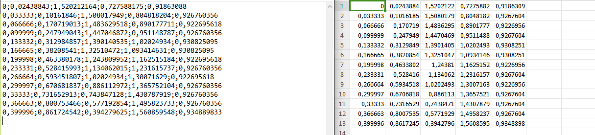

# Lire et écrire dans un fichier

Lorsque l'on fait du traitement de données, les informations sont stockées dans des fichiers au format `csv` ou `txt`. Ces fichiers prennent très peu de place, compte tenu du nombre de données qu'ils contiennent. Il faut alors importer les données dans le programme python à partir de ces fichiers.  
D'autre part, il peut être interessant de sauvegarder des données entre deux éxécutions d'un même programme. Sauvegarder des scores, des noms dans un répertoire, ...  
Nous allons donc voir comment importer ou exporter des données.  
## Chemin relatif et absolu
Tout d'abord, il est impératif de maîtriser la notion d'aborescence pour savoir où se trouve le fichier de données par rapport au fichier python.  
[Un petit tour par ici](../archi/OS/linux.md#chemin-relatif-et-absolu) pour comprendre la notion de chemin.  
Dans la suite, nous considèrerons que les fichiers de données se trouvent dans le même répertoire que le ficher python.  


## Lire un fichier `.txt`
### ouvrir et lire le fichier
Le fichier se nomme `donnee.txt` :

```python
with open('donnees.txt',"r") as file : #on créé une variable file qui va contenir le fichier
    contenu=file.read()# la variable contenu va récupérer ce qu'on lit das le fichier
    print(contenu)#affiche ce qui a été lu
    file.close()#ferme le fichier
```
La varirable `contenu ` ici contient tout le fichier tel qu'il a été créé.

!!! warning Fermeture du fichier
	On prendra soin de fermer le fichier après chaque manipulation pour ne pas prendre le risque de perdre des données.

	
!!! info 
	Les différents modes d'ouverture d'un fichier :  
	"r" : lecture seule  
	"w" : écriture avec remplacement (si le fichier n'est pas vide ça écrit par dessus)      
	"a" : écriture avec ajout en fin de fichier     
	"x" : leture et écriture 


!!! note Méthodes de lecture
	Si on remplace la méthode `read` par `readline` ou `readlines` le rendu peut être différent:  
	`read()` : lit tout le fichier d'un coup  
	`readline()` : lit une ligne à la fois  
	`readlines()` : lit toutes les lignes en les séparant


### Ecrire dans un fichier `.txt`
Pour écrire, on utilisera le mode ` w`.

``` python
with open('mon_fichier.txt',"w") as fichier : # si le fichier n'exite pas il sera créé
    fichier.write('ligne 1\n')
    fichier.write('ligne 2\n')
    fichier.write(str(15),'\n')
fichier.close()
```

!!! info On remarque que...
	- On a ajouté '\n' à la fin des lignes pour que dans le fichier il y ait un retour à la ligne.
	- On ne peut que écrire des chaines de caractères, donc si on veut saisir un nombre, il faut au prréalable le convertir en chaine de caractères à l'aide de la fonction `str()`.

## Les fichiers `.csv`
Les fichiers de ce format (comma separated values) sont des fichiers permettant de stocker des tableaux de données, dont les valeurs sont séparées par une virgule (ou un point virgule lorsque la vigule est utilisée comme séparateur décimal).

Ici par exemple, on trouve à gauche le fichier au format .csv et à droite le rendu avec un tableur :


Pour récupérer les informations lignes par lignes, on peut executer ceci :
```python
import csv
with open('mon_fichier.csv',"r") as f:# fichier transféré dans la variable f
    contenu_csv=csv.reader(f) #tout le contenu de f est lu et affecté à la variable contenu_csv
    for ligne in contenu_csv:
        print(ligne)
f.close()
```
Ici par exemple, le fichier contenait une liste de noms et prenoms d'employés, le service et le mois d'anniversaire.

!!! note Remarque
	A noter ici que l'on a besoin d'importer le module csv pour traiter le fichier.


```
['name', 'department', 'birthday month']
['John Smith', 'compta', 'novembre']
['Erica Meyers', 'Technique', 'Mars']
['Joh Doe', 'administratif', 'juin']
```
chaque ligne, contiendra la liste des valeurs de la ligne du fichier csv.

En revanche, on peut avoir besoin de récuprer dans une liste les éléments par colonnes. Par exemple si on souhaite avoir la liste des noms et celle des mois d'anniversaire.

On exécutera alors ceci, qui pour chaque ligne va lire les données une par une et les ranger dans la bonne liste.
```python
import csv
with open('mon_fichier.csv',"r") as f:
    contenu_csv=csv.reader(f)
    ligneNom=[]
    ligneDep=[]
    ligneAnniv=[]
    for ligne in contenu_csv:
        ligneNom.append(ligne[0])
        ligneDep.append(ligne[1])
        ligneAnniv.append(ligne[2])
f.close()
print(ligneNom)
print(ligneDep)
print(ligneAnniv)
```

## Ecrire dans un fichier csv
En mode écriture, on écrit ligne par lignes les informations que l'on veut stocker. 

```python
import csv
with open('moncsv.csv','w') as file:
    aecrire=csv.writer(file)
    aecrire.writerow([0,1,2,3])
    aecrire.writerow(['coucou','bonbon','artichauts'])
    for i in range (100):
        aecrire.writerow([10,20,30])
    
```

## Cas des dictionnaires
Les dictionnaires peuvent être sauvegardés en utilisant le module `pickle`. Ce module ne permet pas d'avoir un rendu lisible mais peut etre très pratique.
Par exemple, on crée un dictionnaire contenant le nom et le numéro de certains départements et on l'enregistre dans un fichier appelé `dep.txt`

```python
import pickle
#le dictionnaire que l'on souhaite sauvegarder
departement={36:'Indre',30:'Gard',75:'Paris'}
#on ouvre un fichier dont le nom est dep (il sera créé s'il n'existe pas) et on le place dans une variable appelée fichier
fichier=open('dep.txt','wb')
#on enregistre le dictionnaire dans le fichier 
pickle.dump(departement,fichier)
#on ferme le fichier
fichier.close()
```

Puis on veut récupérer les noms de département préalablement enregistrés:
```python
import pickle

#ouverture du fichier
f=open('dep.txt','rb')
#chargement du contenu du fichier dans la variable Dept
Dept=pickle.load(f)
f.close()

print(Dept)
```

On obtient `{36: 'Indre', 30: 'Gard', 75: 'Paris'}`.

