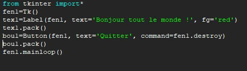
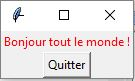
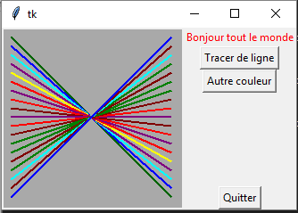
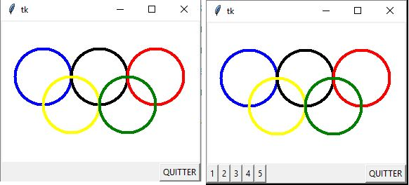
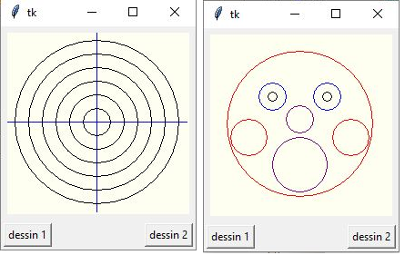
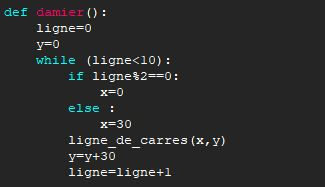
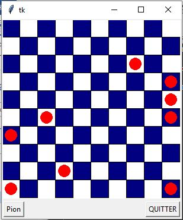

# Interface Graphique TKinter (Tool Kit Interface)

Tkinter est UNE des nombreuses interfaces graphiques de python parmi d'autre. Étant une des plus simple à utiliser, elle permet des interfaces graphiques simples même quand on est débutant.   
Dans cette partie, les applications seront à faire au fur et à mesure pour bien intégrer chaque notion avant de progresser. Veillez à chaque modification de programme à l'enregistrer sous un autre nom afin de ne pas écraser le précédent.   
Ressources complémentaires :  
[Tableauxmaths : Boutons et zones de textes](http://tableauxmaths.fr/spip/spip.php?article202)  
[Tableauxmaths : dessiner déplacer et gérer les collisions](http://tableauxmaths.fr/spip/spip.php?article48)

## Dessiner
### Prise en main
Création d'une fenêtre avec deux widgets (contraction de window gadget) : un bout de texte (label) et un bouton (button).
Écrire, sauvegarder et exécuter le script suivant :

vous devriez obtenir l'ouverture d'une fenêtre popup telle que: 
  

**fen1=tk()** crée la fenêtre qui s'appellera fen1.  
**tex1=Label(fen1, text='Bonjour tout le monde !', fg='red')** : le premier argument est le nom de la fenêtre dans lequel sera le bouton (fen1 est le widget maître de l'objet tex1, ou l'objet tex1 est un widget esclave de l'objet fen1). Le deuxième est facile à comprendre et le troisième est la couleur d'avant plan (foreground, en anglais).  

**tex1.pack() :** nous activons ici la méthode pack() à l'objet tex1. Cette méthode agit sur la disposition géométrique, la fenêtre maître est réduite automatiquement pour qu'elle soit juste assez grande pour contenir les widgets esclaves.  

**fen1.mainloop() :** c'est cette ligne qui provoque le démarrage du réceptionnaire d'événements associé à la fenêtre. Cette instruction est nécessaire pour que l'application soit « à l'affût » des clics de souris, des pressions exercées sur les touches du clavier, etc.   C'est donc cette instruction qui la met en marche.  

### La notion d'évènements
La notion d’événements est commune à tous les langages informatiques. Il s'agit des clics sur les boutons de souris, sur les touches du clavier ou sur l'interface créée. Il sera alors toujours nécessaire d'avoir un écouteur d’événement et des fonctions associées à chaque événement qui nous intéressera.  
Par exemple, on pourra associer une fonction qui permet de quitter l'interface à une frappe sur la touche "q" du clavier.  

### Tracé de lignes
Écrire, sauvegarder et exécuter le script suivant :
```python
from tkinter import*
from random import randrange

# --- définition des fonctions gestionnaires d'événements : ---
def drawline():
    #Tracé d'une ligne dans le canevas can1
    global x1,x2,y1,y2,coul
    can1.create_line(x1,y1,x2,y2,width=2,fill=coul)
    # modification des coordonnées pour la ligne suivante :
    y2=y2-10
    y1=y1+10
def changecolor():
    #Changement aléatoire de la couleur du tracé
    global coul
    pal=['purple','cyan','maroon','green','red','blue','orange','yellow']
    c=randrange(8) # => génère un nombre aléatoire de 0 à 7
    coul=pal[c]

#------ Programme principal ------
# Les variables suivantes seront utilisées de manière globale :
x1,y1,x2,y2=10,10,190,190 # coordonnées de la ligne
coul="dark green" # couleur de la ligne

# Création du widget principal ("maître") :
fen1=Tk()
# Création des widgets "esclaves" :
can1=Canvas(fen1,bg='dark grey',height=200,width=200)
can1.pack(side=LEFT)
tex1=Label(fen1,text="Bonjour tout le monde",fg='red')
tex1.pack()
bou1=Button(fen1, text="Quitter", command=fen1.quit)
bou1.pack(side=BOTTOM)
bou2=Button(fen1, text="Tracer de ligne", command=drawline)
bou2.pack()
bou3=Button(fen1, text="Autre couleur", command=changecolor)
bou3.pack()
fen1.mainloop() # démarrage du réceptionnaire d'événement
fen1.destroy() # destruction (fermeture) de la fenêtre

```
On doit obtenir ceci :  


Un canevas dans tkinter est une surface rectangulaire délimitée, dans laquelle on peut installer ensuite divers dessins et images à l'aide de méthodes spécifiques (canevas s'écrit canvas en anglais !).  
La fonctionnalité de ce programme est assurée essentiellement par les deux fonctions `drawline()` et `changecolor()`.  
Dans la fonction `changecolor()`, une couleur est choisie au hasard dans une liste, à l'aide de la fonction `randrange()` importée du module random.   Appelée avec un argument N, cette fonction renvoie un nombre entier, tiré au hasard entre zéro et N-1.
La commande liée au bouton « Quitter » appelle la méthode `quit( )` de la fenêtre `fen1`.  
Cette méthode sert à fermer le réceptionnaire d'événements (mainloop) associé à cette fenêtre. Lorsque cette méthode est activée, l'exécution du programme se poursuit avec les instructions qui suivent l'appel de mainloop. Dans l'exemple, cela consiste donc à effacer (destroy) la fenêtre.  

### Exercices
1. Modifier le programme pour ne plus avoir que des lignes de couleur cyan, maroon et green.
2. Modifier le programme pour que toutes les lignes tracées soient horizontales et parallèles.
3. Agrandir le canevas de manière à lui donner une largeur de 500 unités et une hauteur de 650. Modifier également la taille des lignes, afin que leurs extrémités se confondent avec les bords du canevas.
4. Ajouter une fonction `drawline2( )` qui tracera deux ligne rouges en croix au centre du canevas : l'une horizontale et l'autre verticale. Ajouter également un bouton portant l'indication « viseur ». Un clic sur ce bouton devra provoquer l'affichage de la croix.
5. Reprendre le programme initial. Remplacer la méthode `create_line` par la méthode `create_rectangle`. Que se passe-t-il ? Qu'indique les coordonnées fournies en paramètres ? (Noter ses informations dans un endroit où vous les retrouverez facilement
6. Recommencer en remplaçant cette fois par `create_oval`. Que se passe-t-il et qu'indique les coordonnées fournies en paramètres ?
7. Créer un programme qui dessinera les cinq anneaux olympiques dans un rectangle de fond blanc (white). Utiliser l'argument outline à la place de fill pour la couleur des anneaux. Un bouton « quitter » doit permettre de fermer la fenêtre.

8. Modifier le programme précédent en y ajoutant cinq boutons. Chacun de ces boutons provoquera le tracé d'un anneau.

### Deux dessins alternés
Écrire, sauvegarder et exécuter le script suivant :
```python
from tkinter import*
def cercle(x, y, r, coul='black'):
    "tracé d'un cercle de centre (x,y) et de rayon r"
    can.create_oval(x-r, y-r, x+r, y+r, outline=coul)
def figure_1():
    "dessiner une cible"
    # Effacer d'abord tout dessin préexistant :
    can.delete(ALL)
    # Tracer les deux lignes (vert. et horiz.) :
    can.create_line(100, 0, 100, 200, fill='blue')
    can.create_line(0, 100, 200, 100, fill='blue')
    # Tracer plusieurs cercles concentriques :
    rayon = 15
    while rayon < 100:
        cercle(100, 100, rayon)
        rayon += 15

def figure_2():
    "dessiner un visage simplifié"
    # Effacer d'abord tout dessin préexistant :
    can.delete(ALL)
    # Les caractéristiques de chaque cercle sont
    # placées dans une liste de liste :
    cc=[[100, 100, 80, 'red'], # visage
        [70, 70, 15, 'blue'], # yeux
        [130, 70, 15, 'blue'],
        [70, 70, 5, 'black'],
        [130, 70, 5, 'black'],
        [44, 115, 20, 'red'], # joues
        [156, 115, 20, 'red'],
        [100, 95, 15, 'purple'], # nez
        [100, 145, 30, 'purple']] # bouche
    # on trace tous les cercles à l'aide d'une boucle :

    i=0
    while i < len(cc): # parcourt de la liste
        el = cc[i] # chaque élément est lui-même une liste
        cercle(el[0], el[1], el[2], el[3])
        i += 1
##### Programme principal #####
fen = Tk()
can = Canvas(fen, width=200, height=200, bg='ivory')
can.pack(side=TOP, padx=5, pady=5)
b1 = Button(fen, text='dessin 1', command=figure_1)
b1.pack(side=LEFT, padx=3, pady=3)
b2 = Button(fen, text='dessin 2', command=figure_2)
b2.pack(side=RIGHT, padx=3, pady=3)
fen.mainloop()
```
on obtient : 


L'option `side` peut accepter les valeurs `TOP, BOTTOM, LEFT ou RIGHT`, pour « pousser » le widget du côté correspondant de la fenêtre.  
Les options `padx` et `pady` permettent de réserver un petit espace autour du widget. Cet espace est exprimé en nombre de pixels : `padx` réserve un espace à gauche et à droite du widget, `pady` réserve un espace au- dessus et au-dessous du widget.  
Prenez le temps d'essayer de bien comprendre ce programme.  

### Exercices :
Écrire une application qui dessine un damier (carrés 'navy' sur fond blanc), ainsi que des pions rouges qui apparaissent au hasard lorsque que l'on clique sur un bouton dans un premier temps, on se contentera du damier).  
Le canevas devra avoir une dimension de 300*300. Les carrés devront avoir un côté égal à 30.
Les pions devront avoir un rayon égal à 10.

Le programme comportera les fonctions suivantes :  
`damier()`: donnée ci-dessous  
`ligne_de_carres(x, y) `: dessine une ligne de 5 carrés de couleur 'navy' espacés, en partant de (x,y).  
`disque(x, y, r, coul)` : dessine un disque de centre (x,y), de rayon r et de couleur coul.  
`pion( ) `: dessine un pion au hasard sur le damier (utilisera la fonction disque).  
{align=left}
{align=float}

## Les entrées au clavier : la calculatrice
Écrire, sauvegarder et exécuter le script suivant : 
```python
from tkinter import*
from math import*
# définition de l'action à effectuer si l'utilisateur actionne
# la touche "enter" alors qu'il édite le champ d'entrée :
def evaluer(event):
	chaine.configure(text='Résultat = '+str(eval(entree.get())))

##### Programme principal #####
fenetre = Tk()
entree = Entry(fenetre, background='white')
entree.bind("<Return>", evaluer)
chaine = Label(fenetre)
entree.pack()
chaine.pack()
fenetre.mainloop()

```

on obtient : 
## Détection du clic de souris

## Widgets et positionnement dans le Canevas

## Animations : déplacer les objets

## Minis projets