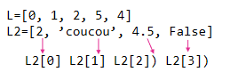
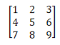

# Types construits (chaines de caractères, listes, dictionnaires et tuples)

## Les listes

En python (pas avec les autres langages) une liste est un ensemble d’éléments du même type OU NON.  
 

### Indexation (posistion dans la liste)
L'index d'un élément, correspond à sa position. On compte à partir de 0.

```python
>>> print (L2[2]) #affiche l'élément d'index 2 de la liste L2
4.5
>>> print(L2[-2])  #2e element en partant de la fin
4.5
```

### Longueur d'une liste (nombre d'objets qu'elle contient)

`len()` Longueur d’une liste : renvoie le nombre d’éléments
```python
print(len(L2))
>>> 4
```

!!! warning "Remarque"
	Le denier index de la liste correspond donc à la longueur -1.

### Découper une liste

On peut avoir besoin d'utiliser seulement une partie de la liste. Seulement de début, ou seulement la fin par exemple. On peut alors utiliser les slices pour ne prendre que certains éléments.
`L[a:b]` correspond à la partie de la liste dont les index sont commpris entre a et b-1 (attention b est exclu).   
Si a n'est pas rensigné, on commence au début, si b n'est pas renseigné, on va jusqu'à la fin.

!!! example 'exemples'
	```python
	L=[0,1,2,3,4,5,6,7,8]
	print(L[2:6])
	>>> [2,3,4,5]
	print(L[:6])
	>>> [0,1,2,3,4,5]
	print(L[5:])
	>>> [5,6,7,8]
	print(L[1:2:7]) # index de  1  à 6 avec un pas de 2
	>>> [1,3,5]
	```

!!! note "Remarque"
	L'utilisation du code `L2=L[:]` permet de faire une copie de la liste. Ce code n'est pas équivalent à `L2=L` qui se contente de faire pointer `L2` vers `L`. Donc dans le dernier cas si on modifie `L` cela modifie également `L2` alors qu'avec l'astuce du slice, on fait une copie dont la modification est indépendante.


### Créer une liste
Une liste peut etre créer directement si l'on sait ce qu'elle doit contenir :
```python
L=[1, 'bon', 'chocolat', True, 24,6.7]
```
On peut créer une boucle pour remplir une liste.  il faut d'abord créer  une liste de valeurs identiques par exemple de la taille que l'on souhaite, puis la parcourir pour remplacer les éléments.
```python


>>> [0,2,4,6,8,10,12,14,16,18]
```

Si on souhaite ajouter des éléments un par un, on peut utiliser la méthode `L.append(element)` qui va ajouter un élément à la fin de la liste.
```python

L=[1, 'bon', 'chocolat', True, 24,6.7]
L.append(345)
print(L)
```
```shell
>>> L=[1, 'bon', 'chocolat', True, 24, 6.7, 345]
```

### Parcourir une liste 
Si on a besoin de chercher un élément dans une liste, il va falloir "visiter" les éléments de la liste un par un. Par exemple, on cherche le nombre maximum dans une liste d'entiers, on regarde les éléments un par un et on le mémorise s'il est plus grand que l'élément précédemment mémorisé.

```python
L=[5,8,10,3,5,17,4]
maximum=0
for i in range (0,len(L)):
	if maximum<L[i]:
		maximum=L[i]
print(maximum)
```
!!! note Remarque :
	On peut la parcourir à l'envers en remplaçant `(0,len(L))` par `(len(L)-1,-1,-1)`.


!!! warning  "Plus difficile : Liste par commpréhension"
	On peut créer une liste de manière succinte en une seule ligne, qui correspond en fait à la construction par boucle.
	[element boucle condition]
	```python
	>>> [i*0.5 for i in range(1,10)] #i va de 1 à 9 et les éléments de la liste sont la moitié de i
	[0.5, 1, 1.5, 2, 2.5, 3, 3.5, 4, 4.5]
	[i*0.5 for i in range(1,10) if i%2==0] # même chose sauf que i%2 doit être égal à 0 (c'est-à-dire que i doit etre pair)
	[1, 2, 3, 4]
	```

!!! danger "Liste non exhaustive des méthodes de listes"

	- `liste.append(truc)` : ajoute l’élément unique truc à la fin de la liste  
	- `liste1.extend(liste2)` : rajoute en fin de liste1 la liste2. Equivaut à faire liste1 = liste1 + liste2   
	- `min(liste)` : retourne la valeur minimum d’une liste  
	- `max(liste)` : retourne la valeur maximum d'une liste  
	- `liste.sort()` : trie une liste dans l’ordre croissant (cf. doc pour l’ordre décroissant et les options)  
	- `liste.remove(valeur)` : supprime la première occurrence de valeur dans la liste  
	- `liste.insert(index, valeur)` : insère valeur à l’indice index  
	- `liste.reverse()` : inverse les éléments de la liste  
	- `a=liste.count(valeur)` : la viaiable a prend pour valeur le nombre d’occurrences de valeur dans la liste   
	- `b=liste.index(valeur)` : la variable b prend pour valeur l’index de la première occurrence de valeur dans la liste   
	- `in()` : permet de savoir si un élément est dans une liste `>>>2 in(L)` renvoie `True` ou `False`  


### Les tableaux : listes de listes

Un tableau est une liste de liste. 
Chaque élément de la liste est un ligne du tableau.



```python
tab3x3=[[1,2,3],[4,5,6],[7,8,9]]
```

`tab3x3[1]` est la 2e ligne du tableau
`tab3x3[1][0]` est le 1er élément de la 2e ligne
 

```python
	print(tab3x3[1])
	>>> [4,5,6]
	print(tab3x3[1][0])
	>>> 4
```

!!! note "Remarque"
	Toutes les méthodes de listes sont applicables aux tableaux puisque ce sont des listes.

**Création d'un tableau de N lignes et M colonnes**  
On commence par créer un tableau vide dans lequel on ajoute N lignes vides. Puis on ajoute autant de fois qu'il y a de colonnes ce que l'on veut dans **chaque ligne** du tableau.  
```python
tab=[] #Créer le cadre du tableau
for i in range (N) : #on répète autant de fois qu’on veut de lignes
	Tab.append([]) # création d’un ligne vide

for i in range(N) :
	for j in range (M) : #on répète autant de fois qu’il y a de colonnes
		Tabl[i].append(UnTruc) #on ajoute un truc à la ième ligne
```

**Parcourir un tableau dont on ne connait pas les dimensions**
```python
for i in range(len(tab)) :
	for j in range (len(tab[i])) : #on répète autant de fois qu’il y a de colonnes
		tab[i][j]+=1 
```
`tab[i][j]` est l'élément de tableau de la ligne d'indice i et de la colonne d'index j.


## Les chaînes de caractères
Un texte est un ensemble de caractères (lettres). Tout ce qui concerne les listes s'applique aux chaînes de caractères (sauf certaines des méthodes cités).  

Cetaines méthodes sont spécifiques aux chaînes de caractères :  

- ```chaine.split()``` qui permet de découper une châine de caractères. On choisit le séparateur, par défaut c’est l’espace : on obtient alors tous les mots de la châine. On verra dans le chapitre sur les données qu’un autre séparateur peut être utile (souvent la virgule pour les fichier .csv). On précise le séparateur entre les parenthèses.  
- `“séparateur”.join(liste)` fait l’inverse du split. Il crée une chaîne à partir d’une liste de chaînes. On peut là aussi préciser le séparateur.  
- `chaine.find(sousChaine)` cherche la position d’une sous-chaîne à l’intérieur d’une chaîne.  
- `chaine.index(caractère)` cherche la position d’un caractère à l’intérieur d’une chaîne.  
- `chaine.count(sousChaine)` compte le nombre d’occurences d’une sous-chaîne à l’intérieur d’une chaîne  
- `Chaine1+chaine2` : lie les chaines de caractères sans séparateur  

Et bien d'autres mais il est inutile ici de les répertorier toutes.

## Les dictionnaires
Un dictionnaire en Python va aussi permettre de rassembler des éléments mais ceux-ci seront identifiés par une clé. On peut faire l’analogie avec un dictionnaire de français où on accède à une définition avec un mot.
Contrairement aux listes qui sont délimitées par des crochets, on utilise des accolades pour les dictionnaires.

Par exemple :
Nombre_de_pneus : nom du dictionnaire
"voiture" et "vélo" sont des clés (keys) et 4 et 2 les valeurs (values) correspondantes.
A chaque **clé** correspond une **valeur**. Un couple clé : valeur est appelé **item**.

```python
	Nombre_de_pneus={} # création du dictionnaire vide
	Nombre_de_pneus["voiture"]=4
	Nombre_de_pneus["vélo"]=2
	Nombre_de_pneus["tricycle"]=3
	print(Nombre_de_pneus)
	>>> {'voiture': 4, 'vélo': 2, 'tricycle': 3}
```

#### Méthodes principales d'un dictionnaire

	- dico.get (k) : permet d'accéder à la valeur dont la clé est k dans le dictionnaire dico
	- dico.items() : liste les items du dictionnaire
	- dico.values() : liste les valeurs du dictionnaire
	- dico.pop(k) : supprime l'item dont la clé est k du dictionnaire dico mais récupère la valeur supprimée contrairement à del
	- dico.keys() : liste les clés du dictionnaire
	NB : les méthodes keys, items, et values renvoient un objet que l'on peut transformer en liste par :
	list(nombre_de_roues.values())

**Parcourir un dictionnaire :**
Pour parcourir un dictionnaire et récupérer la clé et la valeur, on utilise :
```python
for cle,valeur in Nombre_de_pneus.items():
	print(cle, 'possède ',valeur,' roues.')
```
```shell
>>> 
voiture possède  4  roues.
vélo possède  2  roues.
tricycle possède  3  roues.
```

Pour ne récupérer que la clé :
```python
for cle in Nombre_de_pneus.keys():
	print(cle)
```
```shell
>>>
voiture
vélo
tricycle
```
ou que la veleur:
```python
for valeur in Nombre_de_pneus.values():
	print(valeur)
```
```shell
>>>
4
2
3
```

## Les tuples (ou n-uplets)


Un tuple est un ensemble de plusieurs éléments (comme une liste). La différence est qu'une fois qu'il a été construit, il n'est plus modifiable. On ne peut pas modifier les valeurs, ni en ajouter, ni en enlever.  
### Affectation et récupération des valeurs

`a=(3,4)` est un tuple contenant 3 et 4.  
`u,v=a` permet de récupérer 3 dans la variable u  et 4 dans la variable v.  
`(b,c)=(5,6)` permet de récupérer 5 dans la variable b  et 6 dans la variable c.  

Les méthodes de listes s'appliquent au tuples, sauf si elles en modifie le contenu.  

