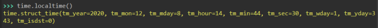

#Coût temporel d'un programme
##Qu'est ce que la compléxité?
Le problème de la complexité temporelle (le temps mis par le programme) est fondamental en informatique. Sur un petit exercice contenant seulement 20 valeurs, les ranger dans l'ordre croissant sera très rapide quel que soit la méthode. Mais s'il faut répéter cela des milliers de fois ou que la taille de la liste est de 50000 valeurs, la qualité de l'algorithme est très importante. Entre l'algorithme le plus performant et le moins performant nous aurons un écart de 15 fois meilleur (dans le pire des cas) pour 20 valeurs et de 10640 fois pour 50000 valeurs! 

Pour évaluer la complexité d'un algorithme on calcule le nombre d'étapes (comparaisons, calculs, affectations) nécessaires pour n données.  


!!! faq "Parcours d'un tableau"
	Lorsqu'on parcourt un tableau pour lire toutes les valeurs, combien d'actions fait-on si on a 20 éléments dans le tableau ?
	```pseudocode
	tab ← tableau de 20 valeurs
	Pour i allant de 0 à 19 :
    	afficher tab[i]
	fin pour
	```

	<div id="text">
  	<form>
	    <input style="border : solid 1px; border-radius : 2px;" type="text" name="reponse" maxlenght="15" id="reponse1" autocomplete="off">
	    <input type='button' style="margin:5px; padding:5px;  background-color : lightblue; border : solid 2px blue; border-radius : 5px;" onclick="reactionText1()" value="Vérifier">  <input id="bouAffText1" type="button" onclick="AfficheText1()" value="Correction" style="display:none;"><br> 
		</form>
	     <div style="font-weight: bold;" id="messageText1"></div>
	     <div id="correctionText1" style="display:none;"> <p> Pour chaque case, on affiche la valeur, on réalise donc une action par case du tableau. Donc ici 20 étapes.</p></div>
	</div>
	


!!! faq "et pour n cases?"
	<div id="text">
	  	<form>
	    <input style="border : solid 1px; border-radius : 2px;" type="text" name="reponse" maxlenght="15" id="reponse2" autocomplete="off">
	    <input type='button' style="margin:5px; padding:5px;  background-color : lightblue; border : solid 2px blue; border-radius : 5px;" id="BoutonValider" onclick="reactionText2()" value="Vérifier">  <input id="bouAffText2" type="button" onclick="AfficheText2()" value="Correction" style="display:none;"><br>  
		</form>
     <div style="font-weight: bold;" id="messageText2"></div>
     <div id="correctionText2" style="display:none;"> <p> Si on ne fait qu'une instruction par case, on aura autant d'actions que de cases soit n étapes.</p></div>
	</div>


### Et si on en fait plus?
Pour chaque valeur du tableau, on additionne la valeur courante avec la suivante.
```pseudocode
tab ← tableau de 20 valeurs
pour i allant de 0 à 18 :
    lire tab[i]
    lire tab[i+1]
    afficher (tab[i]+tab[i+1])
fin pour
```
A chaque case (sauf pour la dernière) on effectue ici 3 étapes.  
Pour 20 valeurs on aura 3x(20-1) = 57 étapes  

Pour n valeurs : 3x(n-1)  

On dit que l'algorithme est **d'ordre n (O(n))** (on ne s'occupe pas des constantes). Une telle complexité est dite linéaire.  
Si le calcul d'une complexité nous amène à un ordre de 4n²+3n+1 on dira que la complexité est un **O(n²)**. Une complexité d'ordre **O(n²)** est une complexité quadratique.  
Une complexité de l'ordre **O(nlog(n))** est dite quasi-linéaire.

On peut s'intéresser à la complexité d'un algorithme dans: le meilleur des cas, le cas moyen et le pire des cas. Pour comparer des algorithme entre eux, on comparera en générale leur complexité dans le pire des cas.

!!! info "Qu'est ce qu'une instruction élémentaire qui doit compter comme une étape?"  

	- Une addition
	- une soustraction
	- Une multiplication, une division, Mod (%), Div
	- Une opération arithmétique simple (sans appel de fonctions)
	- Une comparaison, les opérations booléennes (et,ou,non)
	- une affectation
	- Des opérations de lectures et d'écritures simples.  
	*A noter que l'incrémentation pour passer d'un élément à l'autre dans une boucle n'est pas considérée comme une étape*

!!! faq "Calcul de la moyenne d'un tableau"
	Voici un algorithme. Quel est le type de complexité pour l'exécuter?
	```pseudocode
	➦ initialiser total à 0
	➦ pour tous les éléments de la Liste
		➦ additionner l'élément à total
	➦ diviser le total par le nombre d'éléments	
	```
	<form id="test1">
		<label><input type="radio" name="test" value="A"> linéaire</label><br>
		<label><input type="radio" name="test" value="B"> quasi-linéaire</label><br>
		<label><input type="radio" name="test" value="C">quadratique</label><br>
	    <input type="button" style="margin:5px; padding:5px;  background-color : lightblue; border : solid 2px blue; border-radius : 5px;" id="BoutonValider" id="bouton" type="button" onclick="reactionQCU1()" value="Vérifier">  <input id="bouAffQCU" type="button" onclick="AfficheQCU()" value="Correction" style="display:none;"><br><br>
	</form>
         <div  style="font-weight: bold;" id="messageQCU1"></div>
         <div id="correctionQCU" style="display:none;"> <p> Une seule étape par élément de la liste soit n puis la division finale : n+1 = O(n)</p></div>

	


!!! faq "Recherche de maximum"
	Quelle est la complexité de cet algorithme ?  
	*La réponse attendue est un seul mot*  
	```pseudocode
	➦ initialiser maximum à l'élément 0 de la liste
	➦ pour tous les éléments de la Liste à partir du 2nd
		➦ si l'élément est plus grand que maximum
			➦ mettre maximum à la valeur de élément
	➦ afficher maximum
	```

	<form>
	    <input style="border : solid 1px; border-radius : 2px;" type="text" name="reponse" maxlenght="15" id="reponse3" autocomplete="off">
	    <input type='button' style="margin:5px; padding:5px;  background-color : lightblue; border : solid 2px blue; border-radius : 5px;" id="BoutonValider" onclick="reactionText3()" value="Vérifier">  <input id="bouAffText3" type="button" onclick="AfficheText3()" value="Correction" style="display:none;"><br> 
    </form>
     <div style="font-weight: bold;" id="messageText3"></div>
     <div id="correctionText3" style="display:none;"> <p> 	1+(n-1)*2+1 = 2n-2+1=2n-1=>O(n) complexité linéaire  
	affectation de la variable maximum et l'affichage du max correspondent aux deux 1 que l'on trouve dans le calcul.</p></div>


!!! faq "Comparer deux algorithmes"
	On cherche à comparer les deux algorithmes :
	```pseudocode
	## Algorithme 1
	➦ Soit T la valeur à trouver
	➦ initialiser trouve à Faux
	➦ pour tous les éléments de la Liste
		➦ si l'élément = T
			➦trouve = Vrai
	➦ afficher trouve

	## Algorithme 2
	➦ soit T la valeur à trouver
	➦ soit L la longueur de la liste
	➦ initialiser trouve à Faux
	➦ initialiser i à 0
	➦ tant que i < L et élément i de liste pas égal à T
		➦ incrémenter i
	➦ si i < L alors
		➦ trouve=True
	➦ affiche trouve
	```
	Pour une liste de 20 éléments :

	Le meilleur des cas est le cas ou la valeur recherchée est à la position 
	<input style="border : solid 1px; border-radius : 2px;" type="text" name="reponse" maxlenght="15" id="reponse4" autocomplete="off"> 
	(on attend l'index de la liste en python). Le pire des cas est celui où la valeur recherchée est à la position
	<input style="border : solid 1px; border-radius : 2px;" type="text" name="reponse" maxlenght="15" id="reponse5" autocomplete="off">.
	L'algorithme 1 dans le meilleur des cas fait 
	<input style="border : solid 1px; border-radius : 2px;" type="text" name="reponse" maxlenght="15" id="reponse6" autocomplete="off"> opérations. Le deuxième fait  <input style="border : solid 1px; border-radius : 2px;" type="text" name="reponse" maxlenght="15" id="reponse7" autocomplete="off">
	opérations.
	Dans le pire des cas, l'algorithme 1 fait opérations opérations
	<input style="border : solid 1px; border-radius : 2px;" type="text" name="reponse" maxlenght="15" id="reponse8" autocomplete="off">
	. Le deuxième fait 
	<input style="border : solid 1px; border-radius : 2px;" type="text" name="reponse" maxlenght="15" id="reponse9" autocomplete="off"> opérations.
	La complexité de l'algorithme 1 est
	<input style="border : solid 1px; border-radius : 2px;" type="text" name="reponse" maxlenght="15" id="reponse10" autocomplete="off">
	et celle du 2 est <input style="border : solid 1px; border-radius : 2px;" type="text" name="reponse" maxlenght="15" id="reponse11" autocomplete="off">.  

<input type='button' style="margin:5px; padding:5px;  background-color : lightblue; border : solid 2px blue; border-radius : 5px;" id="BoutonValider" onclick="reactionText4()" value="Vérifier"> <div style="font-weight: bold;" id="messageText4"></div>
<input type='button' style="display: none;" id="boutoncorrection" onclick="affiche1()" value="Correction">

<div id="correction1" style='display: none;'><p>Le meilleur des cas est le cas ou la valeur recherchée est à la position 0 (on attend l'index de la liste en python). Le pire des cas est celui où la valeur recherchée est à la position 19.
L'algorithme 1 dans le meilleur des cas fait opérations 43 opérations. Le deuxième fait 10 opérations.
Dans le pire des cas, l'algorithme 1 fait opérations 43 opérations. Le deuxième fait 67 opérations.
La complexité de l'algorithme 1 est linéaire et celle du 2 est linéaire.</p></div>


### Module time
Le module `time` permet de gérer le temps.  
Tout part du nombre de seconde (microsecondes même) qui se sont écoulées depuis le 1er janvier 1970 à minuit. Cette date est appelée Epoch Time.

<iframe src="https://trinket.io/embed/python3/af01bb1340" width="100%" height="356" frameborder="0" marginwidth="0" marginheight="0" allowfullscreen></iframe>

**Affichage de l'heure locale**
<div id=center>
	
</div>

Renvoie un objet contenant :

- `tm_year` : l'année sous la forme d'un entier ;
- `tm_mon`: le numéro du mois (entre 1 et 12) ;
- `tm_mday`: le numéro du jour du mois (entre 1 et 31, variant d'un mois et d'une année à l'autre) ;
- `tm_hour`: l'heure du jour (entre 0 et 23) ;
-  `tm_min`: le nombre de minutes (entre 0 et 59) ;
- `tm_sec`: le nombre de secondes (entre 0 et 61, même si on n'utilisera ici que les valeurs de 0 à 59, c'est bien suffisant) ;
- `tm_wday`: un entier représentant le jour de la semaine (entre 0 et 6, 0 correspond par défaut au lundi) ;
- `tm_yday`: le jour de l'année, entre 1 et 366 ;
- `tm_isdst`: un entier représentant le changement d'heure local.


###Module Matplotlib
Déjà probablement utilisé en sciences physiques, le module matplotlib permet de tracer des graphiques.  
L'idée ici est de comparer les complexités selon la taille du tableau.  
Voici comment tracer un graphique avec deux séries de valeurs (abscisses et ordonnées) :  
```python
#importation du module
import matplotlib.pyplot as plt

#liste des valeurs d'abscisses
x = [0, 1, -1, 0]
#liste des valeurs d'ordonnées
y = [0, 1, 1, 0]
#tracé du graphique
plt.plot(x, y)
#affichage du graphique
plt.show()
plt.close()
```

Pour tracer plusieurs graphiques sur la même fenêtre :

```python
import matplotlib.pyplot as plt

x = [0, 1, 0]
y = [0, 1, 2]

x1 = [0, 2, 0]
y1 = [2, 1, 0]

x2 = [0, 1, 2]
y2 = [0, 1, 2]

plt.plot(x, y)
plt.plot(x1, y1)
plt.plot(x2, y2)
plt.show()
plt.close()
```
Voici quelques propriétés des fenêtres graphiques (mais il y en a plein d'autres RTFM)
```python
import matplotlib.pyplot as plt

x = [0.25, 0.25, 1.25, 0.5, 1, 0.25, 0.6, 0, -0.6, -0.25, -1, -0.5, -1.25, -0.25, -0.25, 0.25]
y = [0, 0.5, 0.5, 1, 1, 1.5, 1.5, 2, 1.5 , 1.5, 1, 1, 0.5, 0.5, 0, 0]
#les prorpiétés permettent ici de définir la couleur le style de trait
plt.plot(x, y, '-.', color = "green")
#titre
plt.title("Mon beau sapin")

plt.axis('equal')
# titre des axes
plt.xlabel("C'est Noel")
plt.ylabel("Vive le vent")
plt.show()
plt.close()

```


##Exercices
###Exercice 1
Écrire le programme qui calcule le maximum et le minimum d'un tableau en utilisant l'algorithme ci-dessus

###Exercice 2
Écrire les programmes de recherche de valeur avec les deux algorithmes. Faire afficher le nombre d'étapes exécutées et comparer à la complexité dans le pire des cas. A-t-on autant d'étapes que celles évaluées sur la complexité ?  

!!! note "Comparer les compléxités"
	Après avoir codé la recherche de valeurs avec les deux algorithmes de recherche de valeur (exercice 2), récupérer le nombre d'étapes en fonction de la taille de la liste et tracer les deux graphiques dans la même fenêtre.

###Exercice 3
Codez une fonction qui cherche le maximum d'une liste en ne tenant pas compte des valeurs supérieures ou égales à 10.

Faire compter les étapes au programme et comparer avec les camarades.

###Exercice 4
Une liste contient des listes de coordonnées dans l'espace (x,y,z). On cherche le point le plus bas! Réalisez ce codage en recherchant la complexité minimum

###Exercice 5
Une liste contient des listes de coordonnées dans l'espace (x,y,z). On cherche si un point de la liste a une abscisse donnée, ou une ordonnée données ou une profondeur donnée.


<p style="text-align: center; color:gray; font-size: 10px;">
Création MB. (ré)utilisation et modification libre mais non commerciale CC-BY-NC
</p>

<!---Javascript-->
<script>
function reactionText1(){
	var msg;
	var reponse=document.getElementById("reponse1");
	if (reponse.value ==='20'){
		msg='bravo';
		style='style="color:green;"';
		}
	else{msg='non, essaye encore';
	style='style="color:red;"';}
	document.getElementById("messageText1").innerHTML='<p '+style+'>'+msg+'</p>';
	document.getElementById("bouAffText1").style="margin:5px; padding:5px;  background-color : lightblue; border : solid 2px blue; border-radius : 5px;display:inline;";
}

function AfficheText1(){
	document.getElementById("correctionText1").style="display:block;";
}

function reactionText2(){
	var msg;
	var reponse=document.getElementById("reponse2");
	if (reponse.value ==='n'){
		msg='bravo';
		style='style="color:green;"';
		}
	else{msg='non, essaye encore';
	style='style="color:red;"';}
		document.getElementById("messageText2").innerHTML='<p '+style+'>'+msg+'</p>';
		document.getElementById("bouAffText2").style="margin:5px; padding:5px;  background-color : lightblue; border : solid 2px blue; border-radius : 5px;display:inline;";
}

function AfficheText2(){
	document.getElementById("correctionText2").style="display:block;";
}
	

function reactionQCU1(){
	var style;
	var msg;
	var reponse = document.getElementById("test1");
	var rep=reponse.elements["test"].value;
	console.log(rep);
	if (rep=="A"){msg='bonne réponse';
	style='style="color:green;"';
	}
	else {msg='mauvaise reponse';
	style='style="color:red;"';}
	document.getElementById("messageQCU1").innerHTML='<p '+style+'>'+msg+'</p>';
	document.getElementById("bouAffQCU").style="margin:5px; padding:5px;  background-color : lightblue; border : solid 2px blue; border-radius : 5px;display:inline;";
}
/*affiche la réponse si on clique sur le bouton correction*/
function AfficheQCU(){
	document.getElementById("correctionQCU").style="display:block;";
}

function reactionText3(){
	var msg;
	var reponse=document.getElementById("reponse3");
	if (reponse.value =='linéaire' || reponse.value =='lineaire' || reponse.value =='Linéaire' || reponse.value =='Lineaire'){
		msg='bravo';
		style='style="color:green;"';
		}
	else{msg='non, essaye encore';
	style='style="color:red;"';}
	document.getElementById("messageText3").innerHTML='<p '+style+'>'+msg+'</p>';
	document.getElementById("bouAffText3").style="margin:5px; padding:5px;  background-color : lightblue; border : solid 2px blue; border-radius : 5px;display:inline;";
}

function AfficheText3(){
	document.getElementById("correctionText3").style="display:block;";
}

function reactionText4(){
	var msg;
	console.log('fonction executee');
	var reponse4=document.getElementById("reponse4");
	var reponse5=document.getElementById("reponse5");
	var reponse6=document.getElementById("reponse6");
	var reponse7=document.getElementById("reponse7");
	var reponse8=document.getElementById("reponse8");
	var reponse9=document.getElementById("reponse9");
	var reponse10=document.getElementById("reponse10");
	var reponse11=document.getElementById("reponse11");
	if (reponse4.value ==='0' &&
		reponse5.value ==='19' &&
		reponse6.value ==='43' &&
		reponse7.value ==='10' &&
		reponse8.value ==='43' &&
		reponse9.value ==='67' &&
		reponse10.value ==='linéaire' &&
		reponse11.value ==='linéaire'){
		msg='bravo';
		style='style="color:green;"';
		}
	else{msg='Vous avez des erreurs';
	style='style="color:red;"';}
	document.getElementById("messageText4").innerHTML='<p '+style+'>'+msg+'</p>';
	document.getElementById("boutoncorrection").style="margin:5px; padding:5px;  background-color : lightblue; border : solid 2px blue; border-radius : 5px;display:inline;";
	}
function affiche1(){
	document.getElementById("correction1").style="display:block;";}
	

</script>