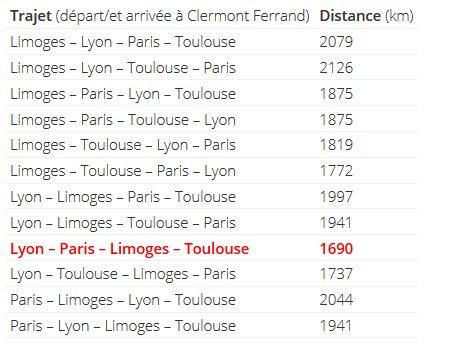

# Correction du petit exemple
Il y a 4X3x2x1/2 trajets possibles (soit 12 trajets car on ne tient pas compte de Limoges Lyon Paris Toulouse et Toulouse paris Lyon Limoges puisque c'est la même distance)

