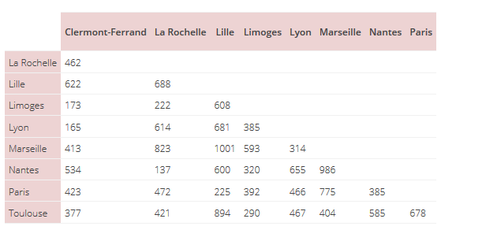
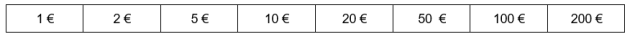
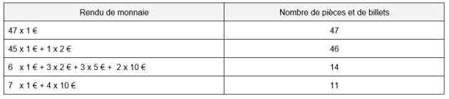
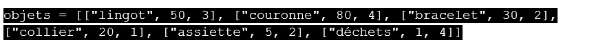

# Les Algorithmes gloutons
## Présentation
En programmation, on cherche à optimiser le problème, c'est-à-dire à trouver la meilleure solution. On cherche à diminuer le temps de calcul, l'utilisation de la mémoire, et surtout l'efficacité. On souhaite que la solution soit trouvée à chaque fois (ou au moins le plus souvent possible).  

Pour résoudre un problème d'optimisation nous auront besoin : 

- d'un problème aux multiples solutions  
- d'une fonction permettant d'évaluer la résolution   
- l’existence d'une solution optimale ou assez bonne  

!!! example "Un petit exemple"
	Un voyageur souhaite visiter plusieurs villes de France, dans n'importe quel ordre, mais en minimisant la distance parcourue.
	Départ et arrivée à Clermont-Ferrand.  
	Villes à visiter : Limoges, Lyon, Paris et Toulouse.  
	Le tableau suivant donne les distances routières kilométriques entre plusieurs villes de France :
	
	1. Déterminer tous les trajets possibles et en déduire le trajet optimal.  
	*On ne comptera pas deux fois les mêmes trajets effectués dans deux sens différents*  
    Pour débloquer la solution entrer le code correspondant au nombre de trajets trouvés :  
    <iframe src="https://lockee.fr/o/yTAfGoCJ?noft" height="500" style="width:100%;" frameborder="0" ></iframe>
	2. Calculer le nombre de trajets possibles si le voyageur décide de visiter toutes les villes du tableau.
	*On donnera que la façon de calculer le nombre de coombinaisons possibles avec n chiffres est nx(n-1)x(n-2)x...x1 = n! (factorrrielle n)*  
    *compter le nombre de villes*  
    <iframe src="https://lockee.fr/o/qrK8Peae?noft" height="500" style="width:100%;" frameborder="0" ></iframe>


## Problème de rendu de monnaie
Le but est de programmer une caisse automatique pour qu'elle rende la monnaie de façon optimale, c'est-à- dire avec le nombre minimal de pièces et de billets.
Nous disposons de toutes ces pièces et nous en avons autant que l'on veut !


Vous souhaitez acheter un objet d'une valeur de 53 € et vous payez avec un billet de 100 €.   
La caisse doit vous rendre : 100 - 53 = 47 € mais de quelle façon !  
En effet, Il existe un grand nombre de possibilités pour vous rendre la monnaie :  


Nous pourrions ainsi lister l'ensemble de ces possibilités de façon “méthodique” en utilisant un arbre mais cet algorithme serait très “coûteux” en temps de calcul.
Imaginons un exemple en partant simplement de la valeur 11 €  


Nous allons donc utiliser un algorithme “glouton” pour optimiser ce problème.

> Définition : A chaque étape, on effectue le choix qui semble le meilleur, sans jamais remettre en question les choix déjà effectués.

Pour le rendu de monnaie, c'est assez simple, il suffit de prendre à chaque étape la plus grande valeur de billet ou de pièce. Dans notre système monétaire, cet algorithme est pratiquement toujours la solution la plus optimisée mais nous allons verrons plus loin que ce n'est pas toujours le cas.  
Voici l'algorithme proposé, il sera à implémenter plus tard.  
La fonction `renduMonnaie()` prendra en argument la somme à rendre et la liste des pièces et billets à disposition. Cette fonction retournera la liste des pièces et billets à rendre  
```pseudocode
def renduMonnaie(somme, liste):
    Initialisation d'un tableau monnaie à la liste vide.
    Initialisation de somme_restante à somme
    Tant que la somme_restante est >0
        Choisir valeur_choisie dans la liste la plus grande valeur de monnaie qui ne dépasse pas somme_restante.
        Ajouter cette valeur_choisie à monnaie
        Somme_restante =  Somme_restante - valeur choisie
    Fin tant que
renvoie monnaie 
```

!!! example "Exemple 1 : on dispose de toutes les pièces"
    

!!! example "Exemple 2 :"
	L'algorithme est-il toujours optimisé si vous ne disposez plus de toutes les pièces ...
	A vous de résoudre cette situation à la main dans un premier temps.
	somme = 63
	liste = [1, 2, 20, 50, 100, 200]...
	**Vous avez bien lu, il ne reste plus de pièces de 5 € , ni de billets de 10 €!!**  
    Pour débloquer la solution, trouver au moins le nombre de pièces rendues :  
    <iframe src="https://lockee.fr/o/JD6XgHKb?noft" height="500" style="width:100%;" frameborder="0" ></iframe>


### Implémentation
!!! faq "A faire"
	Programmer le rendu de monnaie et vérifier le résultat pour les exemples 1 et 2.

!!! note "Situation Canonique"
	La situation du rendu de monnaie, ici, est canonique c'est à dire qu'elle arrive toujours à une solution optimale. Ceci est lié à notre système de monnaie.  
	Avec un autre système monétaire, on pourrait se retrouver avec des résultats qui ne seraient pas satisfaisants : la somme rendue peut être supérieure ou inférieure à la somme dûe.  
	L'ancien système monétaire britannique était composé de pièces de (1,3,6,12,24,30).  
	Modifier le système de monnaie et vérifier que le programme n'est plus optimal.  


## Problème du sac à dos
{align=left}
Vous êtes chasseur de trésors ! Après de longues heures d'aventure, des dangers évités de justesse, et malgré une armée de pilleurs à vos trousses, vous avez trouvé un énorme TRÉSOR !  
Vous êtes heureux, vous sautez de joie et lancez des pièces en l'air !  
Finalement vous retrouvez votre calme et commencez à réfléchir vite (n'oubliez pas l'armée de pillards qui est sur vos traces...).  
{align=right}
Votre sac à dos est assez solide pour n'emporter que 10 kg et le trésor pèse bien plus... Il va vous falloir choisir les objets à emporter. Heureusement vous êtes prévoyant et vous avez la liste des objets présents dans le coffre ainsi que leur masse et leur valeur (Comment ça “ce n'est pas très crédible” ? Vous êtes vraiment chasseur de trésor vous ?)  
En bon “geek” que vous êtes, vous avez toujours votre IDE Python favorite sur vous. Il va falloir créer un algorithme de remplissage de votre sac à dos et fissa si vous ne voulez pas finir ruiné voire pire...  
Il s'agit de choisir les objets à emporter dans le sac afin d'obtenir la valeur totale la plus grande tout en respectant la contrainte du poids maximal. C'est un problème d'optimisation avec contrainte.  
Ce problème peut se résoudre par force brute, c'est-à-dire en testant tous les cas possibles. Mais ce type de résolution présente un problème de complexité. Son coût en fonction du nombre d'objets disponibles croît de manière exponentielle. 
Vous envisagerez plutôt une stratégie gloutonne (méthode heuristique dans la vidéo suivante).
Le principe d'un algorithme glouton est de faire le meilleur choix pour le premier objet, puis le meilleur choix pour le deuxième, et ainsi de suite sans jamais remettre en cause le choix précédent !  

Que faut-il entendre par “meilleur choix” ?
- Est-ce prendre l'objet qui a la plus grande valeur ?  
- Est-ce prendre l'objet qui a la plus petite masse ?  
- Est-ce prendre l'objet le rapport valeur/poids le plus grand ?  
- Le choix le plus “spontané” serait de prendre les objets qui ont les valeurs les plus élevées ?  
- Est ce vraiment le bon ?  
Bien sur, si vous êtes joueur, vous pouvez essayer de tout tester ;-) mais nous vous conseillons vivement de regarder cette vidéo avant de vous lancer dans la programmation : 
<iframe width="560" height="315" src="https://www.youtube.com/embed/w0Q-X4F2iFU" title="YouTube video player" frameborder="0" allow="accelerometer; autoplay; clipboard-write; encrypted-media; gyroscope; picture-in-picture" allowfullscreen></iframe>

### A vous de l'implémenter

Vous disposez de plusieurs programme “squelette” qui contient l'ossature de vos différentes fonctions. Elles sont documentées `(docstring)` et testées `(assert)`.
Vous disposez également d'une liste des objets présents pour tester vos différentes fonctions :


La fonction (valeur) permet de trier la liste des objets en fonction de leur valeur.

Cette fonction est déjà complétée

**Sac_v1.py**
```python
## Chasse au trésor : glouton sac a dos
## liste des objets dispo chaque objet est représenté par une liste
## item 0 : nom de l 'objet en str
## item 1 : valeur de l'objet en float
## item 2 : masse de l'objet en int
from operator import itemgetter      # pour utiliser la fonction sorted en choisissant l'élément qui sert au tri

objets = [["lingot", 50, 3], ["couronne", 80, 4], ["bracelet", 30, 2], ["collier", 20, 1], ["assiette", 5, 2], ["déchets", 1, 4]]

def valeur(liste) :
    """
    trie les objets de la liste par valeur décroissante
    parametre :
    liste : la liste des objets à trier
    
    return :
    liste : la liste triée
    """
    liste = sorted(liste, key = itemgetter(1), reverse = True)
    return liste

assert(valeur([["lingot", 50, 3], ["couronne", 80, 4], ["bracelet", 30, 2], ["collier", 20, 1], ["assiette", 5, 2], ["déchets", 1, 4]])) == [['couronne', 80, 4], ['lingot', 50, 3], ['bracelet', 30, 2], ['collier', 20, 1], ['assiette', 5, 2], ['déchets', 1, 4]]

def sacGlouton(liste, maxSac) :
    """
    parametres :
    liste  : la liste des objets à choisir c'est une liste de liste
    maxSac : masse max que peut supporte le sac (int)
    
    return :
    objetsSac    : la liste des objets sélectionnés
    masseTotale  : la masse du sac
    valeurTotale : la valeur du contenu
    """
    ## A COMPLETER
    return objetsSac, masseTotale, valeurTotale

assert(sacGlouton([['lingot', 50, 3], ['couronne', 80, 4], ['bracelet', 30, 2], ['collier', 20, 1], ['assiette', 5, 2], ['déchets', 1, 4]], 10) == ([['couronne', 80, 4], ['lingot', 50, 3], ['bracelet', 30, 2], ['collier', 20, 1]], 10)
```

Une version plus subtile vous permettra de tester différentes méthodes heuristiques pour optimiser votre choix. (soit par valeur, soit par masse ou rapport valeur/masse)  
La dernière fonction sacGlouton est la partie du programme qui sélectionne les trésors à emporter.  
**Sac_v2.py**
```python
# glouton sac a dos
## liste des objets dispo chaque objet est représenté par une liste
## item 0 : nom de l 'objet en str
## item 1 : valeur de l'objet en float
## item 2 : masse de l'objet en float
from operator import itemgetter # pour utiliser la fonction sorted en choisissant l'élément qui sert au tri

objets = [["lingot", 50, 3], ["couronne", 80, 4], ["bracelet", 30, 2], ["collier", 20, 1], ["assiette", 5, 2], ["déchets", 1, 4]]

def valeur(liste) :
    """
    trie les objets de la liste par valeur décroissante
    parametre :
    liste : la liste des objets à trier
    return :
    liste : la liste triée
    """
    liste = sorted(liste, key = itemgetter(1), reverse = True)
    return liste

assert(valeur([["lingot", 50, 3], ["couronne", 80, 4], ["bracelet", 30, 2], ["collier", 20, 1], ["assiette", 5, 2], ["déchets", 1, 4]])) == [['couronne', 80, 4], ['lingot', 50, 3], ['bracelet', 30, 2], ['collier', 20, 1], ['assiette', 5, 2], ['déchets', 1, 4]]


def masse(liste) :
    """
    trie les objets par masse croissante
    parametre :
    liste : la liste des objets à trier
    return :
    liste : la liste triée
    """
    ### A COMPLETER
    return liste

assert(masse([["lingot", 50, 3], ["couronne", 80, 4], ["bracelet", 30, 2], ["collier", 20, 1], ["assiette", 5, 2], ["déchets", 1, 4]])) == [['collier', 20, 1], ['assiette', 5, 2], ['bracelet', 30, 2], ['lingot', 50, 3], ['déchets', 1, 4], ['couronne', 80, 4]]


def rapport(liste) :
    """
    trie les objets par leur rapport valeur/masse, en cas d'égalité, on pourra favoriser l'objet le plus léger
    parametre :
    liste : la liste des objets à trier
    return :
    listeTriee : la liste triée
    """
    ## A COMPLETER
    return listeTriee

assert(rapport([["lingot", 50, 3], ["couronne", 80, 4], ["bracelet", 30, 2], ["collier", 20, 1], ["assiette", 5, 2], ["déchets", 1, 4]])) == [['couronne', 80, 4], ['collier', 20, 1], ['lingot', 50, 3], ['bracelet', 30, 2], ['assiette', 5, 2], ['déchets', 1, 4]]

def sacGlouton(liste, maxSac, choixTri) :
    """
    parametres :
    liste : la liste des objets à choisir c'est une liste de liste
    maxSac : masse max que peut supporte le sac (int)
    choixTri : si on choisit de faire un tri des objets par masse, valeur ou rapport (str)
    return :
    objetsSac : la liste des objets sélectionnés
    masseTotale : la masse du sac
    valeurTotale : la valeur du contenu
    """
    ## A COMPLETER
    return objetsSac, masseTotale, valeurTotale

assert(sacGlouton([['lingot', 50, 3], ['couronne', 80, 4], ['bracelet', 30, 2], ['collier', 20, 1], ['assiette', 5, 2], ['déchets', 1, 4]], 10, rapport)) == ([['couronne', 80, 4], ['collier', 20, 1], ['lingot', 50, 3], ['bracelet', 30, 2]], 10, 180)
assert(sacGlouton([['lingot', 50, 3], ['couronne', 80, 4], ['bracelet', 30, 2], ['collier', 20, 1], ['assiette', 5, 2], ['déchets', 1, 4]], 10, masse)) == ([['collier', 20, 1], ['assiette', 5, 2], ['bracelet', 30, 2], ['lingot', 50, 3]], 8, 105)
assert(sacGlouton([['lingot', 50, 3], ['couronne', 80, 4], ['bracelet', 30, 2], ['collier', 20, 1], ['assiette', 5, 2], ['déchets', 1, 4]], 10, valeur)) == ([['couronne', 80, 4], ['lingot', 50, 3], ['bracelet', 30, 2], ['collier', 20, 1]], 10, 180)
    
```
Si vous commencez par la version simple (Sac_v1.py), vous ne perdrez absolument pas votre temps car votre travail va vous permettra d'implémenter assez facilement la version adaptative qui permet de faire des comparaisons ( Sac_v2.py )  
A vous de les compléter pour emporter les meilleurs pièces du trésor avant l'arrivée de vos ennemis !  
Vous présenterez vos résultats sous la forme d'une phrase en français indiquant la valeur dans le sac à dos, sa masse et la liste des objets !  
<SCRIPT>

function AccesProtege1() {
	self.location.href=prompt("Mot de passe (nombre de solutions trouvées) :","") + ".html";
	}
function AccesProtege2() {
	self.location.href=prompt("Mot de passe (nombre de solutions trouvées) :","") + ".html";
	}

</SCRIPT>