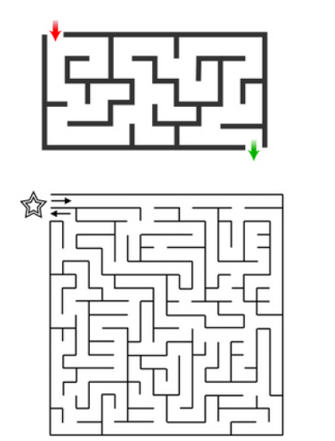
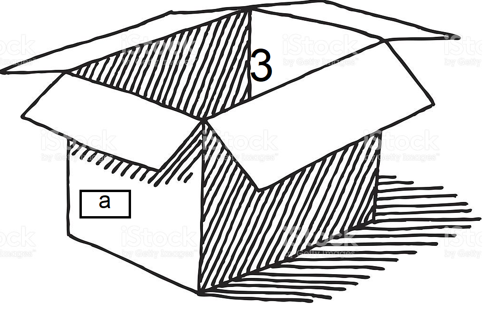
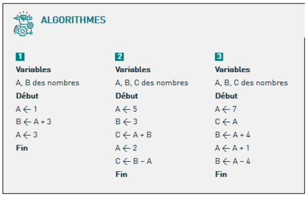
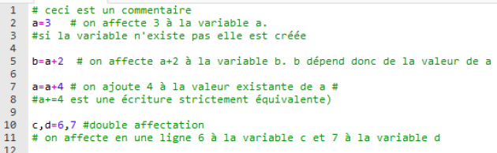

#Introduction à l'algorithmie

## Recette des crèpes

- poser 500g de farine en tas  
- creuser un trou au somment  
- casser 3 œufs dans le trou  
- malaxer à la main  
- dans un saladier, ajouter un demi litre de lait  
- mélanger au fouet  
- cuire les crêpes à feu doux  

Ceci est une liste d'étapes à réaliser dans l'ordre et en respectant les quantités afin de réussir sa recette.
Les consignes sont précises et si une seule étape n'est pas réalisée comme demandé, le résultat ne sera pas celui attendu.

!!! faq "Les labyrinthes"
	Pour sortir d'un labyrinthe à coup sur, poser la main droite sur le mur et longer le mur sans jamais décoller la main. Lorsqu'il n'y a plus de mur, vous êtes sorti.  
	Cet méthode permet-elle de sortir des labyrinthes proposés ?  
	  
	<div><form id="test">
	    <label><input type="radio" name="test" value="oui"> oui</label><br>
	    <label><input type="radio" name="test" value="non"> non</label><br>
	    <input  type="button" style="margin:5px; padding:5px;  background-color : lightblue; border : solid 2px blue; border-radius : 5px;" onclick="reactionQCU1()" value="Vérifer"> 
	    <input id="bouAffQCU1" type="button" onclick="AfficheQCU1()" value="Correction" style="display:none;"><br>
	</form></div>
        <div id="messageQCU1"></div>
        <div id="correctionQCU1" style="display:none;"> <p> Cette méthode peut être longue dans le cas du 2eme labyrinthe notamment mais elle est fiable à 100% ! !</p></div>

>Définition : L'algorithme

>Un algorithme est une suite d'instruction précises et sans ambiguïté permettant de résoudre un problème à partir de certaines données.

### Algorithmes de la vie quotidienne

!!! faq "Ma journée"
	Mettre dans l'ordre les étapes à suivre pour aller au travail.  
	<div>
	<form name="f">
		étape 1 :
	    <select id="liste1">
	        <option value="nonChoix" selected> ... </option>
	        <option value="installer"> S'installer à son poste de travail </option>
	        <option value="sortir"> Sortir de sa voiture </option>
	        <option value="garer"> se garer</option>
	        <option value="lever"> Se lever </option>
	        <option value="monter"> Monter dans sa voiture</option>
	        <option value="rondpoint"> prendre la 3e sortie au rondpoint</option>
	    </select><br>
	    étape 2 :
	    <select id="liste2">
	        <option value="nonChoix" selected> ... </option>
	        <option value="installer"> S'installer à son poste de travail </option>
	        <option value="sortir"> Sortir de sa voiture </option>
	        <option value="garer"> se garer</option>
	        <option value="lever"> Se lever </option>
	        <option value="monter"> Monter dans sa voiture</option>
	        <option value="rondpoint"> prendre la 3e sortie au rondpoint</option>
	    </select><br>
		étape 3 :
		<select id="liste3">
	        <option value="nonChoix" selected> ... </option>
	        <option value="installer"> S'installer à son poste de travail </option>
	        <option value="sortir"> Sortir de sa voiture </option>
	        <option value="garer"> se garer</option>
	        <option value="lever"> Se lever </option>
	        <option value="monter"> Monter dans sa voiture</option>
	        <option value="rondpoint"> prendre la 3e sortie au rondpoint</option>
	    </select><br>
		étape 4 :
	    <select id="liste4">
	        <option value="nonChoix" selected> ... </option>
	        <option value="installer"> S'installer à son poste de travail </option>
	        <option value="sortir"> Sortir de sa voiture </option>
	        <option value="garer"> se garer</option>
	        <option value="lever"> Se lever </option>
	        <option value="monter"> Monter dans sa voiture</option>
	        <option value="rondpoint"> prendre la 3e sortie au rondpoint</option>
	    </select><br>
		étape 5 :
	    <select id="liste5">
	        <option value="nonChoix" selected> ... </option>
	        <option value="installer"> S'installer à son poste de travail </option>
	        <option value="sortir"> Sortir de sa voiture </option>
	        <option value="garer"> se garer</option>
	        <option value="lever"> Se lever </option>
	        <option value="monter"> Monter dans sa voiture</option>
	        <option value="rondpoint"> prendre la 3e sortie au rondpoint</option>
	    </select><br>
		étape 6 :
	    <select id="liste6">
	        <option value="nonChoix" selected> ... </option>
	        <option value="installer"> S'installer à son poste de travail </option>
	        <option value="sortir"> Sortir de sa voiture </option>
	        <option value="garer"> se garer</option>
	        <option value="lever"> Se lever </option>
	        <option value="monter"> Monter dans sa voiture</option>
	        <option value="rondpoint"> prendre la 3e sortie au rondpoint</option>
	    </select><br>
	        <input type='button' style="margin:5px; padding:5px;  background-color : lightblue; border : solid 2px blue; border-radius : 5px;" id="BoutonValider" onclick="reactionListe2()" value="Vérifier">
	        <input id="bouAffListe2" type="button" onclick="AfficheListe2()" value="Correction" style="display:none;"><br>
	</form></div>
    <div id="messageListe2"></div>
    <div id="correctionListe2" style="display:none;"> <p> Dans l'ordre, je me lève, je monte dans ma voiture je prends la 3e sortie au rond-point, je me gare je sors de ma voiture et le m'installe à mon poste de travail.</p></div>

!!! faq " Créer un algorithme de calcul"
	mettre dans l'ordre les étiquettes d'étapes de l'algorithme  
	<div>
	<form name="f2">
		étape 1 :
	    <select id="list1">
	        <option value="nonChoix" selected> ... </option>
	        <option value="multiplier"> Multiplier le tout par 3,14</option>
	        <option value="r2"> Prendre R=2 </option>
	        <option value="carre"> Mettre R au carré</option>
	        <option value="afficher"> Afficher le résultat</option>
	    </select><br>
	    étape 2 :
	    <select id="list2">
	        <option value="nonChoix" selected> ... </option>
	        <option value="multiplier"> Multiplier le tout par 3,14</option>
	        <option value="r2"> Prendre R=2 </option>
	        <option value="carre"> Mettre R au carré</option>
	        <option value="afficher"> Afficher le résultat</option>
	    </select><br>
		étape 3 :
	    <select id="list3">
	        <option value="nonChoix" selected> ... </option>
	        <option value="multiplier"> Multiplier le tout par 3,14</option>
	        <option value="r2"> Prendre R=2 </option>
	        <option value="carre"> Mettre R au carré</option>
	        <option value="afficher"> Afficher le résultat</option>
	    </select><br>
	    étape 4 :
	    <select id="list4">
	        <option value="nonChoix" selected> ... </option>
	        <option value="multiplier"> Multiplier le tout par 3,14</option>
	        <option value="r2"> Prendre R=2 </option>
	        <option value="carre"> Mettre R au carré</option>
	        <option value="afficher"> Afficher le résultat</option>
	    </select><br>
	        <input type='button' style="margin:5px; padding:5px;  background-color : lightblue; border : solid 2px blue; border-radius : 5px;" id="BoutonValider" onclick="reactionListe3()" value="Vérifier">
	        <input id="bouAffListe3" type="button" onclick="AfficheListe3()" value="Correction" style="display:none;"><br>
	</form></div>
    <div id="messageListe3"></div>
    <div id="correctionListe3" style="display:none;"> <p>Prendre R = 2 et le mattre au carré. Multiplier le tout par 3,14 puis aficher le résultat. </p></div>

!!! faq "Que fait cet algorithme?"
	=== "Question"
		Que fait cet algorithme?

	=== "Vérifier"
		Il calcule l'aire dans disque de rayon R.

### Conventions
Lorsqu'on écrit un algorithme, on prendra soin de commencer par le nommer, de lister les variables qu'il utilise puis de mettre les instructions encadrées par les mots DEBUT et FIN :   
```pseudocode
	Algo Aire du disque :
	variables : R
	Debut :
		R prend la valeur 2
		on élève au carré
		on multiplie par 3,14
	Fin
```

## Variables et affectation
Une variable correspond à un emplacement en mémoire de l'ordinateur.  
On peut la représenter par une boite qui aurait un nom et qui contiendrait une valeur.  
{width=50%}

**affectation**
Pour affecter une valeur à une variable on utilise cette notation :  
`a←3`  
Mais on peut aussi utiliser d'autres variables pour affecter une valeur à une autre :  
`début :`  
`b←a*2  `  
`c←b+a `   
`fin`    

!!! faq "Exécuter un algorithme"
	  
	A la fin de l'exécution de :
	<form>l'algorithme 1, la variable A contient
		<input style="border:  solid 1px; width:30px;border-radius:3px;" type="text" name="reponse" maxlenght="5" id="reponse41" autocomplete="off">
		 et la variable B contient 
		<input style="border:  solid 1px;width:30px;border-radius:3px;" type="text" name="reponse" maxlenght="5" id="reponse42" autocomplete="off">.<br>
		l'algorithme 2, la variable A contient 
		<input style="border:  solid 1px;width:30px;border-radius:3px;" type="text" name="reponse" maxlenght="5" id="reponse43" autocomplete="off">
		, la variable B contient 
		<input style="border:  solid 1px;width:30px;border-radius:3px;" type="text" name="reponse" maxlenght="5" id="reponse44" autocomplete="off">
		et la variable C contient 
		<input style="border:  solid 1px;width:30px;border-radius:3px;" type="text" name="reponse" maxlenght="5" id="reponse45" autocomplete="off">.<br>
		l'algorithme 3, la variable A contient 
		<input style="border:  solid 1px;width:30px;border-radius:3px;" type="text" name="reponse" maxlenght="5" id="reponse46" autocomplete="off">
		, la variable B contient 
		<input style="border:  solid 1px;width:30px;border-radius:3px;" type="text" name="reponse" maxlenght="5" id="reponse47" autocomplete="off">
		et la variable C contient 
		<input style="border:  solid 1px;width:30px;border-radius:3px;" type="text" name="reponse" maxlenght="15" id="reponse48" autocomplete="off">.<br>
		<input type='button' style="margin:5px; padding:5px;  background-color : lightblue; border : solid 2px blue; border-radius : 5px;" id="BoutonValider" onclick="reactionText4()" value="Vérifier">
	    <input id="bouAffText4" type="button" onclick="AfficheText4()" value="Correction" style="display:none;"><br>
	</form>
    <div id="messageText4"></div>
    <div id="correctionText4" style="display:none;"> <p> L'algorithme 1, la variable A contient 3 et la variable B contient 4.
	l'algorithme 2, la variable A contient 2, la variable B contient 3 et la variable C contient 1.
	l'algorithme 3, la variable A contient 8, la variable B contient 4 et la variable C contient 7.</p></div>


##les instructions d'entrée et de sortie
###Les entrées
On peut avoir besoin de récupérer un valeur entrée au clavier par l'utilisateur.  
On utilise alors la syntaxe  
```pseudocode
	LIRE a
```
Le programme demandera à l'utilisateur d'entrer quelque chose (un mot ou un nombre) et l'affectera à la variable a.
Par exemple :
```pseudocode
	Algo Aire_Disque :
	Variable R nombre
	DEBUT :
	LIRE R
	A←R*R*3.14
	FIN
```

###Créer un algorithme
!!! faq "remplir les champs avec les variables"
	Compléter l’algorithme ci-dessous pour qu'il calcule la moyenne de 4 nombres entrés par l'utilisateur.
	Algo moyenne :
	variables , nb1, nb2, nb3, nb4, s, m sont des nombres
	`DEBUT :`
	<form>`LIRE : `
	<select id="lis1">
        <option value="nonChoix" selected> ... </option>
        <option value="nb1"> nb1 </option>
        <option value="nb2"> nb2 </option>
        <option value="nb3"> nb3 </option>
        <option value="nb4"> nb4 </option>
    </select><br>
	`LIRE : `
	<select id="lis2">
	   	<option value="nonChoix" selected> ... </option>
        <option value="nb1"> nb1 </option>
        <option value="nb2"> nb2 </option>
        <option value="nb3"> nb3 </option>
        <option value="nb4"> nb4 </option>
    </select><br>
	`LIRE : `
	<select id="lis3">
        <option value="nonChoix" selected> ... </option>
        <option value="nb1"> nb1 </option>
        <option value="nb2"> nb2 </option>
        <option value="nb3"> nb3 </option>
        <option value="nb4"> nb4 </option>
    </select><br>
	`LIRE : `
	<select id="lis4">
        <option value="nonChoix" selected> ... </option>
        <option value="nb1"> nb1 </option>
        <option value="nb2"> nb2 </option>
        <option value="nb3"> nb3 </option>
        <option value="nb4"> nb4 </option>
    </select><br>
    <select id="lis5">
        <option value="nonChoix" selected> ... </option>
        <option value="nb1"> nb1 </option>
        <option value="nb2"> nb2 </option>
        <option value="s"> s</option>
        <option value="m"> m </option>
    </select>
    <-
     <select id="lis6">
        <option value="nonChoix" selected> ... </option>
        <option value="somme"> nb1+nb2+nb3+nb4 </option>
        <option value="nb1/4"> nb1/4 </option>
        <option value="s/4"> s/4</option>
        <option value="m/4"> m/4 </option>
    </select><br>
    <select id="lis7">
        <option value="nonChoix" selected> ... </option>
        <option value="s"> s</option>
        <option value="m"> m </option>
    </select>
    <-
    <select id="lis8">
        <option value="nonChoix" selected> ... </option>
        <option value="somme"> nb1+nb2+nb3+nb4 </option>
        <option value="s/4"> s/4</option>
        <option value="m/4"> m/4 </option>
    </select><br> 
    `FIN`  
    <input type='button' style="margin:5px; padding:5px;  background-color : lightblue; border : solid 2px blue; border-radius : 5px;" id="BoutonValider" onclick="reactionListe5()" value="Vérifier">
        <input id="bouAffListe5" type="button" onclick="AfficheListe5()" value="Correction" style="display:none;"><br>
	</form>
    <div id="messageListe5"></div>
    <div id="correctionListe5" style="display:none;"> <p>
    	DEBUT :<br>
		LIRE nb1<br>
		LIRE nb2<br>
		LIRE nb3<br>
		LIRE nb4<br>
		s←nb1+nb2+nb3+nb4<br>
		m←s/4</p></div>


### Les sorties
Le dernier algorithme calcule l'aire d'un disque dont le rayon est entré par l'utilisateur mais ne le renseigne pas sur le résultat.
Il faut ensuite afficher le résultat du calcul avec :  
`AFFICHER A`  
Ce qui donne :  
`Algo Aire_Disque :`  
`Variable R nombre`  
`DEBUT :`  
`LIRE R`  
`A←R*R*3.14`  
`AFFICHER A`  
`FIN`

##Passer de l'algorithme au langage Python  
Toutes les instructions qui ont été vue peuvent être traduites en langage de programmation : python ou autre.  

## Affections de variables
En python, les variables sont créées au moment où on leur affecte une valeur. Il n'est pas utile de les déclarer préalablement comme dans la plupart des langages.  
  


## Entrées et sorties  
Pour demander à l'utilisateur de rentrer une valeur, on utilise la commande `input().`  
Lorsque l'on écrit cette commande, le programme attend que l'utilisateur écrive quelque chose avant de poursuivre.  
En ajoutant du texte entre guillemets dans la parenthèse, on peut écrire un message destiné à l'utilisateur.  
Pour faire afficher les données au langage python, on utilise la commande `print()`.  
Soit on afficher un message et on doit mettre des guillemets, soit on affiche le contenu d'une variable et on en met pas.  
On peut affecter à une variable, les informations entrées par l'utilisateur. Tester et comprendre le code ci-dessous :  


<iframe src="https://trinket.io/embed/python3/8409cc04bc" width="100%" height="356" frameborder="0" marginwidth="0" marginheight="0" allowfullscreen></iframe>


<p style="text-align: center; color:gray; font-size: 10px;">
Création MB. (ré)utilisation et modification libre mais non commerciale CC-BY-NC
</p>
<!-------------------------javascript--------------------------------->
<script>
function reactionQCU1(){
	var style;
	var msg;
	var reponse = document.getElementById("test");
	var rep=reponse.elements["test"].value;
	if (rep=="oui"){msg='bonne réponse';
	style='style="color:green;"';
	}
	else {msg='mauvaise reponse';
	style='style="color:red;"';
	}
	document.getElementById("messageQCU1").innerHTML='<p '+style+'>'+msg+'</p>';
	document.getElementById("bouAffQCU1").style="margin:5px; padding:5px;  background-color : lightblue; border : solid 2px blue; border-radius : 5px;display:inline;";
}
/*affiche la réponse si on clique sur le bouton correction*/
function AfficheQCU1(){
	document.getElementById("correctionQCU1").style="display:block;";
}


function reactionListe2(){
	var msg;
	var style;
	var selectElmt1 = document.getElementById("liste1");
	var valeurselectionnee1 = selectElmt1.options[selectElmt1.selectedIndex].value;

	var selectElmt2 = document.getElementById("liste2");
	var valeurselectionnee2 = selectElmt2.options[selectElmt2.selectedIndex].value;

	var selectElmt3 = document.getElementById("liste3");
	var valeurselectionnee3 = selectElmt3.options[selectElmt3.selectedIndex].value;

	var selectElmt4 = document.getElementById("liste4");
	var valeurselectionnee4 = selectElmt4.options[selectElmt4.selectedIndex].value;

	var selectElmt5 = document.getElementById("liste5");
	var valeurselectionnee5 = selectElmt5.options[selectElmt5.selectedIndex].value;

	var selectElmt6 = document.getElementById("liste6");
	var valeurselectionnee6 = selectElmt6.options[selectElmt6.selectedIndex].value;

	if (valeurselectionnee1=="lever" && valeurselectionnee2=="monter" && valeurselectionnee3=="rondpoint" && valeurselectionnee4=="garer" && valeurselectionnee5=="sortir" && valeurselectionnee6=="installer"){
		msg='Bonne réponse';
		style='style="color:green;"';
	}
	else if (valeurselectionnee1=="lever" || valeurselectionnee2=="monter" || valeurselectionnee3=="rondpoint" || valeurselectionnee4=="garer" || valeurselectionnee5=="sortir" || valeurselectionnee6=="installer"){
		msg='Réponse partiellement correcte';
		style='style="color:orange;"';
	}
	else{msg='Mauvaise réponse';
		style='style="color:red;"';
	}
	document.getElementById("messageListe2").innerHTML='<p '+style+'>'+msg+'</p>';
	document.getElementById('bouAffListe2').style="margin:5px; padding:5px;  background-color : lightblue; border : solid 2px blue; border-radius : 5px;display:inline;";
}

/*affichage de la réponse*/
function AfficheListe2(){
	document.getElementById("correctionListe2").style="display:block;";
}

function reactionListe3(){
	var msg;
	var style;
	var selectElmt1 = document.getElementById("list1");
	var valeurselectionnee1 = selectElmt1.options[selectElmt1.selectedIndex].value;
	var selectElmt2 = document.getElementById("list2");
	var valeurselectionnee2 = selectElmt2.options[selectElmt2.selectedIndex].value;
	var selectElmt3 = document.getElementById("list3");
	var valeurselectionnee3 = selectElmt3.options[selectElmt3.selectedIndex].value;
	var selectElmt4 = document.getElementById("list4");
	var valeurselectionnee4 = selectElmt4.options[selectElmt4.selectedIndex].value;
	if (valeurselectionnee1=="r2" && valeurselectionnee2=="carre" && valeurselectionnee3=="multiplier" && valeurselectionnee4=="afficher"){
		msg='Bonne réponse';
		style='style="color:green;"';
	}
	else if (valeurselectionnee1=="r2" || valeurselectionnee2=="carre" || valeurselectionnee3=="multiplier" || valeurselectionnee4=="afficher"){
		msg='Réponse partiellement correcte';
		style='style="color:orange;"';
	}
	else{msg='Mauvaise réponse';
		style='style="color:red;"';
	}
	document.getElementById("messageListe3").innerHTML='<p '+style+'>'+msg+'</p>';
	document.getElementById('bouAffListe3').style="margin:5px; padding:5px;  background-color : lightblue; border : solid 2px blue; border-radius : 5px;display:inline;";
}

/*affichage de la réponse*/
function AfficheListe3(){
	document.getElementById("correctionListe3").style="display:block;";
}

function reactionText4(){
	var msg;
	var style;
	var reponse41=document.getElementById("reponse41");
	console.log(reponse41.value);
	var reponse42=document.getElementById("reponse42");
	var reponse43=document.getElementById("reponse43");
	var reponse44=document.getElementById("reponse44");
	var reponse45=document.getElementById("reponse45");
	var reponse46=document.getElementById("reponse46");
	var reponse47=document.getElementById("reponse47");
	var reponse48=document.getElementById("reponse48");

	if ((((((((reponse41.value =='3' && reponse42.value =='4') && reponse43.value =='2') && reponse44.value =='3' )&& reponse45.value =='1') && reponse46.value =='8') && reponse47.value =='4') && reponse48.value =='7')){
		msg='bravo';
		style='style="color:green;"';
		}
	else if (reponse41.value =='3' || reponse42.value =='4' || reponse43.value =='2' || reponse44.value =='3' || reponse45.value =='1' || reponse46.value =='8' || reponse47.value =='4' || reponse48.value =='7'){
			msg='Réponse partiellement correcte!';
			style='style="color:orange;"';
		}
	else{msg='non, essaye encore';
		style='style="color:red;"';
	}
	document.getElementById("messageText4").innerHTML='<p '+style+'>'+msg+'</p>';
	document.getElementById("bouAffText4").style="margin:5px; padding:5px;  background-color : lightblue; border : solid 2px blue; border-radius : 5px;display:inline;";
}

function AfficheText4(){
	document.getElementById("correctionText4").style="display:block;";
}

function reactionListe5(){
	var msg;
	var style;
	var selectElmt1 = document.getElementById("lis1");
	var valeurselectionnee1 = selectElmt1.options[selectElmt1.selectedIndex].value;

	var selectElmt2 = document.getElementById("lis2");
	var valeurselectionnee2 = selectElmt2.options[selectElmt2.selectedIndex].value;

	var selectElmt3 = document.getElementById("lis3");
	var valeurselectionnee3 = selectElmt3.options[selectElmt3.selectedIndex].value;

	var selectElmt4 = document.getElementById("lis4");
	var valeurselectionnee4 = selectElmt4.options[selectElmt4.selectedIndex].value;

	var selectElmt5 = document.getElementById("lis5");
	var valeurselectionnee5 = selectElmt5.options[selectElmt5.selectedIndex].value;

	var selectElmt6 = document.getElementById("lis6");
	var valeurselectionnee6 = selectElmt6.options[selectElmt6.selectedIndex].value;
	var selectElmt7 = document.getElementById("lis7");
	var valeurselectionnee7 = selectElmt7.options[selectElmt7.selectedIndex].value;
	var selectElmt8 = document.getElementById("lis8");
	var valeurselectionnee8 = selectElmt8.options[selectElmt8.selectedIndex].value;


	if (valeurselectionnee1=="nb1" && valeurselectionnee2=="nb2" && valeurselectionnee3=="nb3" && valeurselectionnee4=="nb4" && valeurselectionnee5=="s" && valeurselectionnee6=="somme" && valeurselectionnee7=="m" && valeurselectionnee8=="s/4"){
		msg='Bonne réponse';
		style='style="color:green;"';
	}
	else if (valeurselectionnee1=="nb1" || valeurselectionnee2=="nb2" || valeurselectionnee3=="nb3" || valeurselectionnee4=="nb4" || valeurselectionnee5=="s" || valeurselectionnee6=="somme" || valeurselectionnee7=="m" || valeurselectionnee8=="s/4"){
		msg='Réponse partiellement correcte';
		style='style="color:orange;"';
	}
	else{msg='Mauvaise réponse';
		style='style="color:red;"';
	}
	document.getElementById("messageListe5").innerHTML='<p '+style+'>'+msg+'</p>';
	document.getElementById('bouAffListe5').style="margin:5px; padding:5px;  background-color : lightblue; border : solid 2px blue; border-radius : 5px;display:inline;";
}

/*affichage de la réponse*/
function AfficheListe5(){
	document.getElementById("correctionListe5").style="display:block;";
}

</script>