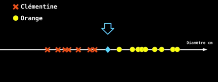
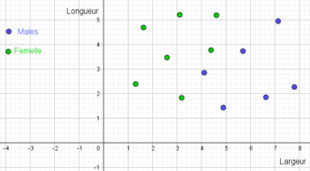
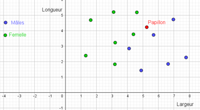
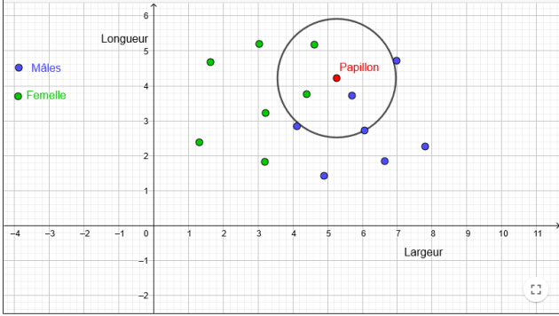
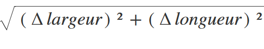
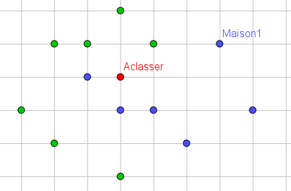

# Algorithme des k plus proches voisins
## Qu'est-ce que le machine learning (algorithme d'apprentissage) ?

Visionner cette conférence jusque au moins 17min30s

<iframe width="560" height="315" src="https://www.youtube.com/embed/OEJX-q6UOag" title="YouTube video player" frameborder="0" allow="accelerometer; autoplay; clipboard-write; encrypted-media; gyroscope; picture-in-picture" allowfullscreen></iframe>

Dans l'exemple de la vidéo, l'objectif est de reconnaître une clémentine d'une orange en mesurant simplement son diamètre.  

Si tous les voisins sont des clémentines ou des oranges, la prédiction est assez simple. Cependant en cas de "cas limite" il faut faire un choix sur la détermination. Est-on au-dessus ou en-dessous de la moyenne ? Quel est le fruit le plus proche ?  

Autre solution, que sont les 3 ou 5 plus proches voisins ?  



!!! question "Causalité ou corrélation?"

	La causalité entre deux données établit une relation de <input style="border : solid 1px; border-radius : 2px;" type="text" name="reponse" maxlenght="15" id="reponse1" autocomplete="off"> à <input style="border : solid 1px; border-radius : 2px;" type="text" name="reponse" maxlenght="15" id="reponse2" autocomplete="off">. Alors que la corrélation se contente de faire le <input style="border : solid 1px; border-radius : 2px;" type="text" name="reponse" maxlenght="15" id="reponse3" autocomplete="off">entre deux données.

	<input type='button' style="margin:5px; padding:5px;  background-color : lightblue; border : solid 2px blue; border-radius : 5px;" id="BoutonValider" onclick="reactionText1()" value="Vérifier"> <input type='button' style="display: none;" id="boutoncorrection" onclick="affiche1()" value="Correction"> 
	<div style="font-weight: bold;" id="messageText1"></div>
	
	<div id="correction1" style='display: none;'><p>La causalité entre deux données établit une relation de cause à effets. Alors que la corrélation se contente de faire le lien entre deux données.
	</p></div>

!!! question "Apprentissage"
	Dans quel ordre se fait l'apprentissage?
	<div>
		<form name="f">
			étape 1 :
		    <select id="liste1">
		        <option value="nonChoix" selected> ... </option>
		        <option value="preidction"> Prédiction</option>
		        <option value="validation"> Validation </option>
		        <option value="entrainement"> Entrainement</option>
		    </select><br>
		    étape 2 :
		    <select id="liste2">
		        <option value="nonChoix" selected> ... </option>
		        <option value="preidction"> Prédiction</option>
		        <option value="validation"> Validation </option>
		        <option value="entrainement"> Entrainement</option>
		    </select><br>
			étape 3 :
		    <select id="liste3">
		        <option value="nonChoix" selected> ... </option>
		        <option value="prediction"> Prédiction</option>
		        <option value="validation"> Validation </option>
		        <option value="entrainement"> Entrainement</option>
		    </select><br>
		 	    <input type='button' style="margin:5px; padding:5px;  background-color : lightblue; border : solid 2px blue; border-radius : 5px;" id="BoutonValider" onclick="reactionListe2()" value="Vérifier">
		        <input id="bouAffListe2" type="button" onclick="AfficheListe2()" value="Correction" style="display:none;"><br>
		</form>
		<div id="messageListe2"></div>
	    <div id="correctionListe2" style="display:none;"> <p> Dans l'ordre, on s'entraine, on valide avec des tests puis on l'utilise pour les prédictions.</p></div>
	</div>

## Algorithme des kppv (ou Knn K nearest neighbors)
Dans le cas précédent, il n'y a qu'un seul paramètre d'entrée (le diamètre). Dans le cas de l'étude de papillon, par exemple, on classe les mâles et es femelles en les caractérisant par leur largeur et leur longueur.  

Voici la répartitions des données :  

On utilise ensuite des données de papillons, dont on souhaite identifier le sexe.  
1er cas : pas de doute les données le font se trouver au milieu des femelles. On peut prévoir que celui-ci est une femelle.  

2e cas : L'hésitation est permise. On n'est pas sur de le classer correctement.  


On utilise alors l'algorithme des k plus proches voisins. On observe sur K voisins combien sont des mâles et combien sont des femelles.

Sur le document ci-dessous, en cliquant sur cercle (cercle centre-point) chercher à déterminer que sont les plus proches voisins et répondez à la question  :  
<a href="https://www.geogebra.org/m/zhbhycsh" ></a>


!!! question "Choix du nombre de voisins"
	<div>
			<form name="f">
				Si k = 1 ce papillon est :
			    <select id="liste31">
			        <option value="nonChoix" selected> ... </option>
			        <option value="male"> Un male</option>
			        <option value="femelle"> Une femelle </option>
			        <option value="indetermine"> On ne peut pas savoir </option>
			    </select><br>
			   Si k = 3 ce papillon est :
			    <select id="liste32">
			        <option value="nonChoix" selected> ... </option>
			        <option value="male"> Un male</option>
			        <option value="femelle"> Une femelle </option>
			        <option value="indetermine"> On ne peut pas savoir </option>
			    </select><br>
				Si k = 5 ce papillon est :
			    <select id="liste33">
			        <option value="nonChoix" selected> ... </option>
			        <option value="male"> Un male</option>
			        <option value="femelle"> Une femelle </option>
			        <option value="indetermine"> On ne peut pas savoir </option>
			    </select><br>
			    Si k = 6 ce papillon est :
			    <select id="liste34">
			        <option value="nonChoix" selected> ... </option>
			        <option value="male"> Un male</option>
			        <option value="femelle"> Une femelle </option>
			        <option value="indetermine"> On ne peut pas savoir </option>
			    </select><br>
			 	    <input type='button' style="margin:5px; padding:5px;  background-color : lightblue; border : solid 2px blue; border-radius : 5px;" id="BoutonValider" onclick="reactionListe3()" value="Vérifier">
			        <input id="bouAffListe3" type="button" onclick="AfficheListe3()" value="Correction" style="display:none;"><br>
			</form>
			<div id="messageListe3"></div>
		    <div id="correctionListe3" style="display:none;"> <p> Si k= 1 on a une majotrité de mâle on suppose donc que c'est un mâle.<br>
		    	Si k=3 une majorité de voisins sont des femmelles, on suppose donc que c'est une femelle.<br>
		    	Si k=5 une majorité de voisins sont des mâles, on suppose donc que c'est un mâle.<br>
		    	Si k=6 on a une égalité entre les mâles et les femmelles on ne peut pas conclure.</p></div>
	</div>

!!! question "Nombre de voisins"
	On attend ici une réponse en un mot uniquement.  
	Pourquoi choisit on entre 1, 3, 5, ... pour le nombre de plus proches voisins ? Qu'est ce que ces valeurs ont de particulier ?  
	Elles sont ...<form>
	    <input style="border:  solid 1px;border-radius:3px;" type="text" id="reponse4" maxlenght="15" id="reponse" autocomplete="off">
	    <input type='button' style="margin:5px; padding:5px;  background-color : lightblue; border : solid 2px blue; border-radius : 5px;" id="BoutonValider4" onclick="reactionText4()" value="Vérifier">
	    <input id="bouAffText4" type="button" onclick="AfficheText4()" value="Correction" style="display:none;"><br>
	</form>
	    <div id="messageText4"></div>
	    <div id="correctionText4" style="display:none;"> <p> Les valeurs sont impaires. Si on choisit un nombre pair, en cas d'égalité, le programme sera incapable de choisir entre les deux catégories.
	</p></div>


!!! question "grand jeu de données"
	L'avantage d'utiliser un grand jeu de données est que la prédiction est plus <input style="border : solid 1px; border-radius : 2px;" type="text" name="reponse" maxlenght="15" id="reponse51" autocomplete="off"> mais que l'apprentissage est plus <input style="border : solid 1px; border-radius : 2px;" type="text" name="reponse" maxlenght="15" id="reponse52" autocomplete="off">.<br>
	<input type='button' style="margin:5px; padding:5px;  background-color : lightblue; border : solid 2px blue; border-radius : 5px;" id="BoutonValider" onclick="reactionText5()" value="Vérifier"> <input type='button' style="display: none;" id="boutoncorrection5" onclick="affiche5()" value="Correction">
	<div style="font-weight: bold;" id="messageText5"></div>
	<div id="correction5" style='display: none;'><p>Plus le jeu de données est grand plus la prédiction est fiable mais plus l'apprentissage est long.
	</p></div>

## La métrique
La métrique est la "distance" que l'on se fixe. Dans le cas précédent, la métrique est

Dans l'exemple ci-dessous, on a classer des maisons, selon si les enfants sont scolarisés dans l'école bleue ou dans l'école verte. Une nouvelle maison a été construite.  


!!! question "Choisir l'école"
	<div>
				<form name="f">
					Dans le cas ou la métrique est a distance à vol d'oiseau, en choisissant k =5, les enfants iront dans l'école 
				    <select id="liste61">
				        <option value="nonChoix" selected> ... </option>
				        <option value="bleue"> bleue</option>
				        <option value="verte"> verte </option>
				    </select><br>
				   On décide cette fois que le quadrillage représente les routes. La maison 1 est à 4 de distance de la maison à classer. En utilisant, comme nouvelle métrique la distance sur le quadrillage et k =7, les enfants iront dans l'école :
				    <select id="liste62">
				        <option value="nonChoix" selected> ... </option>
				        <option value="bleue"> bleue</option>
				        <option value="verte"> verte </option>
				    </select><br>
				<input type='button' style="margin:5px; padding:5px;  background-color : lightblue; border : solid 2px blue; border-radius : 5px;" id="BoutonValider" onclick="reactionListe6()" value="Vérifier">
				  <input id="bouAffListe6" type="button" onclick="AfficheListe6()" value="Correction" style="display:none;"><br>
				</form>
				<div id="messageListe6"></div>
			    <div id="correctionListe6" style="display:none;"> <p> A vol d'oiseau, les enfants iront dans l'école bleue et avec le quadrillage dans la verte.</p></div>
	</div>


## Conclusion

L'algorithme des k plus proches voisins est un des plus simples algorithmes d'apprentissage.  

Malgré sa simplicité, pour qu'il puisse contribuer à des prévisions correctes, il faut avoir un jeu de données important (d'où l'enjeu des données personnelles dont les GAFAM sont si gourmandes).  

Le principe étant de disposer d'un jeu d'apprentissage et d'un jeu de test (un ensemble de données sur lesquelles ont connaît la réponse et on évalue la fiabilité de la prédiction). Le travail de mise au point (choix de k ici est fondamental).  

## L'algorithme

### Apprentissage :

A partir d'un jeu de données importants, extraire la métrique.  
associer la valeur de la métrique à une catégorie.  

### Utilisation :

Entrer une valeur de métrique et un nombre de voisins k  
Chercher dans le tableau d'apprentissage les k valeurs les plus proches de la métrique d'entrée  
extraire les catégories correspondantes  
chercher le nombre d’occurrences de chaque catégories  
Renvoyer la catégorie ayant le plus grand nombre d’occurrences  

## TP : Application
Pour mettre en application cet algorithme rendez-vous sur capytale avec le code : 123b-604638
## Projet : Le choixpeau magique

L'idée est de programmer le choixpeau magique.  
[choixpeau magique](img/Le_choixpeau_magique.pdf)
Une première partie permet d'affecter une maison selon des scores d'ambition, de courage, de bonté et d'intelligence.  
voir capytale code : 85b9-1576377.  

La deuxième partie pour les plus rapide sera de créer le questionnaire permettant de générer les notes. Il faudra que le programme pose les questions, gère les réponses et renvoie un score.  
Vous pouvez inventer les questions ou vous aider de questionnaires existant.
  

*Bonus* : Si vraiment vous vous ennuyez, essayer de créer un programme en .exe que l'on pourrait donner à quelqu'un pour qu'il réponde aux questions et se voit affecter une maison.  

<! --
## TP : détection de la langue d'un texte
Dans un texte, on constate que la fréquence d'apparition des lettres de l'alphabet est différente selon la langue. En effet, en anglais par exemple, les H sont beaucoup plus fréquents que en français et à l'inverse, le français utilise plus de U.  

Nous allons utiliser un texte anglais et un texte français pour tracer la fréquence d’apparition des U en fonction de celle des H pour étudier la répartition.

Marche suivre :

- Chaque phrase des textes d'apprentissage possède une fréquence de U et de H que l'on associera dans une liste [freqU,freqH]  
- On crée une liste combinant les fréquences dans les textes d'apprentissage et la langue associée.  
- On compare les distances des fréquences entre le texte inconnu et les textes d'apprentissage.  
- On en extrait les plus courtes pour déterminer la langue.  
- On utilisera le fichier knn.py pour écrire les fonctions et le fichier main.py pour appeler les fonction et traiter les textes.

Détail des fonctions à écrire :[projet KPPV](img/projet KPPV.pdf)

Codes à compléter :
!!! tip "knn.py"
	```python
	from math import sqrt
	def distance(freq1,freq2) :
	    '''test distance:
	    >>> distance((6,4),(2,1))
	    5.0
	    >>> distance((5,3),(3,3))
	    2.0
	    '''
	    #...
	    return #...

	def compteFreq(texte) :
	    ''' test compteFreq :
	    >>> compteFreq('Uuuhhhhhhie.usdksvzep.huumd')
	    [[0.2727272727272727, 0.5454545454545454], [0.1111111111111111, 0.0], [0.4, 0.2]]'''
	    #...
	    return #...

	def Liste_distance(freq_inc,L):
	    '''freq_inc est un tuple de fréquences d'appartion de U et de H, L est la liste contenant toutes
	    les couples de fréquence et la langue associée L=[((0.5,0.2),"A"),((0.3,0.4),"F"), ...]. La fonction calcule la distance entre freq_inc
	    chaque element de L et les place dans une nouvelle liste D en y ajoutant la langue correspondant
	    test Liste_distance:
	    >>> Liste_distance((0.2,0,1),(((0.5,0.2),"A"),((0.3,0.4),"F")))
	    [[0.36055512754639896, 'A'], [0.4123105625617661, 'F']]
	    '''
	    D=[]
	    #...
	    return D

	#jeu d'apprentissage
	def apprentissage(L1,L2) :
	    '''test apprentissage
	    >>> apprentissage([[0.5, 0.0], [0.2, 0.1], [0.2, 0.4]],[[0.25, 0.5], [0.1, 0.0], [0.4, 0.2]])
	    [[[0.5, 0.0], 'A'], [[0.2, 0.1], 'A'], [[0.2, 0.4], 'A'], [[0.25, 0.5], 'F'], [[0.1, 0.0], 'F'], [[0.4, 0.2], 'F']]'''
	    jeuA=[]
	    for elt in L1 :
	        #...
	    for elt in L2 :
	        #...
	    return #...

	def prediction(liste,k):
	    '''test prediction:
	    >>> prediction([[[0.5, 0.0], 'A'], [[0.2, 0.1], 'A'], [[0.2, 0.4], 'A'], [[0.25, 0.5], 'F'], [[0.1, 0.0], 'F'], [[0.4, 0.2], 'F']],3)
	    'phrase en anglais'
	    '''
	    liste.sort()
	    liste_reduite=#ne garder que les elements de la liste qui nous interessent
	    nbA=#compte le nombre de A
	    nbF=#compte le nombre de F
	    if nbA<nbF :
	    #...

	if __name__ == "__main__":
	    import doctest
	    doctest.testmod()

	```

!!! tip "main.py"
	```python
	from knn import *
	import matplotlib.pyplot as plt


	#Liste des fréquences dans les phrases du texte en français
	monfichier = open("cleves.txat", "r", encoding="utf-8")
	texteF = monfichier.read()
	monfichier.close()

	Lfr=compteFreq(texteF)

	#Liste des fréquences dans les phrases du texte en français
	monfichier = open("pride.txt", "r", encoding="utf-8")
	texteA = monfichier.read()
	monfichier.close()

	Lang=compteFreq(texteA)

	#Liste des fréquences dans la phrase inconnue "inconnu.txt
	#...

	#Liste des distances :
	# créer une liste cumule les fréquences d'appatiton des lettres U et H et la langue à partir des listes Lang et Lfr
	#puis calculer les distances entre le texte inconnu et les textes d'apprentissage
	listeD=...

	#Faire afficher le résultat de la prédiction et vérifier avec la représentation graphique
	#tester avec les 3 textes inconnus


	"""Complément Pour représenter les données"""
	# Données de type 1
	liste_x_1=[100*elt[0] for elt in Lang]
	liste_y_1=[100*elt[1] for elt in Lang]

	# Données de type 2
	liste_x_2=[100*elt[0] for elt in Lfr]
	liste_y_2=[100*elt[1] for elt in Lfr]

	plt.axis([0,15, 0, 15]) # Attention [x1,x2,y1,y2]
	plt.xlabel('Freq des U')
	plt.ylabel('Freq des H')
	#plt.title('Représentation des deux types')
	plt.grid()
	plt.scatter(liste_x_1,liste_y_1, label='Anglais')
	plt.scatter(liste_x_2,liste_y_2, label='Français')
	plt.scatter([100*inc[0]],[100*inc[1]],label="A classer")
	plt.legend()
	plt.show()
	"""Fin"""
	```


Textes d'apprentissage :
texte en anglais : [texte en anglais](img/pride.txt)  
texte en français : [texte en français](img/cleves.txt)  

Textes inconnus dont il faut déterminer la langue :  
[texte inconnu](img/inconnu.txt)  
[texte inconnu 2](img/inconnu2.txt)  
[texte inconnu 3](img/inconnu3.txt)  
[texte inconnu 4](img/inconnu4.txt)  

### Rendu :
il est IMPÉRATIF de rendre le fichier knn.py contenant les fonctions et le fichier main.py qui appelle les fonctions. RESPECTER LE NOM DES FICHIERS !! (pour passer les tests automatiques).  

Le tout pourra être mis dans un dossier contenant les fichiers txt et les fichiers .py.  
 -->
<!---Javascript-->
<script>


function reactionText1(){
	var msg;
	console.log('fonction executee');
	var reponse1=document.getElementById("reponse1");
	var reponse2=document.getElementById("reponse2");
	var reponse3=document.getElementById("reponse3");

	if ((reponse1.value =='cause' )&&
		reponse2.value =='effets' || reponse2.value =='effet' &&
		reponse3.value =='lien' ){
		msg='bravo';
		style='style="color:green;"';
		}
	else{msg='Vous avez des erreurs';
	style='style="color:red;"';}
	document.getElementById("messageText1").innerHTML='<p '+style+'>'+msg+'</p>';
	document.getElementById("boutoncorrection").style="margin:5px; padding:5px;  background-color : lightblue; border : solid 2px blue; border-radius : 5px;display:inline;";
	}

function affiche1(){
	document.getElementById("correction1").style="display:block;";
	document.getElementById("correction1").style="font-style:italic;";}

function reactionListe2(){
	var msg;
	var style;
	var selectElmt21 = document.getElementById("liste1");
	var valeurselectionnee21 = selectElmt21.options[selectElmt21.selectedIndex].value;

	var selectElmt22 = document.getElementById("liste2");
	var valeurselectionnee22 = selectElmt22.options[selectElmt22.selectedIndex].value;

	var selectElmt23 = document.getElementById("liste3");
	var valeurselectionnee23 = selectElmt23.options[selectElmt23.selectedIndex].value;


	if (valeurselectionnee21=="entrainement" && valeurselectionnee22=="validation" && valeurselectionnee23=="prediction" ){
		msg='Bonne réponse';
		style='style="color:green;"';
	}
	else if (valeurselectionnee21=="entrainement" || valeurselectionnee22=="validation" || valeurselectionnee23=="prediction" ){
		msg='Réponse partiellement correcte';
		style='style="color:orange;"';
	}
	else{msg='Mauvaise réponse';
		style='style="color:red;"';
	}
	document.getElementById("messageListe2").innerHTML='<p '+style+'>'+msg+'</p>';
	document.getElementById('bouAffListe2').style="margin:5px; padding:5px;  background-color : lightblue; border : solid 2px blue; border-radius : 5px;display:inline;";
}

/*affichage de la réponse*/
function AfficheListe2(){
	document.getElementById("correctionListe2").style="display:block;";
	document.getElementById("correctionListe2").style="font-style:italic;";
}

function reactionListe3(){
	var msg;
	var style;
	var selectElmt31 = document.getElementById("liste31");
	var valeurselectionnee31 = selectElmt31.options[selectElmt31.selectedIndex].value;

	var selectElmt32 = document.getElementById("liste32");
	var valeurselectionnee32 = selectElmt32.options[selectElmt32.selectedIndex].value;

	var selectElmt33 = document.getElementById("liste33");
	var valeurselectionnee33 = selectElmt33.options[selectElmt33.selectedIndex].value;
	var selectElmt34 = document.getElementById("liste34");
	var valeurselectionnee34 = selectElmt34.options[selectElmt34.selectedIndex].value;


	if (valeurselectionnee31=="male" && valeurselectionnee32=="femelle" && valeurselectionnee33=="male" && valeurselectionnee34=="indetermine"  ){
		msg='Bonne réponse';
		style='style="color:green;"';
	}
	else if (valeurselectionnee31=="male" || valeurselectionnee32=="femelle" || valeurselectionnee33=="male" || valeurselectionnee34=="indetermine"  ){
		msg='Réponse partiellement correcte';
		style='style="color:orange;"';
	}
	else{msg='Mauvaise réponse';
		style='style="color:red;"';
	}
	document.getElementById("messageListe3").innerHTML='<p '+style+'>'+msg+'</p>';
	document.getElementById('bouAffListe3').style="margin:5px; padding:5px;  background-color : lightblue; border : solid 2px blue; border-radius : 5px;display:inline;";
}

/*affichage de la réponse*/
function AfficheListe3(){
	document.getElementById("correctionListe3").style="display:block;";
	document.getElementById("correctionListe3").style="font-style:italic;";
}

function reactionText4(){
	var msg;
	var style;
	var reponse=document.getElementById("reponse4");
	if (reponse.value =='impaires' || reponse.value =='impaire' ){
		msg='bravo';
		style='style="color:green;"';
		}
	else{msg='non, essaye encore';
		style='style="color:red;"';
	}
	document.getElementById("messageText4").innerHTML='<p '+style+'>'+msg+'</p>';
	document.getElementById("bouAffText4").style="margin:5px; padding:5px;  background-color : lightblue; border : solid 2px blue; border-radius : 5px;display:inline;";
}

function AfficheText4(){
	document.getElementById("correctionText4").style="display:block;";
	document.getElementById("correctionText4").style="font-style:italic;";
}


function reactionText5(){
	var msg;
	console.log('fonction executee');
	var reponse51=document.getElementById("reponse51");
	var reponse52=document.getElementById("reponse52");


	if ((reponse51.value =='précise' || reponse51.value =='precise' || reponse51.value =='fiable')&&
		reponse52.value =='lent' || reponse52.value =='long'  ){
		msg='bravo';
		style='style="color:green;"';
		}
	else{msg='Vous avez des erreurs';
	style='style="color:red;"';}
	document.getElementById("messageText5").innerHTML='<p '+style+'>'+msg+'</p>';
	document.getElementById("boutoncorrection5").style="margin:5px; padding:5px;  background-color : lightblue; border : solid 2px blue; border-radius : 5px;display:inline;";
	}

function affiche5(){
	document.getElementById("correction5").style="display:block;";
	document.getElementById("correction5").style="font-style:italic;";}

function reactionListe6(){
	var msg;
	var style;
	var selectElmt61 = document.getElementById("liste61");
	var valeurselectionnee61 = selectElmt61.options[selectElmt61.selectedIndex].value;

	var selectElmt62 = document.getElementById("liste62");
	var valeurselectionnee62 = selectElmt62.options[selectElmt62.selectedIndex].value;


	if (valeurselectionnee61=="bleue" && valeurselectionnee62=="verte" ){
		msg='Bonne réponse';
		style='style="color:green;"';
	}
	else if (valeurselectionnee61=="bleue" || valeurselectionnee62=="verte" ){
		msg='Réponse partiellement correcte';
		style='style="color:orange;"';
	}
	else{msg='Mauvaise réponse';
		style='style="color:red;"';
	}
	document.getElementById("messageListe6").innerHTML='<p '+style+'>'+msg+'</p>';
	document.getElementById('bouAffListe6').style="margin:5px; padding:5px;  background-color : lightblue; border : solid 2px blue; border-radius : 5px;display:inline;";
}

/*affichage de la réponse*/
function AfficheListe6(){
	document.getElementById("correctionListe6").style="display:block;";
	document.getElementById("correctionListe6").style="font-style:italic;";
}
</script>