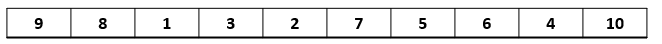
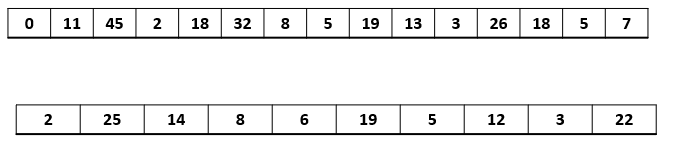
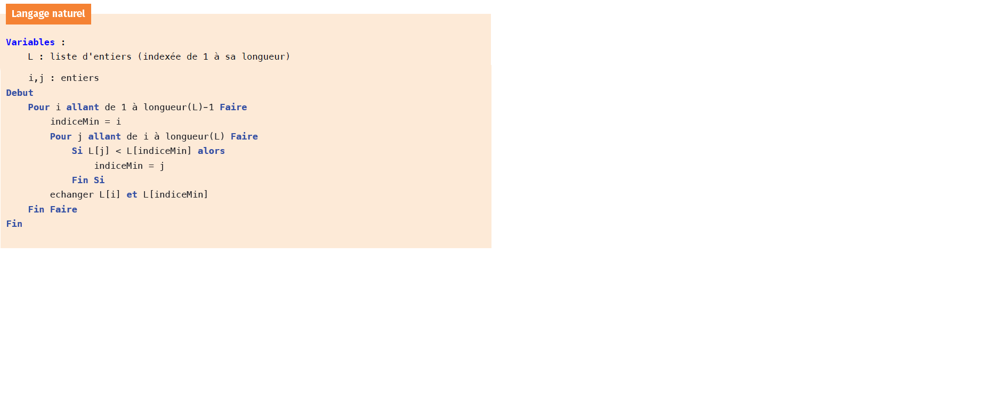
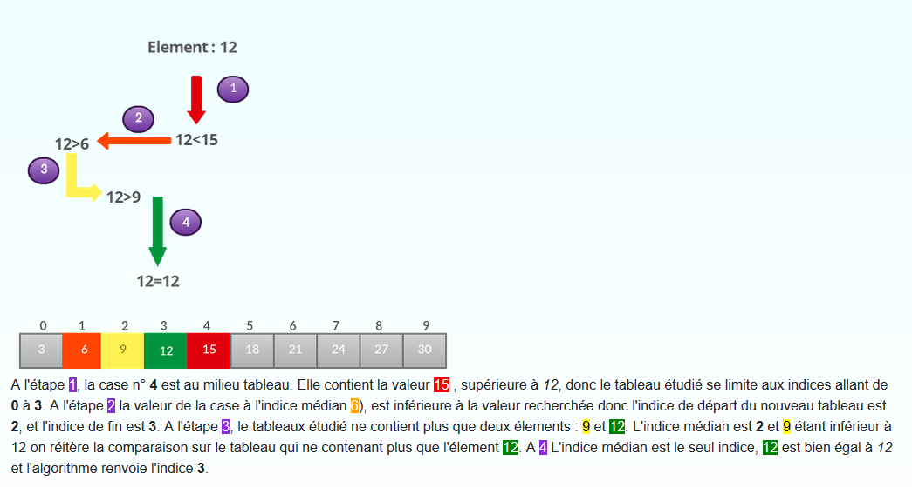
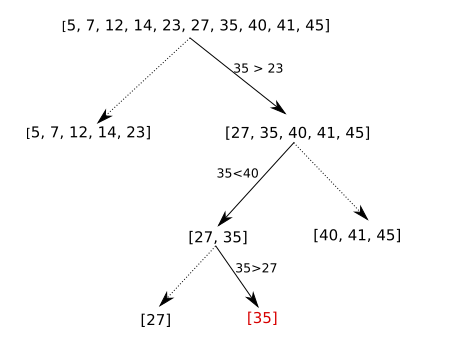
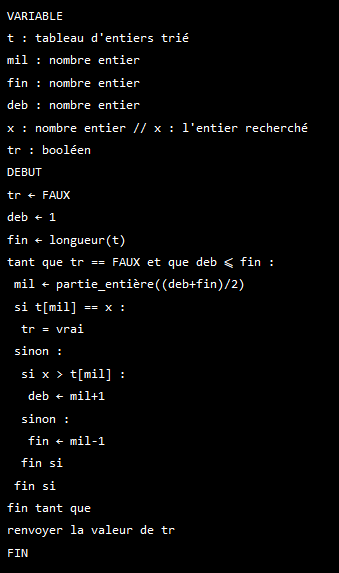

# Algorithmes de tris
## Dis moi comment tu tries...

!!! faq "Trier un tableau"
	Trier le tableau donné dans l'ordre croissant et érire l'algorithme utilisé sur le tableau blanc.
	
	Une fois l'algorithme rédigé, l'essayer sur ces tableaux :
	

## Découvrir les tris
### Tris par sélection

Une petite vidéo pour comprendre

<iframe width="560" height="315" src="https://www.youtube.com/embed/qpeeRU_K90k" title="YouTube video player" frameborder="0" allow="accelerometer; autoplay; clipboard-write; encrypted-media; gyroscope; picture-in-picture" allowfullscreen></iframe>

L'algorithme de tri par sélection : 


On trouve le plus petit élément de la liste puis on le place en premier. On recommence en partant du 2ème élément : on trouve le minimum de la liste restante et on le place en 2ème,et ainsi de suite.

### Tri par insertion
Une petite vidéo pour comprendre
<iframe width="560" height="315" src="https://www.youtube.com/embed/pzxSlJVprkc" title="YouTube video player" frameborder="0" allow="accelerometer; autoplay; clipboard-write; encrypted-media; gyroscope; picture-in-picture" allowfullscreen></iframe>

L'algorithme de tri par insertion : 


C’est le tri qu’on utilise quand on range des cartes : On parcourt la liste à trier du début à la fin. Au moment où l’on considère le ième élément,les i−1 premiers sont déjà triés, et on insère ce ième élément à la bonne place parmi les i−1 En pratique, on fait «remonter» ce ième élément en l’échangeant avec son prédécesseur tant qu’il est plus grand que lui.

!!! faq "Question"
	Un de ces tris correspond-il à celui que vous avez utilisé?

!!! faq "Dérouler l'algorithme"
	En partant des tableaux ci-dessous, écrire la modification du tableau à chaque étape de chaque tri.  
	Selection :`t = [5, 4, 3, 2, 1]`  
	Insertion : `t = [12, 8, 23, 10, 15]`  

## Implémenter les tris
Compléter la fonction `tri_selection(L)` qui prend en paramètre un tableau L et le trie par ordre croissant.  
```python
from random import randint
def tri_selection(L):
#todo

print(tri_selection([randint(0,10) for i in range (10)]))
```


Compléter la fonction `tri_insertion(L)` qui prend en paramètre un tableau L et le trie par ordre croissant.
```python
from random import randint
def tri_insertion(L):
#todo

print(tri_insertion([randint(0,10) for i in range (10)]))

```


Ajouter les tests unitaires das les deux fonctions pour trier :  
`[2,5,4,3,0,8]  
 [21,15,44,13,30,84]  
 [9,8,7,5,5,4,3,2] ` 
  
Modifier les fonctions précédentes de façon à ce que la fonction renvoie le tableau trié mais aussi le nombre d'étapes.
Une étape c'est une inversion ou une comparaison.  
Afficher le nombre d'étapes maximales (c'est-à-dire dans le pire des cas) pour un tableau de taille 10, 50 et 100.  
*NB : le pire des cas, ici, est un tableau trié dans l'ordre décroissant.*  


## Recherche dicothomique
La recherche d'un élément dans un tableau peut se faire par dichotomie. La condition d'utilisation de cette recherche est que le tableau soit déjà trié. Elle consiste à comparer la valeur recherchée à la valeur du ilieu de la liste. Si la valeur recherchée est inférieure à la moitié, on fait la meme recherche avec le demi tableau inférieur, etc ... 
!!! example "exemple 1:"
	 
!!! example "exemple2:"
	 

Algorithme :


Implémenter l'algorithme précédent et faites le test avec :  
`t = [5, 7, 12, 14, 23, 27, 35, 40, 41, 45]` et `x = 9`  
puis avec des valeurs figurant dans le tableau.
<p style="text-align: center; color:gray; font-size: 10px;">
Création MB. (ré)utilisation et modification libre mais non commerciale CC-BY-NC
</p>