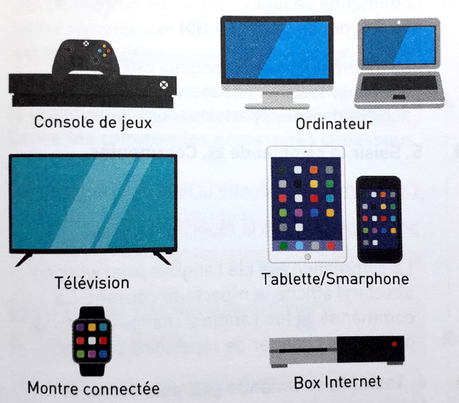

# Les systèmes d'exploitation
## Repères historiques

## A quoi sert un OS ?
Visionner la vidéo ci-dessous :

Un système d'exploitation, souvent appelé OS  est un logiciel qui permet à l'utilisateur d'accéder aux ressousrces d'un ordinateurs et aux périphériques. Il est le chef d'orchestre des programmes en définissant les accès aux périphériques et à la mémoire et l'ordre des opérations à effectuer.
			
!!! question "Questions"
	1.Que signifie OS?  
	2.Citer les OS que vous connaissez.   
	3.Quels sont les services rendus par un OS?  

## Libre, propriétaire ou gratuit
D'après la *Free Software fondation*, un logiciel **libre** (free software) désigne un logiciel qui rspecte la liberté des utilisateurs. Ceux-ci ont la liberté d'exécuter, de copier, de distribuer, d'étudier, de modifier et enfin d'améliorer ce logiciel. Ainsi "logiciel libre" fait référence à la "liberté d'expression".  
Un logiciel **propriétaire** est un logiciel qui est la propriété exclusive de la société qui l'a conçuet qui le commercialise. Celui-ci est distribué uniquement en version "exécutable", alors que les logiciels libres ont un "code source" entièrement accessible.

!!! question "Quesions"
	4.Chercher des noms de logiciels libres.  
	5.Une application comme Sapchat sur smartphone est gratuite. Est-elle nécessairement libre?  

## Histoire de UNIX

<iframe width="560" height="315" src="https://www.youtube.com/embed/Za6vGTLp-wg" title="YouTube video player" frameborder="0" allow="accelerometer; autoplay; clipboard-write; encrypted-media; gyroscope; picture-in-picture" allowfullscreen></iframe>

Le système UNIX est un système dit "propriétaire" (certaines personnes disent "privateur"), c'est-à-dire un système non libre. Mais plus généralement, qu'est-ce qu'un logiciel libre ?
D'après Wikipédia : "Un logiciel libre est un logiciel dont l'utilisation, l'étude, la modification et la duplication par autrui en vue de sa diffusion sont permises, techniquement et légalement, ceci afin de garantir certaines libertés induites, dont le contrôle du programme par l'utilisateur et la possibilité de partage entre individus". Le système UNIX ne respecte pas ces droits (par exemple le code source d'UNIX n'est pas disponible, l'étude d'UNIX est donc impossible), UNIX est donc un système "propriétaire" (le contraire de "libre"). Attention qui dit logiciel libre ne veut pas forcement dire logiciel gratuit (même si c'est souvent le cas), la confusion entre "libre" et "gratuit" vient de l'anglais puisque "free" veut à la fois dire "libre", mais aussi gratuit.   

!!! question "Questions"
		6.Citer des logiciels libres que vous connaissez.  
		7.Parmis les OS cités dans la première partie, lesquels sont libres? Lesquels sont gratuits?.  
		8.Quelle est la conséquence du statut **propriétaire** de Windows?  

## Et les autres

		<iframe width="560" height="315" src="https://www.youtube.com/embed/IquNF_DXcF8" frameborder="0" allow="accelerometer; autoplay; encrypted-media; gyroscope; picture-in-picture" allowfullscreen></iframe>

Microsoft a été créée par Bill Gates et Paul Allen en 1975. Microsoft est surtout connue pour son système d'exploitation Windows. Windows est un système d'exploitation "propriétaire", la première version de Windows date 1983, mais à cette date Windows n'est qu'un ajout sur un autre système d'exploitation nommé MS-DOS. Aujourd'hui Windows reste le système d'exploitation le plus utilisé au monde sur les ordinateurs grand public.  
Enfin pour terminer, quelques mots sur le système d'exploitation des ordinateurs de marque Apple : tous les ordinateurs d'Apple sont livrés avec le système d'exploitation macOS. Ce système macOS est un système d'exploitation UNIX, c'est donc un système d'exploitation propriétaire.  

!!! question "Questions"
		9.Où retrouve-t-on presque systématiquement un OS linux?    
		10.Pourquoi ces objets ci-dessous necessitent-ls tous un système d'exploitation  
		
	
