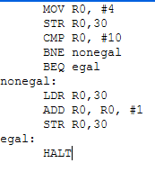

# L'ASSEMBLEUR
Avant de commencer cette activité, assurez-vous d'avoir fait celle sur la [logique combinatoire](logique_combinatoire.html)
## Le processeur et la mémoire
Les ordinateurs plus modernes, sont principalement composés de deux grands circuits : le processeur et la mémoire. Ces deux circuits sont reliés entre eux par des fils qui constituent un ou plusieurs bus de communication, parmi lesquels un bus de données et un bus d'adresses. Le processeur est composé de deux unités. L'unité de contrôle lit en mémoire un programme et donne à l'unité de calcul la séquence des instructions à effectuer. Le processeur dispose par ailleurs de bus d'entrées et de sorties permettant d'accéder aux autres parties de l'ordinateur, que l'on nomme les périphériques (clavier, écran, souris, disques....). Cette organisation générale, l'architecture de Von Neumann, est étonnamment stable depuis les années quarante.  


La mémoire est composée de plusieurs milliards de circuits mémoires de un bit. Ces circuits sont organisés en agrégats de huit, seize, trente deux, soixante quatre bits, et parfois davantage, que l'on appelle des cases mémoires, et qui peuvent donc mémoriser des mots de huit, seize, trente deux, soixante quatre bits, etc. Le nombre de ces cases définit la taille de la mémoire de l'ordinateur. Comme il faut distinguer ces cases les unes des autres, on donne à chacune un numéro : son adresse. La mémoire contient les données sur lesquelles on calcule et le programme qui décrit le calcul effectué, donné sous la forme d'un ensemble d'instructions.  
Le processeur de son côté n'a qu'un très petit nombre de cases mémoires que l'on appelle des registres. Les registres peuvent contenir des données, mais aussi des adresses de cases mémoire. Lorsque l'on parle de processeurs 32 bits ou 64 bits, on fait référence à la taille de ces registres.  
Le langage machine n'étant pas facile à manipuler, on a conçu des langages plus facile à utiliser par l'homme (C, java, …) . Un compilateur traduit ensuite le programme en langage machine.  
*Extrait de Informatique et sciences du numérique de Gilles Dowek*
</br>


## Langage Assembleur
Toutes les instructions traitées par le CPU sont codées en binaire. C'est le langage machine. Indigeste et très complexe à lire.
L'assembleur est un langage assez proche du langage machine mais compréhensible par un être humain. Nous allons donc utiliser le langage assembleur dans la suite de l'activité. 
Toutes les instructions sont écrites de la même façon :  
  

- le champ "code opération" qui indique au processeur le type de traitement à réaliser. Par exemple le code "00100110" donne l'ordre au CPU d'effectuer une multiplication.
- le champ "opérandes" indique la nature des données sur lesquelles l'opération désignée par le "code opération" doit être effectuée.

Les instructions machines sont relativement basiques (on parle d'instructions de bas niveau), voici quelques exemples :

- les instructions arithmétiques (addition, soustraction, multiplication...). Par exemple, on peut avoir une instruction qui ressemble à "additionne la valeur contenue dans le registre R1 et le nombre 789 et range le résultat dans le registre R0" (l'adresse mémoire est donnée en base 10 pour souci de simplicité, n'oubliez pas qu'en interne elle est codée en binaire)

- les instructions de transfert de données qui permettent de transférer une donnée d'un registre du CPU vers la mémoire vive et vice versa. Par exemple, on peut avoir une instruction qui ressemble à "prendre la valeur située à l'adresse mémoire 487 et la placer dans la registre R2" ou encore "prendre la valeur située dans le registre R1 et la placer à l'adresse mémoire 512"

- les instructions de rupture de séquence : les instructions machines sont situées en mémoire vive, si, par exemple, l'instruction n°1 est située à l'adresse mémoire 343, l'instruction n°2 sera située à l'adresse mémoire 344, l'instruction n°3 sera située à l'adresse mémoire 345... Au cours de l'exécution d'un programme, le CPU passe d'une instruction à une autre en passant d'une adresse mémoire à l'adresse mémoire immédiatement supérieure : après avoir exécuté l'instruction n°2 (situé à l'adresse mémoire 344), le CPU "va chercher" l'instruction suivante à l'adresse mémoire 344+1=345.  
Les instructions de rupture de séquence d'exécution encore appelées instructions de saut ou de branchement permettent d'interrompre l'ordre initial sous certaines conditions en passant à une instruction située une adresse mémoire donnée, par exemple, nous pouvons avoir une instruction qui ressemble à cela : imaginons qu'à l'adresse mémoire 354 nous avons l'instruction "si la valeur contenue dans le registre R1 est strictement supérieure à 0 alors exécuter l'instruction située à l'adresse mémoire 4521". 
Si la valeur contenue dans le registre R1 est strictement supérieure à 0 alors la prochaine instruction à exécuter est l'adresse mémoire 4521, dans le contraire, la prochaine instruction à exécuter est à l'adresse mémoire 355.  

Comme déjà dit, les opérandes désignent les données sur lesquelles le code opération de l'instruction doit être réalisée. Un opérande peut être de 3 natures différentes :

1. l'opérande est une valeur immédiate : l'opération est effectuée directement sur la valeur donnée dans l'opérande
2. l'opérande est un registre du CPU : l'opération est effectuée sur la valeur située dans un des registres (R0,R1, R2,...), l'opérande indique de quel registre il s'agit
3. l'opérande est une donnée située en mémoire vive : l'opération est effectuée sur la valeur située en mémoire vive à l'adresse XXXXX. Cette adresse est indiquée dans l'opérande.

!!! example "Exemples"
	Quand on considère l'instruction machine : "additionne le nombre 125 et la valeur située dans le registre R2 , range le résultat dans le registre R1", nous avons 2 valeurs : le "nombre 125" (qui est une valeur immédiate, nous sommes dans le cas n°1) et "la valeur située dans le registre R2" (nous sommes dans le cas n°2)

	Quand on considère l'instruction machine : "prendre la valeur située dans le registre R1 et la placer à l'adresse mémoire 512", nous avons 2 valeurs : "à l'adresse mémoire 512" (nous sommes dans le cas n°3) et "la valeur située dans le registre R1" (nous sommes toujours dans le cas n°2).  

### Simulateur
Ouvrir le simulateur de langage assembleur [RISC](http://www.peterhigginson.co.uk/AQA/).  
Il est relativement facile de distinguer les différentes parties du simulateur :

- à droite, on trouve la mémoire vive ("main memory")
- au centre, on trouve le microprocesseur
- à gauche on trouve la zone d'édition ("Assembly Language"), c'est dans cette zone que nous allons saisir nos programmes en assembleur
	
!!! faq "A faire"
	{align=left}
	1.Saisir le programme suivant dans la partie d'édition

<p>Pour démarrer le programme il suffit de cliquer sur SUBMIT puis RUN et le regarder travailler. On peut voir qu'à l'éxecution de ce programme, il charge bien la valeur 42 dans le registre R0 puis le stocke en mémoire à l'adresse 150.  </p>

!!! caution "ATTENTION"
	Pour relancer la simulation, il est nécessaire d'appuyer sur le bouton "RESET" afin de remettre les registres R0 à R12 à 0, ainsi que le registre PC (il faut que l'unité de commande pointe de nouveau sur l'instruction située à l'adresse mémoire 000). La mémoire n'est pas modifiée par un appui sur le bouton "RESET", pour remettre la mémoire à 0, il faut cliquer sur le bouton "OPTIONS" et choisir "clr memory". Si vous remettez votre mémoire à 0, il faudra cliquer sur le bouton "ASSEMBLE" avant de pouvoir exécuter de nouveau votre programme.  

On peut mettre des commentaires en ajoutant / à la fin de la ligne puis le commentaire : `MOV R0,#42 / ajoute 42 au registre R0`  

### Quelques exemples d'instructions
```pseudocode
LDR R1,78
```
Place la valeur stockée à l'adresse mémoire 78 dans le registre R1 (par souci de simplification, nous continuons à utiliser des adresses mémoire codées en base 10)
```pseudocode
STR R3,125
```
Place la valeur stockée dans le registre R3 en mémoire vive à l'adresse 125
```pseudocode
ADD R1,R0,#128
```
Additionne le nombre 128 (une valeur immédiate est identifiée grâce au symbole #) et la valeur stockée dans le registre R0, place le résultat dans le registre R1
```pseudocode
ADD R0,R1,R2
```
Additionne la valeur stockée dans le registre R1 et la valeur stockée dans le registre R2, place le résultat dans le registre R0
```pseudocode
SUB R1,R0,#128
```
Soustrait le nombre 128 de la valeur stockée dans le registre R0, place le résultat dans le registre R1
```pseudocode
SUB R0,R1,R2
```
Soustrait la valeur stockée dans le registre R2 de la valeur stockée dans le registre R1, place le résultat dans le registre R0
```pseudocode
MOV R1, #23
```
Place le nombre 23 dans le registre R1
```pseudocode
MOV R0, R3
```
Place la valeur stockée dans le registre R3 dans le registre R0
```pseudocode
B 45
```
Nous avons une structure de rupture de séquence, la prochaine instruction à exécuter se situe en mémoire vive à l'adresse 45
```pseudocode
CMP R0, #23
```
Compare la valeur stockée dans le registre R0 et le nombre 23. Cette instruction CMP doit précéder une instruction de branchement conditionnel BEQ, BNE, BGT, BLT (voir ci-dessous)
```pseudocode
CMP R0, R1
```
Compare la valeur stockée dans le registre R0 et la valeur stockée dans le registre R1.
```pseudocode
CMP R0, #23
BEQ 78
```
La prochaine instruction à exécuter se situe à l'adresse mémoire 78 si la valeur stockée dans le registre R0 est égale à 23
```pseudocode
CMP R0, #23
BNE 78
```
La prochaine instruction à exécuter se situe à l'adresse mémoire 78 si la valeur stockée dans le registre R0 n'est pas égale à 23
```pseudocode
CMP R0, #23
BGT 78
```
La prochaine instruction à exécuter se situe à l'adresse mémoire 78 si la valeur stockée dans le registre R0 est plus grand que 23
```pseudocode
CMP R0, #23
BLT 78
```
La prochaine instruction à exécuter se situe à l'adresse mémoire 78 si la valeur stockée dans le registre R0 est plus petit que 23
```pseudocode
HALT
```
Arrête l'exécution du programme


!!! note "récapitulatif des instructions de base" 
		
		


!!! faq "A faire"
	2.Modifiez le programme précédent pour qu'à la fin de l'exécution on trouve le nombre 54 à l'adresse mémoire 50. On utilisera le registre R1 à la place du registre R0. Testez vos modifications en exécutant la simulation.   
	3.Entrer la série d'instructions suivante et dire ce qu'elle fait.  
	

### Utilisation des labels
<p>En fait, les instructions assembleur B, BEQ, BNE, BGT et BLT n'utilisent pas directement l'adresse mémoire de la prochaine instruction à exécuter, mais des "labels". Un label correspond à une adresse en mémoire vive (c'est l'assembleur qui fera la traduction "label"->"adresse mémoire"). L'utilisation d'un label évite donc d'avoir à manipuler des adresses mémoires en binaire ou en hexadécimale. Voici un exemple qui montre comment utiliser un label :</p>
```pseudocode
   CMP R4, #18
   BGT monLabel
   MOV R0,#14
   HALT
monLabel:
   MOV R0,#18
   HALT
```
<p>Dans l'exemple ci-dessus, nous avons choisi "monLabel" comme nom de label. La ligne `MOV R0,#18 ` a pour label "monLabel" car elle est située juste après la ligne "monLabel:". Concrètement, voici ce qui se passe avec ce programme : si la valeur stockée dans le registre R4 est supérieure à 18 on place le nombre 18 dans le registre R0 sinon on place le nombre 14 dans le registre R0.</p> 

!!! danger "ATTENTION"
	La présence du "HALT" juste après la ligne "MOV R0,#14" est indispensable, car sinon, la ligne "MOV R0,#18" sera aussi exécutée (même si la valeur stockée dans le registre R4 est inférieure à 18).   

!!! faq "A faire"
	4.Faites en sorte que dans la mémoire 100, il y ait le résultat de la somme de 42 et 54. 

<p>On peut également faire des boucles en assembleur. Le programme ci-contre compare deux valeur et se "branche" sur une autre partie du programme selon le résultat de la comparaison. <code>BNE nonegal</code> va exécuter la partie du programme à partir du lable 'nonegal' si la comparaison n'estpas égale. En revanch, si c'est égal (BEQ : Branch if Equal) le programme continue au label correspondant, ici 'egal'. Les labels peuvent être choisis comme on veut.</p>



!!! faq "A faire"
	5.Compléter le code assembleur pour qu'il traduise le programme python. Tester le...  
	
	


