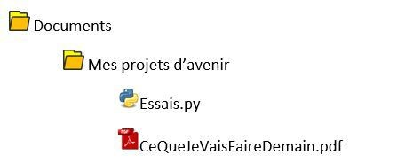
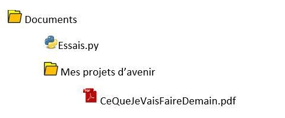

# Apprendre la ligne de commande avec Linux

## Chemin relatif et absolu
### Chemin absolu
Le chemin absolu d'un fichier (appelé path) est l'endroit exact où l'on peut trouver le fichier sur la machine. Par exemple un fichier « CeQueJeVaisFaireDemain.pdf » qui serait placé dans un dossier appelé « Mes projets d'avenir » lui-même placé dans MesDocuments du PC a un chemin absolu :

C:\Users\NomUtilisateur\Documents\Mes projets d'avenir\CeQueJeVaisFaireDemain.pdf
Pour l'appel à un fichier on peut utiliser le chemin absolu avec la certitude de ne pas faire d'erreur... sauf si on déplace notre dossier de travail, sur une clé, sur un autre pc ...

## Chemin relatif
Le chemin relatif est le chemin où l'on peut trouver un ficher à partir du réoertoire courant (le répertoire où l'on se trouve).
Dans l'exemple ci-dessus, en admettant que l'on soit dans le repertoire `Documents` le fichier « `CeQueJeVaisFaireDemain.pdf` est accessible par le chemin `Mes projets d'avenir\CeQueJeVaisFaireDemain.pdf`. 

Autre exmemple, dans l'arborescence ci-dessous , on se place dans le répertoire `Mes projets d'avenir`. Pour accéder au fichier `essai.py` il faudra d'abord sortir du répertoire. Le chemin est donc `../essai.py`. 

## Les commandes de bases
Pour vous entrainer à l'utilisation des lignes de commande, rendez-vous sur [l'émulateur](https://bellard.org/jslinux/vm.html?url=https://bellard.org/jslinux/buildrootx86.cfg)

Voici une liste non exhaustive des commandes de linux.   

!!! note 
	Le réperoire courant est le répertoire dans lequel on se trouve.

### ls
!!! quote 
	liste les éléments contenu dans le répertoire courant.

### pwd
!!! quote 
	Affiche le nom du répertoire courant.

### whoami
!!! quote 
	Qui sui-je ?Affiche le nom de l'utilisateur connecté.

### cd
!!! quote 
	Change directory. Permet de changer de répertoire en indiquant le chemin. Pour remonter dans le dossier parent on utilisera `../`

### mkdir
!!! quote 
	Make directory. Création d'un répertoire dans le répertoire courant. Il faudra préciser le nom ou le chemin du dossier créé.

### touch
!!! quote 
	Crée un fichier dont le nom est spécifié en paramètre de la commande

### cp
!!! quote 
	Copy. Copie un fichier dans un autre répertoire ou dans le même. Le premier paramètre est le chemin du fichier à copier et le second est le chemin de la copie.

### mv
!!! quote
	Move. Déplace un fichier. On precise d'abord le fichier à déplacer puis le chemin de la cible. Si on déplace un fichier dans le même répertoire, cela revient à le renommer.

### rm
!!! quote
	Remove. Supprime un fichier ou un dossier

!!! warning
	Linux ne demande pas si on est sur de vouloir supprimer. Attention à  l'utilisation de cette commande.

## Permissions

Les permissions d'un utilisateur ou d'un groupe d'utilisateurs concernent ce que l'on peut faire ou non avec un fichier. On peut écrire, lire ou exécuter le fichier. Bien évidemment, tous les utilisateurs ne doivent pas pouvoir modifier tous les documents.

La commande `ls -l` permet de lister les éléments du répertoire courant et les permissions des différents utilisateurs.  
Chaque ligne correspond à un élément du dossier, le premier caractère indique s'il s'agit d'un dossier ou non, les 3 caractères suivants correspondent aux permissions de l'utilisateur connecté. `r` s'il peut lire `- `sinon, puis `w` s'il peut écrire (modifier) ou `-` sinon et `x` s'il peut exécuter `- ` sinon.  
Les trois caractères suivants sont les droits de lecture, écriture et exécution des membres du meme groupe que l'utilisateur et enfin ceux des autres utilisateurs que ceux du groupe.  
La suite de la ligne indique le propriétaire du fichier et le nom du groupe auquel appartient le propriétaire.  
### Changer les permissions
Cette action ne peut se faire qu'en tant qu'administrateur (appelé `root`).  

`chmod u+w nom_du_fichier `  
Ajoute le droit en écriture pour l'utilisateur cité  
`chmod o-rw nom_du_fichier`  
Retire le droit en lecture et écriture pour les autres  

### Changer de propriétaire
`chown nv_propriétaire nom_du_fichier`  
Remplace le précédent propriétaire du fichier par nv_propriétaire  

## Récapitulatif des principales commandes
`pwd ` indique le dossier dans lequel on se trouve  
`whoami`: indique le nom de l'utilisateur (impossible d'utiliser LINUX sans être loguer)  
`ls` : indique ce que contient le dossier courant (-l avec les permissions)  
`cd` : permet de changer de répertoire   
`mkdir` : créer un dossier dans le répertoire courant  
`touch` : créer un fichier dans le répertoire courant  
`rm `: effacer un fichier ou un dossier (-p pour un dossier et –rf pour un dossier non vide)  
`mv` : déplacer/renommer un fichier ou un dossier  
`cp` : copier un fichier  
`cat, less`: ouvrir un fichier texte  
`chmod` : change les permissions des différents utilisateurs  
`chown` : change l'utilisateur et le groupe propriétaire  
`su, sudo` : permet de passer en mode root (à condition de connaitre le mot de passe)  