# Apprendre la ligne de commande avec Linux

## Représentation de l'arborescence
On représente généralement l'arborescence de linux sous cette forme :
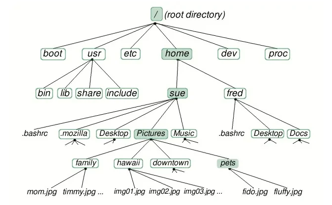
Les dossiers sont encadrés et les fichiers sont écrit sans encadrement.
Ici `sue` est le dossier parent de `Pictures` et le dossier `family` contient les fichers `mom.jpg `et `timmy.jpg`

## Chemin absolu
Le chemin absolu est le chemin que l'on doit emprunter **à partir de la racine** de la machine pour accéder au fichier. Il est toujours le même tant que l'on ne déplace pas le fichier où que ne le change pas de machine.
!!! example "Chemin de `timmy.jpg`"
	our accéder à ce fichier à partir de la racine du PC il faudra saisir : `/home/sue/Pictures/family/timmy.jpg`

## Chemin relatif
Le chemin relatif est le chemin où l'on peut trouver un ficher à partir du réoertoire courant (le répertoire où l'on se trouve). Cette méthode est plus souple si on déplace u projet en entier sur une clé US par exemple.

!!! example "Chemin relatif `timmy.jpg` à partir du répertoire `sue`""
	A partir du répertoire `sue`, on trouve le fichier `timmy.jpg` en saisissant : `Pictures/family/timmy.jpg`

!!! warning "Remonter d'un niveau `../`"

	Imaginons maintenant que nous désirions indiquer le chemin relatif pour accéder au fichier `timmy.jpg` depuis le répertoire `Music`. Comment faire ?  
	 Il faut "remonter" d'un "niveau" dans l'arborescence pour se retrouver dans le répertoire `sue et ainsi pouvoir repartir vers la bonne "branche". Pour ce faire il faut utiliser 2 points : `../Pictures/family/timmy.jpg`

	Il est tout à fait possible de remonter de plusieurs niveaux dans l'arborescence : `../../` depuis le répertoire `Docs` permet de remonter dans le répertoire `home` : `../../sue/Pictures/family/timmy.jpg`

!!! info "Le répertoire `home`"

	Comme déjà évoqué plus haut, les systèmes de type "UNIX" sont des systèmes"multi-utilisateurs": chaque utilisateur possède son propre compte. Chaque utilisateur possède un répertoire à son nom, ces répertoires personnels se situent traditionnellement dans le répertoire `home`.  
	Dans l'arborescence ci-dessus, nous avons 2 utilisateurs : "sue" et "fred". Par défaut, quand un utilisateur ouvre une console, il se trouve dans son répertoire personnel : `/home/sue` par exemple.

	👉 Ce répertoire `home` de l'utilisateur est noté `~`. Sue peut, de tout répertoire ou elle se trouve, accéder à son fichier `~/picture/hawaii/img01.jpg`

## Prise en main et login

Pour explorer le monde de Linux, nous allons utiliser un émulateur du système Linux qui nous donnera l’accès à une invite de
commande [Emulateur Linux](https://chinginfo.fr/chapitre/dossier/weblinux){ .md-button target="_blank" rel="noopener" }
Lors du lancement, vous aurez un écran d’accueil de la forme suivante :

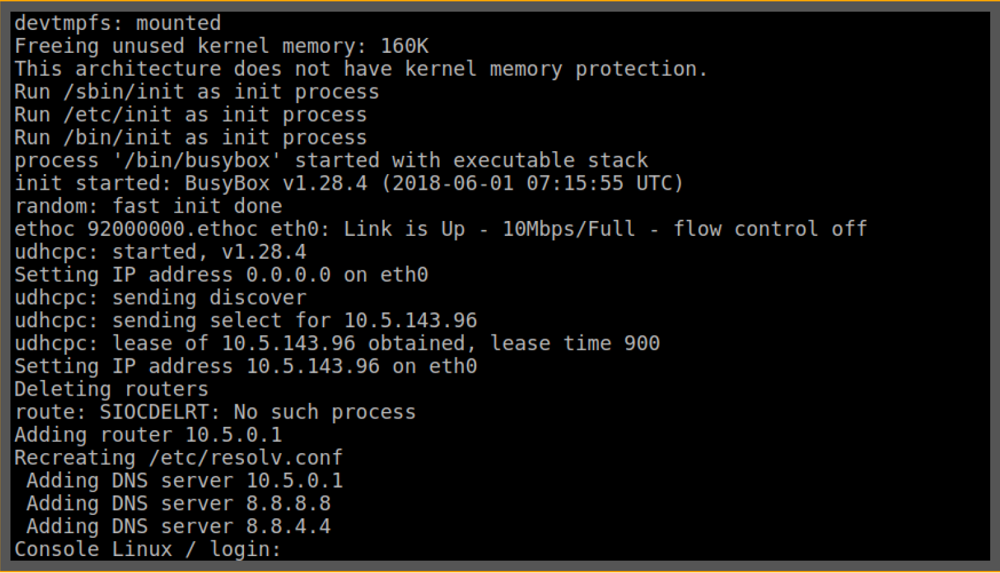{ width=80% }

Les différents utilisateurs et mot de passe pour la connexion **sont inscrits en haut de la page**.

Nous les rappelons ci-dessous :

|Utilisateur|alice|bob|eve|root|user|
|:--:|:--:|:--:|:--:|:--:|:--:|
| Mot de passe|alice22|bob2022|2eve2|admin2022|22user|

Pour nous identifier avec l’utilisateur alice :

* d’abord saisir le login alice
* valider le choix en appuyant sur <kbd>Entrée</kbd>
* saisir le mot de passe alice22 (attention rien n’apparait à l’écran lors de la saisie du mot de passe)
* valider la saisie en appuyant sur <kbd>Entrée</kbd>

👉 Nous voyons que l’authentification a réussi en observant la ligne `alice:~$ `

!!! info "`alice:~$ `"

	* alice : indique le nom de l’utilisateur courant
	* ~ : indique le répertoire courant. Ici “~” indique le répertoire personnel de l’utilisateur courant (ici, alice).
	* $ : permet de séparer le préambule, des instructions saisies par l’utilisateur.

## Les commandes de bases

Voici une liste non exhaustive des commandes de linux.   

!!! note 
	Le réperoire courant est le répertoire dans lequel on se trouve.

### ls
!!! quote 
	liste les éléments contenu dans le répertoire courant.

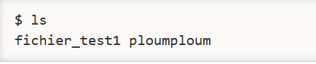

### pwd
!!! quote 
	Affiche le nom du répertoire courant.

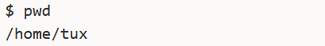

### whoami
!!! quote 
	Qui sui-je ?Affiche le nom de l'utilisateur connecté.

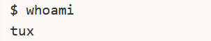

### cd
!!! quote 
	Change directory. Permet de changer de répertoire en indiquant le chemin. Pour remonter dans le dossier parent on utilisera `../`

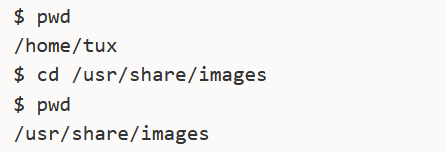

### mkdir
!!! quote 
	Make directory. Création d'un répertoire dans le répertoire courant. Il faudra préciser le nom ou le chemin du dossier créé.

### touch
!!! quote 
	Crée un fichier dont le nom est spécifié en paramètre de la commande

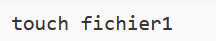

### cp
!!! quote 
	Copy. Copie un fichier dans un autre répertoire ou dans le même. Le premier paramètre est le chemin du fichier à copier et le second est le chemin de la copie.

### mv
!!! quote
	Move. Déplace un fichier. On precise d'abord le fichier à déplacer puis le chemin de la cible. Si on déplace un fichier dans le même répertoire, cela revient à le renommer.

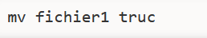

### rm
!!! quote
	Remove. Supprime un fichier ou un dossier

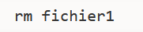

!!! warning
	Linux ne demande pas si on est sur de vouloir supprimer. Attention à  l'utilisation de cette commande.

---

# Groupes d'utilisateurs et permissions
Pour ce TP, nous allons utiliser un émulateur du système Linux qui nous donnera l’accès à une invite de
commande mis à disposition par l'université de la réunion :[Emulateur Linux](http://weblinux.univ-reunion.fr){ .md-button target="_blank" rel="noopener" }

Attendre d'obtenir ceci : 

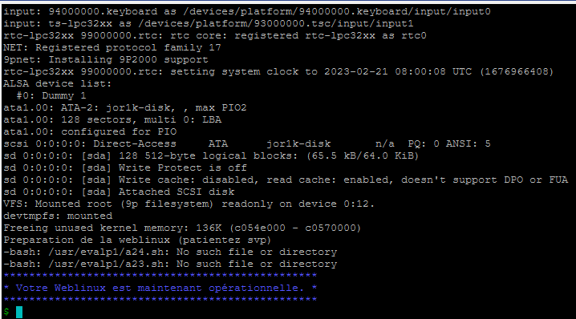{ width=70% }
## Groupes d'utilisateurs
### Les comptes utilisateurs
Un système d’exploitation de type Unix est un système d’exploitation multi-tâches et multi-utilisateurs. Cela signifie que sur une même machine plusieurs personnes peuvent travailler simultanément.

Le système doit donc pouvoir gérer plusieurs utilisateurs en même temps en assurant à la fois le partage des ressources (espace disque, utilisation de la mémoire, périphériques, etc), la confidentialité des données de chaque utilisateur et bien sûr l’intégrité de l’arborescence des répertoires et des fichiers.

Puisque plusieurs personnes peuvent être connectées en même temps le système doit pouvoir identifier clairement chacun des utilisateurs ainsi que les ressources auxquelles ils ont accès et plus généralement qui a le droit de faire quoi.

Ainsi, chaque personne autorisée à utiliser un système de type Unix se voit attribuer un **compte utilisateur**. Il existe un ensemble de règles qui régissent ce qu’un utilisateur a le droit de faire.

### Super-utilisateur et les autres
Il y a deux types d’utilisateurs, comme le montre la figure ci-dessous :

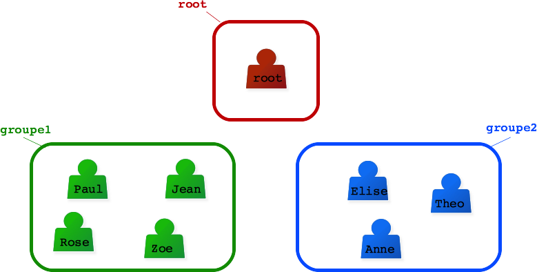{ width=60% }

* Un super-utilisateur qui a le droit de faire tout ce qu’il veut sur le système, absolument tout : créer des utilisateurs, leur accorder des droits, supprimer des utilisateurs, avoir accès à leurs données, modifier le système. Ce super-utilisateur s’appelle root. Cet utilisateur c’est l’administrateur du système.
* Et les autres utilisateurs. Ceux-là n’ont qu’une possibilité d’action limitée et surtout pas la possibilité de modifier le système. Ces utilisateurs peuvent être répartis dans différents groupes

!!! danger "se connecter à un compte utilisateur"

	Pour être identifié sur un système de type Unix, il faut posséder un compte utilisateur, créé par le super-utilisateur, et caractérisé par un identifiant de compte et un mot de passe.

	👉 Pour se connecter sur le système par une console et ouvrir une session de travail, il faut entrer son identifiant à l’invite login puis son mot de passe à l’invite passwd .

	🌵 Afin de rester confidentiel, la saisie du mot de passe se fait en aveugle.

### Utilisateur id : `uid`

👉 En plus de son identifiant de compte, chaque utilisateur est identifié par un numéro unique **uid** (user identifier) et appartient à un groupe principal gid (group identifier) et éventuellement à des groupes secondaires d’utilisateurs.

👉 Le groupe principal est utilisé par le système en relation avec les droits d’accès aux fichiers. Chaque utilisateur doit appartenir à un groupe principal.

👉 Les groupes secondaires sont les autres groupes auxquels un utilisateur appartient. Un utilisateur peut au maximum appartenir à 1024 groupes secondaires.  

👉 Pour connaître son uid et les groupes auxquels on appartient, on peut utiliser la commande `id` (**id**entity).

!!! example "Exemple"

	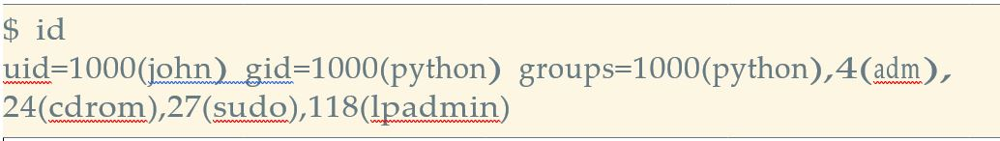{ width=80% }

	Dans cet exemple, l’identifiant de compte de l’utilisateur porte le nom john, son numéro d’identification est 1000, son groupe principal est le groupe python identifié par le numéro 1000. On voit aussi qu’il appartient à plusieurs groupes secondaires de gid 4, 24, 27 et 118

!!! info "Le fichier /etc/passwd"

	C’est dans ce fichier que se trouvent les informations de connexion de tous les utilisateurs du système. Il s’agit d’un fichier texte où chaque ligne correspond à un utilisateur. Cette ligne est composée de sept champs séparés par le caractère ": " comme le montre la figure suivante.

	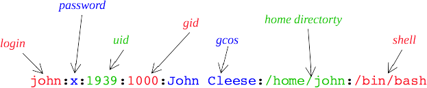{ width=80% }

	Les informations présentes sur cette ligne sont, dans l’ordre :

	* l’identifiant de compte que communément on appelle aussi le nom de l’utilisateur
	* le mot de passe crypté pour cet utilisateur (sur certain systèmes ce champ ne contient pas le mot de passe crypté mais le caractère ’x’ qui indique que le mot de passe est stocké ailleurs dans un fichier /etc/shadow visible uniquement par le super-utilisateur, si ce champ est vide cela signifie que l’utilisateur n’a pas de mot de passe) ;
	* l’**uid** de l’utilisateur ;
	* le **gid** de son groupe principal ;
	* un champ, appelé **gcos** , rempli librement par l’utilisateur et qui contient la description de l’utilisateur ;
	* le répertoire personnel de l’utilisateur (home directory). Habituellement le nom de ce répertoire est `/home/login` , avec login l’identifiant de compte ;
	* le shell de connexion de l’utilisateur, c’est-à-dire le shell utilisé par l’utilisateur lorsqu’il ouvre une session. (Il existe d’autres types de shell que celui du Bash.)

!!! info "Le fichier /etc/shadow"

	Ce fichier, s’il existe, contient les mots de passe cryptés de tous les utilisateurs, il n’est visible que par le super-utilisateur. Chaque ligne de ce fichier texte est associée à un utilisateur et contient un certain nombre de champs d’information que le super-utilisateur peut renseigner pour la gestion des comptes : la date à laquelle le mot de passe a été modifié pour la dernière fois, le nombre de jours avant expiration du mot de passe, le nombre de jours restant avant le prochain changement obligatoire du mot de passe, le nombre de jours pendant lesquels le compte reste actif après expiration du mot de passe, la date de désactivation du compte.

	Remarque : le système installé sur la Weblinux qui accompagne le TP suivant ce cours n’a pas de fichier `/etc/ shadow` , le mot de passe crypté est donc stocké dans le fichier `/etc/passwd .`

!!! info "Le fichier /etc/group"

	C’est grâce à ce fichier texte qu’un système de type Unix peut gérer des groupes d’utilisateurs. Chaque ligne correspond à un groupe. Une ligne est composée de champs séparés par : .

	* le nom du groupe ;
	* le mot de passe du groupe (ce champ est rarement utilisé, par contre s’il est renseigné un utilisateur du groupe qui veut accéder à une ressource appartenant au groupe devra saisir ce mot de passe) ;
	* le numéro unique d’identification du groupe ;
	* la liste des utilisateurs qui appartiennent au groupe.

## Gestion des utilsateurs
### voir les permissions
Seul l'administrateur peut créer un utilisateur, voir et modifier les permissions d'accès aux fichiers et dossiers.
Les permissions d'un utilisateur ou d'un groupe d'utilisateurs concernent ce que l'on peut faire ou non avec un fichier. On peut écrire, lire ou exécuter le fichier. Bien évidemment, tous les utilisateurs ne doivent pas pouvoir modifier tous les documents.
!!! info "r w x"

	Nous nous intéresserons ici uniquement aux droits liés aux fichiers, mais vous devez savoir qu'il existe d'autres droits liés aux autres éléments du système d'exploitation ((imprimante, installation de logiciels...). Les fichiers et les répertoires possèdent 3 types de droits :

	* les droits en lecture (symbolisés par la lettre **r**) : est-il possible de lire le contenu de ce fichier ?
	* les droits en écriture (symbolisés par la lettre **w**) : est-il possible de modifier le contenu de ce fichier ?
	* les droits en exécution (symbolisés par la lettre **x**) : est-il possible d'exécuter le contenu de ce fichier ? (quand le fichier du code est exécutable)

!!! info "u g o"

	Il existe 3 types d'utilisateurs pour un fichier ou un répertoire :

	* le propriétaire du fichier (par défaut c'est la personne qui a créé le fichier), il est symbolisé par la lettre **u**
	* un fichier est associé à un groupe, tous les utilisateurs appartenant à ce groupe possèdent des droits particuliers sur ce fichier.  
	Le groupe est symbolisé par la lettre **g**
	* tous les autres utilisateurs (ceux qui ne sont pas le propriétaire du fichier et qui n'appartiennent pas au groupe associé au fichier).  
	Ces utilisateurs sont symbolisés par la lettre **o** (other).

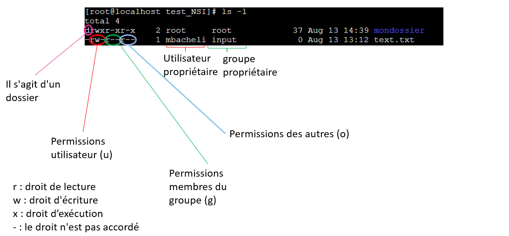

La commande `ls -l` permet de lister les éléments du répertoire courant et les permissions des différents utilisateurs.  
Chaque ligne correspond à un élément du dossier, le premier caractère indique s'il s'agit d'un dossier ou non (`-` s'il s'agit d'un fichier et `d` s'il s'agit d'un dossier), les 3 caractères suivants correspondent aux permissions de l'utilisateur connecté.
Les trois caractères suivants sont les droits de lecture, écriture et exécution des membres du meme groupe que l'utilisateur et enfin ceux des autres utilisateurs que ceux du groupe.  
La suite de la ligne indique le propriétaire du fichier et le nom du groupe auquel appartient le propriétaire. 

### Changer les permissions
Cette action ne peut se faire qu'en tant qu'administrateur (appelé `root`).  

`chmod u+w nom_du_fichier `  
Ajoute le droit en écriture pour l'utilisateur cité  
`chmod o-rw nom_du_fichier`  
Retire le droit en lecture et écriture pour les autres  

### Changer de propriétaire
`chown nv_propriétaire nom_du_fichier`  
Remplace le précédent propriétaire du fichier par nv_propriétaire  

## Récapitulatif des principales commandes
`pwd ` indique le dossier dans lequel on se trouve  
`whoami`: indique le nom de l'utilisateur (impossible d'utiliser LINUX sans être loguer)  
`ls` : indique ce que contient le dossier courant (-l avec les permissions)  
`cd` : permet de changer de répertoire   
`mkdir` : créer un dossier dans le répertoire courant  
`touch` : créer un fichier dans le répertoire courant  
`rm `: effacer un fichier ou un dossier (-p pour un dossier et –rf pour un dossier non vide)  
`mv` : déplacer/renommer un fichier ou un dossier  
`cp` : copier un fichier  
`cat, less`: ouvrir un fichier texte  
`chmod` : change les permissions des différents utilisateurs  
`chown` : change l'utilisateur et le groupe propriétaire  
`su, sudo` : permet de passer en mode root (à condition de connaitre le mot de passe)  