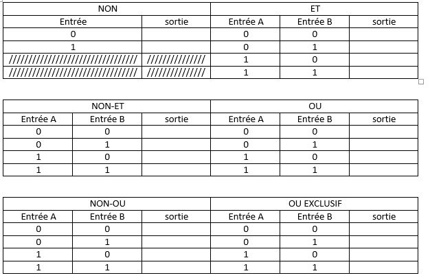
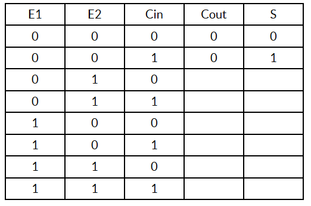

# LOGIQUE COMBINATOIRE
Le processeur est, dans l’ordinateur, le composant qui affecte des places en mémoire charge des données et effectue des calculs avec ces données.
## Comment fait le processeur pour faire des calculs ?
Des circuits intégrés reçoivent des successions de signaux binaires et, selon le câblage, il en ressort une valeur précise en fonction des valeurs d’entrée. 

C’est le cas des portes logiques. 
Les portes logiques possèdent une ou deux entrées et une table logique indique la valeur de la sortie en fonction des valeurs des entrées. 
Par exemple, la table ET (appelée également AND) aura une valeur de sortie à 1 si les deux entrées sont à 1. Sinon, la sortie vaudra 0. 
Utiliser l'application en ligne ci-dessous : 
	<iframe width="600px" height="400px" src="https://circuitverse.org/simulator/embed/portes-logiques" id="projectPreview" scrolling="no" webkitAllowFullScreen mozAllowFullScreen allowFullScreen></iframe>
	
	Les schémas des portes sont donnés dans l'ordre : Non-OU, Non-ET, OU, ET, Non, et OU-Exclusif
!!! faq "Questions"
	1.Remplir les tables de vérité des portes NON (NOTGATE), ET (AND), NON-ET (NAND), OU (OR), NON-OU (NOR) et OU EXCLUSIF (XOR). Ces tables donnent l’état de la sortie en fonction des valeurs d’entrée.    
	

## Combinaison de plusieurs portes
En combinant plusieurs portes logiques, on peut obtenir des opérations plus complexes. Comme son nom l'indique, l'additionneur permet d'additionner 2 bits (E1 et E2) en tenant compte de la retenue entrante ("Cin" "carry in" en anglais). En sortie on obtient le résultat de l'addition (S) et la retenue sortante ("Cout").  
<iframe width="600px" height="400px" src="https://circuitverse.org/simulator/embed/additionneur" id="projectPreview" scrolling="no" webkitAllowFullScreen mozAllowFullScreen allowFullScreen></iframe>

!!! faq "Questions"
		Etablir la table de vérité de l'additionneur.  
		

Une fois l'activité terminée, poursuivre avec [l'assembleur](assembleur.md)
