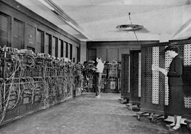
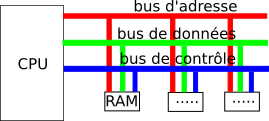
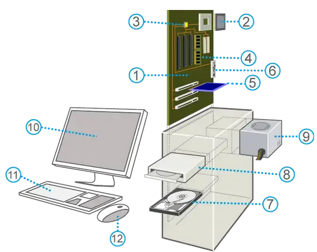
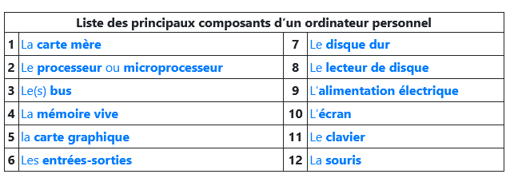

# Le modèle d'architecture de Von Neumann et les systèmes d'exploitaion
## Un peu d'histoire...
### Le premier ordinateur

L’ENIAC — Electronic Numerical Integrator and Computer — fut construit aux Etats Unis pendant la première guerre mondiale. Sous la direction de John Mauchly et J. Presper Eckert, ce calcultateur uiversel était destiné à effectuer des calculs de valeurs des tables de tirs d'artillerie. La machine était programmable par câblage, c'est-à-dire que pour chaque problème donné à résoudre, il fallait passer de longues heures à câbler la machine.
L'ENIAC pesait 27 tonnes et occupait une sirface de 170m² dans les sous-sols de la Moore School of Electrical Engineering de l'université de Pennsylvanie. Le temps moyen entre deux pannes était de 2 jours.   
L'ENIAC n'avait pas de mémoire, au sens actuel du terme, mais seulement 20 accumulateurs pouvant chacun contenir un nombre de 10 chiffres. Les calculs aithmétiques (additions, soustraction, multiplication) étaient possibles à raison de 5000 opérations par seconde. Les entrées-sorties, se faisaient au moyen de cartes perforées.  

### Les précurseurs

		  

Les travaux du mathématicien anglais Alan Turing (1912-1954) à la fin des années 30 ont été fondateurs de l’informatique . Alan Turing est connu pour son rôle pendant la Seconde Guerre Mondiale dans le déchiffrement des messages de la machine Enigma de l’armée allemande. Il travaille en particulier sur les concepts de programmation et d’intelligence artificielle.
 
		

 
Le mathématicien John Von Neumann (1903-1957), inspiré par Turing, reprend les idées de Eckert et Mauchly en y ajoutant le concept de machine universelle introduit par Alaln Turing en 1937. Cette nouvelle architecture est révolutionnaire, munie d'un processeur et de dispositifs d'entrées-sorties, elle permet d'enregistrer des données au cours de l'exécution d'un programme enregistré dans sa **mémoire physique**. Ce qui rend le modèle de Von Neumann si novateur est le fait de pouvoir stocker les données et le programme dans la même mémoire. 
 
	

En 1948, Turiing conçoit la programmation de la *Manchester Small-Scale Experimentale Machine*, surnommée Manchester baby, première machien au monde fondée sur l'architecture de Von Neumann. Le 21 juin 1948, Tom Kilburn écrit et enregistre dans la mémoire de la machine le premier programme de l'histoire. Il s'agissait de calculer le plus grand facteur premier de 218 : 52 minutes et 2 millions d'instructions exécutées plus tard, la machine donne la réponse : 131 072.  
Plus de 70 ans après son invention, les concepts du modèle d'architecture de Von Neumann sont toujours présents dans les ordinateurs modernes.

Claude Shannon (1916-2001) ingénieur américain en électricité et mathématicien, apporte une théorie de l’information et de la communication dans les mêmes années. Il est l’un des premiers a utiliser le mot "bit".  

!!! important "Vocabulaire"

	- le mot anglais "computer" vient du latin computare qui signifie compter.  
	- le mot "informatique" a été créé en 1962 avec les mots information et automatique (par Philippe Dreyfus)  
	- le mot "ordinateur" a été créé en 1955 par Jacques Perret linguiste et professeur à la Sorbonne. 

Il y a 58 ans, le 16 avril 1955, le mot ordinateur était inventé par le professeur de philologie (l'étude d'une langue et de sa littérature à partir de documents écrits) Jacques Perret. 
Son origine est une demande d’IBM, qui voulait un nom français plus parlant que « calculateur » pour sa nouvelle machine électronique destinée au traitement de l'information (IBM 650) en évitant d'utiliser la tra-duction littérale du mot anglais computer (« calculateur » ou « calculatrice »), qui était à cette époque plutôt réservé aux machines scientifiques. 

!!! cite "Voici la lettre envoyée par Jacques Perret à IBM, qui a officialisé le nom ordinateur."
	Cher Monsieur,  
	Que diriez-vous d’ordinateur? C’est un mot correctement formé, qui se trouve même dans le Littré comme adjectif désignant Dieu qui met de l’ordre dans le    monde. Un mot de ce genre a l’avantage de donner aisément un verbe ordiner, un nom d’action ordination. L’inconvénient est que ordina-tion désigne une cérémonie religieuse ; mais les deux champs de signification (religion et comp-tabilité) sont si éloignés et la cérémonie d’ordination connue, je crois, de si peu de personnes que l’inconvénient est peut-être mineur. D’ailleurs votre machine serait ordinateur (et non ordination) et ce mot est tout à fait sorti de l’usage théologique. Systémateur serait un néologisme, mais qui ne me paraît pas offensant ; il permet systématisé ; — mais système ne me semble guère utilisable — Combinateur a l’inconvénient du sens péjoratif de combine ; combiner est usuel donc peu ca-pable de devenir technique ; combination ne me paraît guère viable à cause de la proximité de combinaison. Mais les Allemands ont bien leurs combinats (sorte de trusts, je crois), si bien que le mot aurait peut-être des possibilités autres que celles qu’évoque combine.
	Congesteur, digesteur évoquent trop congestion et digestion. Synthétiseur ne me paraît pas un mot assez neuf pour désigner un objet spécifique, déterminé comme votre machine.  
	En relisant les brochures que vous m’avez données, je vois que plusieurs de vos appareils sont désignés par des noms d’agent féminins (trieuse, tabulatrice). Ordinatrice serait parfaitement pos-sible et aurait même l’avantage de séparer plus encore votre machine du vocabulaire de la théo-logie. Il y a possibilité aussi d’ajouter à un nom d’agent un complément : ordinatrice d’éléments complexes ou un élément de composition, par exemple : sélecto-systémateur. Sélecto-ordinateur a l’inconvénient de deux o en hiatus, comme électro-ordinatrice.  
	Il me semble que je pencherais pour ordinatrice électronique. Je souhaite que ces suggestions stimulent, orientent vos propres facultés d’invention.  N’hésitez pas à me donner un coup de télé-phone si vous avez une idée qui vous paraisse requérir l’avis d’un philologue.  
	Vôtre   
	Jacques Perret  

!!! faq "questions"
    1.Un ordinateur bas de gamme, aujourd'hui, a une fréquence de processeur 2GHz.  
	Combien d'opérations par seconde peut-il faire?  
	2.Relever dans le texte le nom de trois machines programmables.  
	3.Citer quelques avantages et inconvénients de l'ENIAC.  
	4.Quels sont les deux éléments novateurs de l'architecture de Von Neumann?  

## Architecture de Von Neumann

L’architecture de von Neumann est un modèle structurel d’ordinateur dans lequel une unité de stockage (mémoire) unique sert à conserver à la fois les instructions et les données demandées ou produites par le calcul. Les ordinateurs actuels sont tous basés sur des versions améliorées de cette architecture.  
  
 
 
!!! summary "L’architecture de von Neumann décompose l’ordinateur en 4 parties distinctes : "
	
	- l’unité arithmétique et logique (UAL ou ALU en anglais) ou unité de traitement : son rôle est d’effectuer les opérations de base ;  	
	- l’unité de contrôle ou de commande (control unit), chargée du « séquençage » des opérations ;  
	- la mémoire qui contient à la fois les données et le programme qui indiquera à l’unité de contrôle quels sont les calculs à faire sur ces données ;  
	- les dispositifs d’entrée-sortie, qui permettent de communiquer avec le monde extérieur.  

!!! note "Remarques" 
	
	- Les différents éléments échangent des informations à l’aide de bus  (un bus peut être un ensemble de câbles qui transmettent simultanément les informations mais aussi l'ensemble des informations transmises).  
	

	- On peut trouver la vitesse d’horloge dans windows en cherchant "informations système" et on trouve un résultat en GHz (GigaHertz).  
	Un hertz est la mesure de la fréquence de répétition d'un événement qui se répète une fois par seconde. Donc   1 GHz = 109 Hz 
	Par exemple une horloge en 2GHz fait 2.109 opérations par seconde c’est à dire une opération toutes les 0,5 nanoseconde. (1 nanoseconde = 10-9 secondes).  
	- La première innovation de la machine de Von Neumann est la séparation nette entre l’unité de commande, qui organise le flot de séquencement des instructions, et l’unité arithmétique, chargée de l’exécution proprement dite de ces instructions.  
	- La seconde innovation, la plus fondamentale, est l’idée du programme enregistré : les instructions, au lieu d’être codées sur un support externe (ruban, cartes, tableau de connexions), sont enregistrées dans la mémoire selon un codage conventionnel. Un emplacement de mémoire peut contenir indifféremment des instructions et des données, et une conséquence majeure est qu’un programme peut être traité comme une donnée par d’autres programmes. Cette idée, présente en germe dans la machine de Turing, trouvait ici sa concrétisation.  

!!! faq "Questions"
	5.En faisant éventuellement une recherche complémentaire, comment étaient apportés le programme informatique avant sa présence dans l'unité de mémoire?   
	6.Résumer en quelques lignes ce que fait le processeur?  
	7.Quelle est la différence entre un processeur monoprocessus et multiprocessus?

## Composants d'une machine
{align=left width=50%}
{align=float width=50%}

### Vue d'ensemble
Dans cette partie, nous considérerons une machine informatique au sens large : ordinateur de bureau, ordinateur portable, smartphone, tablette …  
Physiquement une machine informatique est constituée de plusieurs éléments :

-	Une carte mère avec un microprocesseur, une carte graphique, des barrettes mémoires, une carte réseau, des ports (=prises)…  
-	Des périphériques qui peuvent être internes ou externes : disques durs, écran, clavier ...  

  

### Les mémoires

Les mémoires d'un ordinateur peuvent être permanente ou volatile. Cette dernière s'efface au moment de la coupre de l'alimetation électrique. Les donées peuvent être remplacées lors de l'éxécution de programmes.

La mémoire d'une machine permet de stocker les données. Elle est exprimée en Mo, Go, To (téraoctets). Il y en a de plusieurs types :

-	La "mémoire morte" , en anglais ROM (Read Only Memory). Mémoire persistante de quelques Mégaoctets contenant juste le nécessaire pour faire démarrer l’ordinateur. Son contenu est fixé lors de la fabrication de la machine et n'est pas prévue pour être modifié. 
-	La "mémoire vive", en anglais RAM (Random Access Memory). Mémoire de capacité moyenne (4 à 32Go dans les ordinateurs personnels). Mémoire dans laquelles sont enregistrées les informations traitées par la machine. 
-	La "mémoire de masse" : Mémoire qui peut être lue et écrite par la machine. Sa grande capacité permet d'y enregistrer une grande quantité de données, C'est le cas des périphériques de stockage.
-	La "mémoire cache", Mémoire qui a pour rôle d'accélérer l'accès aux informations de la mémoire vive. Elle contient des informations fréquemment utilisées par le processeur ou es prochaines dont il aura besoin. Elle a une capacité d'une dizaine de mégaoctets 

!!! faq "questions"
	8.Pour chaque type de mémoire, dire si elle est volatile ou permanente.  
	9.Classer les mémoires citées de la plus rapide à la moins rapide.  
	10. Donner des exemples de mémoires de masse.

### Les périphériques

En plus des ressousrces matérielles, le système doit interagir avec l'utilisateur via des périphériques.  
- Les périphériques d'entrée servent à donner des informations ou des données au système
- Les périphériques de sortie servent à faire sortir les informations du système
- Les périphériques d'entrée/sortie permettent aussi bien de lire et écrire des données

!!! faq "questions"
	11.Parmi la liste des périphériques cités dans le schéma des composants d'un ordinateur, classer les selon leur type (entree, sortie ou entrée/sortie).  
	12.Ajoutez en un maximum d'autres de votre connaissance.    

---
### Pour aller plus loin ...

<iframe  width="560" height="315" src="https://www.youtube.com/embed/c9pL_3tTW2c" frameborder="0" allow="accelerometer; autoplay; encrypted-media; gyroscope; picture-in-picture" allowfullscreen></iframe>

