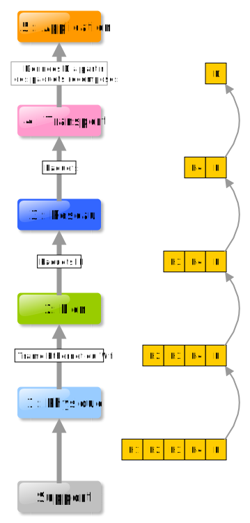
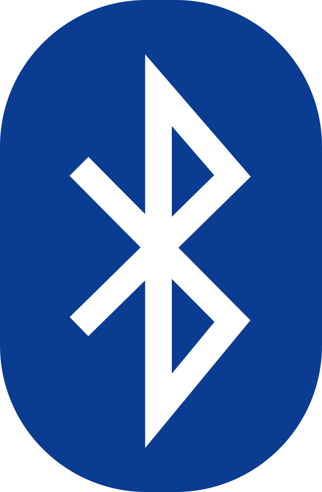

#Réseau - principes

Un *réseau*, c'est un ensemble d'*entités* qui *communiquent* :

- des fourmis qui envoient des informations par voie *chimique* (les phéromones);
- des individus qui s'envoient des colis postaux ou du courrier;
- des ordinateurs qui s'envoient des données.

Chacun des trois exemples ci-dessus est remarquable par son efficacité.

Le premier est sans doute le fruit de l'évolution.

Le deuxième est le résultat de *conventions* et *processus* que les êtres humains ont produits : parmi ces conventions 
il y a les règles d'écriture d'une adresse postale et aussi le moyen de payer le transport du colis *via* un ou des 
timbres postaux et parmi les processus il y a l'acheminement du courrier par voie routière, ferrée, maritime ou aérienne.

Quant au troisième, il est également le fruit de conventions et processus très aboutis que nous allons tenter de 
détailler dans ce chapitre, il fonctionne remarquablement bien et s'appelle Internet. Ce réseau, composé de *milliards*
de machines qui communiquent entre elles et qui permet à deux ordinateurs séparés de milliers de kilomètres de 
s'échanger une quantité considérable d'informations en une fraction de seconde est bel et bien la plus grande 
structure que l'être humain ait construit à ce jour. Elle mérite bien qu'on s'attarde un peu sur son fonctionnement.

## L'idée du modèle à couches empilées

La finalité d'un réseau, quel qu'il soit, c'est transporter de la manière la plus fiable possible des informations (ou
des biens), lesquelles sont émises par une entité A, à destination d'une entité B, et seront transmises en passant très 
probablement par des entités intermédiaires.

Le processus peut être variable mais il existe des mécanismes communs à la plupart des moyens de communication :
on cherche à décomposer en étapes et les similitudes apparaissent :

- A possède une information « brute »;
- l'information est « conditionnée » pour être envoyée;
- il existe un moyen fiable de savoir comment faire arriver l'information en B;
- en définitive, la transmission s'effectue par un moyen physique;
- du point de vue de B, les choses s'effectuent « à l'envers » : par moyen physique, A a réussi à lui faire parvenir 
  une information « conditionnée » que B traite pour finalement disposer de l'information brute de A.

## L'exemple du réseau postal
Les considérations précédentes sont très abstraites, nous allons donc envisager l'exemple d'une personne A qui souhaite 
envoyer un cadeau à B. L'information est le cadeau en lui même, le réseau est le réseau postal :

{width=50%}

On a décomposé la communication en 5 couches, auxquelles on a donné des noms *qui sont déjà liés au vocabulaire des 
réseaux informatiques*. En voici le détail dans l'ordre chronologique:

??? example "Communication"
    === "Du point de vue de A"
        - **Couche 5 - Application :** A veut envoyer un cadeau à B;
        - **Couche 4 - Transport :** le cadeau est emballé pour pouvoir être transporté et reçu intact. On y met aussi 
          l'adresse postale de B;
        - **Couche 3 - Réseau :** le bureau  de poste détermine comment acheminer le colis : il a déjà l'adresse postale de 
          B mais il trouve par lui-même la route qu'il fera suivre au colis;
        - **Couche 2 - Lien :** La route est trouvée mais il faut déterminer comment transporter ce colis : si c'est par 
          voie routière on doit savoir quels véhicules capables d'acheminer le cadeau sont disponibles maintenant ou bien quels sont ceux qui le seront très prochainement;
        - **Couche 1 - Physique :** c'est le transport effectif du colis.

    === "Du point de vue de B"
        - **Couche 1 - Physique :** c'est également le transport effectif du colis;         
        - **Couche 2 - Lien :** le colis arrive au bureau postal;
        - **Couche 3 - Réseau :** le bureau  de poste détermine comment acheminer le colis chez B;
        - **Couche 4 - Transport :** le cadeau est arrivé chez B qui le déballe;                    
        - **Couche 5 - Application :** B profite de son cadeau.

L'intérêt de la décomposition en couches est qu'elle sépare un problème complexe en une succession de tâches plus 
simples. Chaque couche n'interagit directement qu'avec ses couches voisines (ce sont les flèches en trait plein) de 
manière *relativement simple*. L'interaction de chaque couche chez A avec la couche de même niveau chez B est cependant 
plus complexe (ce sont les flèches en pointillés).

- **Couche 1 A - Couche 1 B :** c'est le trajet du véhicule qui transporte le cadeau;
- **Couche 2 A - Couche 2 B :** c'est la planification du trajet;
- **Couche 3 A - Couche 3 B :** c'est l'envoi du cadeau au niveau postal;
- **Couche 4 A - Couche 4 B :** c'est la phase emballage/déballage;
- **Couche 5 A - Couche 5 B :** c'est l'envoi du cadeau de A à B.

En général un colis postal est d'un seul tenant mais on peut très bien imaginer que le cadeau que A veut envoyer à B 
soit très volumineux (par exemple la collection des  romans « Les Rougon-Macquart » d'Emile Zola qui comporte 20 
livres qui se suivent). Lors de la phase d'emballage, plusieurs «paquets » sont créés et envoyés séparément. B ne 
les reçoit pas obligatoirement dans l'ordre d'envoi mais ce n'est pas grave car il finit par avoir tous les paquets et
remet les romans dans le bon ordre.

## Un modèle informatique : TCP/IP
<iframe width="560" height="315" src="https://www.youtube.com/embed/NMY-N6kl6CI" title="YouTube video player" frameborder="0" allow="accelerometer; autoplay; clipboard-write; encrypted-media; gyroscope; picture-in-picture" allowfullscreen></iframe>

Un ordinateur A veut envoyer des données à un ordinateur B. On supposera que ces données sont *un fichier*. 
Le processus ressemble à l'exemple précédent. On va présenter le modèle le plus courant dont le nom est TCP/IP et qu'on 
peut également modéliser avec 5 couches empilées.
On appelle *protocole* tout programme utilisé par une couche.

###Du point de vue de l'émetteur

{align=right width=50%}
Ce qu'il faut retenir c'est que lors de la transmission

- très tôt dans le processus, le fichier est découpé en paquets; 
- chaque couche (hormis la couche application) ajoute son propre en-tête aux données reçues par la couche supérieure 
  et destiné à la même couche pour le destinataire. Ce procédé s'appelle *encapsulation*.

<iframe width="560" height="315" src="https://www.youtube.com/embed/pmSbEL3715E" title="YouTube video player" frameborder="0" allow="accelerometer; autoplay; clipboard-write; encrypted-media; gyroscope; picture-in-picture" allowfullscreen></iframe>

??? note "Couche 5 - Application"  

    Cette couche est chargée d'envoyer les données d'un programme sur l'ordinateur A à un 
    programme sur l'ordinateur B. Puisque plusieurs programmes peuvent utiliser la couche transport en même temps, il 
    existe 65536 *ports* et chaque application va utiliser un ou plusieurs ports particuliers. Les numéros de ports sont 
    attribués par convention mais il est possible de les changer.
    
    Les protocoles les plus connus sont
    
    - HTTP (*HyperText Transfer Prococol*), protocole de transfert hypertexte, sur le port 80 ou 443 pour sa version 
    sécurisée HTTPS;
    - FTP (*File Transfer Protocol*), protocole de transfert de fichiers, sur les ports 20 et 21, et 990 pour sa version
      sécurisée FTPS; 
    - SMTP (*Simple Mal Transfer Protocol*), chargé d'envoyer les emails et POP3 (*Post Office Protocol*) de les
      récupérer;
    - DNS (*Domain Name System*), chargé de traduire un nom de site en adresse IP;
    - BitTorrent, chargé de récupérer et diffuser des fichiers.

??? note "Couche 4 - Transport" 

    Cette couche va découper les données fournie par la couche 5 en paquets (d'une taille de 
    l'ordre du kilooctet). Elle ajoute également son propre en-tête à chaque paquet.
      
    Les protocoles les plus connus sont
    
    - TCP (*Transfert Control Protocol*), protocole de contrôle des transmissions, qui est fiable, fonctionne sur le 
      principe d'une connexion avec accusé de réception.
    - UDP (*User Datagram Protocol*), non fiable en théorie, sans connexion ni accusé de réception, mais plus rapide.
    
    
    On utilise TCP lorsque les données à recevoir sont sensibles (téléchargement d'un fichier). UDP sera préféré dans le 
    cas du *streaming* : le protocole est plus rapide et permet par exemple de visionner un film avec une bonne qualité, 
    et si des données sont perdues, ce n'est pas grave, on passe aux données suivantes, cela ne perturbe pas trop le film 
    (on ne va pas, comme ce serait le cas pour TCP, attendre que les données soient arrivées, et faire des pauses).

<iframe width="560" height="315" src="https://www.youtube.com/embed/VSCLYI8CVTU" title="YouTube video player" frameborder="0" allow="accelerometer; autoplay; clipboard-write; encrypted-media; gyroscope; picture-in-picture" allowfullscreen></iframe>

??? note "Couche 3 - Réseau "

    Cette  couche est responsable de l'aiguillage des paquets vers l'adresse de destination. Elle 
    encapsule les paquets de la couche 4 et y ajoute son propre en-tête (en général un en-tête IP). Du point de vue de 
    cette couche, les paquets sont à envoyer à un ordinateur muni d'une adresse IP (nombre attribué par ce protocole).
      
    Pour que les paquets trouvent leur chemin de l'ordinateur A à l'ordinateur B (qui peut être à plusieurs milliers de 
    kilomètres de A), de *protocoles de routage sont utilisés*, les machines dédiées au routage s'appellent des *routeurs*
    . Un routeur n'utilise que les couches 1,2 et 3 du modèle.
      
    Il faut retenir que chaque paquet suit son propre chemin, indépendamment des autres et qu'il a un «temps de vie» 
    (pour éviter, s'il est perdu, de circuler sur le réseau pendant des années).
    
    Parmi les protocoles utilisés par cette couche on trouve
    
    - IP (*Internet Protocol*), décrit ci-dessus; 
    - ARP (*Address Resolution Protocol*) qui permet de trouver l'adresse *physique* de l'ordinateur connecté à 
      l'adresse IP. Ce protocole est utilisé lorsque l'information est arrivée à B et «remonte les couches ».
 
??? note "Couche 2 - Lien"

    Elle est chargée de coordonner le transfert des données ainsi que le «temps de parole » de chaque machine connectée au 
    support physique (si toutes les machines connectées à un même support émettent des données en même temps, il risque 
    d'y avoir des *collisions*). Elle encapsule les paquets de la couche supérieure dans ce qu'on appelle des *trames* (trames Ethernet par exemple).
    
    Du point de vue de la couche lien, la destination d'un paquet est une adresse physique appelée adresse MAC 
    (*Media Access Control*), déterminée par la carte réseau de la machine destinataire.
    
    Les protocoles utilisés par cette couche sont Ethernet (réseau filaire), Wi-Fi (réseau *via* les ondes radios) et 
    Bluetooth (ondes radio également).

??? note "Couche 1 - Physique"

    Elle est chargée de la transmission effective des trames (qu'elle encapsule également) d'un bout à l'autre du support 
    physique.
    
###Du point de vue du récepteur

{width=33%}

Il faut retenir que chaque couche dépaquète le paquet (ou trame) qui lui est adressé en enlevant l'en-tête correspondant 
et passe le relais à la couche du dessus.  

!!! faq "Questions"
    5. Mettre dans l'ordre les opérations suivantes lors d'une requête à serveur web depuis un navigateur sur un ordinateur à la maison. Certaines étapes manquent (par exemple d'autres recherches dans les tables de routage), on les ignore pour simplifier. L'ordinateur obtient l'IP du serveur par le protocole DNS. 

        - Le serveur envoie la réponse à la requête. 
        - La box transmet la réponse vers l'ordinateur. 
        - Le serveur traite la requête. 
        - L'ordinateur envoie un paquet de requête sur le réseau.
        - La box transmet les paquets vers le serveur. 
        - La box cherche l'IP du serveur dans sa table de routage.

    6. Quel est l'élément central d'un réseau local?
    7. Pourquoi envoyer les données en paquet? Cocher les bonnes réponses :  
    === "propositions" 
        - [ ] pour savoir toujours d'où viennent les données 
        - [ ] Pour simplifier le renvoi en cas de perte  
        - [ ] pour plus de sécurité 
        - [ ] pour aller plus vite 
        - [ ] pour savoir toujours à qui les données sont envoyées 

    Pourquoi les données sont encapsulées ?
    === "propositions" 
        - [ ] pour savoir toujours d'où viennent les données 
        - [ ] Pour simplifier le renvoi en cas de perte  
        - [ ] pour plus de sécurité 
        - [ ] pour aller plus vite 
        - [ ] pour savoir toujours à qui les données sont envoyées 

## Le matériel

### Couche physique

??? note "Liaison filiaire"
    
    {align=right width=50%}

    
    Les informations peuvent être transmises *via* des câbles. Le plus utilisé est le câble Ethernet. Son nom est UTP-CAT5 
    ou UTP-CAT6, la différence étant que le second permet un débit dix fois plus grand que le premier ( 1 Gbit/s contre 100
    Mbit/s).
    
    Parmi les autres types de liaisons filaires, on compte la liaison par câble téléphonique (qui permet par exemple de se 
    connecter à Internet par ADSL) et la liaison par câble optique.

??? note "Bluetooth"

    {width=5% align=left}
    C'est une technologie utilisant les ondes radios pour permettre la communication entre les équipements électroniques 
    (imprimantes, téléphones, scanners, système audio portatif ou dans un véhicule...) à courte distance. Ses 
    fonctionnalités sont assez limitées en terme de mise en réseau.

??? note "Wi-Fi"

    {width=10% align=left}
    Cette technologie utilise également les ondes radio. Son nom de norme est IEEE 802.11 et c'est le moyen de transmission 
    des données sans fil le plus utilisé.

??? note "Répéteur"

    {width=50% align=right}
    Lorsqu'un signal parcourt le support physique, son intensité s'atténue avec la distance. Un *répéteur* régénère le 
    signal perçu avec plus d'intensité pour pallier ce problème.

??? note "Concentrateur"

    {width=50% align=left}
    Le **concentrateur** (*hub*) est moins utilisé de nos jours. C'est une version « multiprise » du répéteur : quand il reçoit 
    un signal sur un des ses branchements, il les recopie sur tous les autres branchements sans se soucier de l'éventuel 
    destinataire du signal.

??? note "Carte réseau"

    {width=50% align=right}
    Que ce soit une clé USB Wi-Fi ou une carte réseau interne, c'est la même chose : ce composant est indispensable pour 
    connecter un ordinateur à un réseau.
    
    Chaque carte réseau possède une *adresse MAC* : c'est l'adresse physique de la carte, elle permet d'identifier 
    l'ordinateur de manière unique.

###Couche lien

??? note "Commutateur"

    {align=left width=50%}
    Le **commutateur** (*switch* en Anglais) est un équipement à plusieurs branchements (au moins 2) appelés *ports* (ne pas confondre avec la notion de port utilisé par une application).

    Son rôle est de rediriger une trame reçue vers l'ordinateur de destination.

###Couche réseau

??? note "Routeur"

    {align=right width=50%}
    Le **routeur** (*router* en Anglais) permet d'effectuer le routage des paquets et de les faire transiter d'une partie du réseau vers une autre (par exemple d'un réseau local à un autre, nous verrons cela plus tard).

###Couches supérieures

C'est un ordinateur qui exécute les protocoles des couches transport et application. Cela peut être un téléphone, une tablette, un ordinateur portable ou de bureau ou bien encore un objet connecté tel qu'une enceinte Bluetooth.
