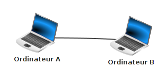
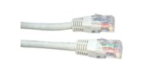
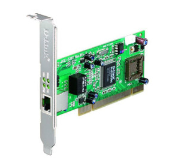
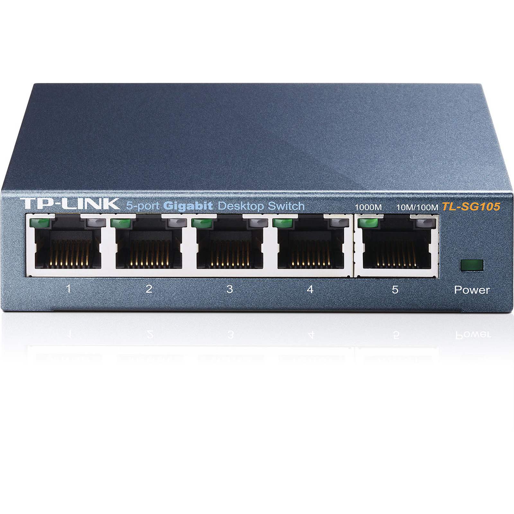
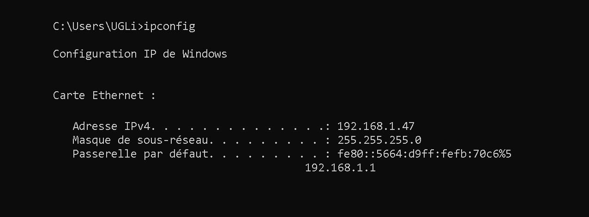

#Qu'est-ce qu'un réseau?

##Construire un réseau
Il est possible de faire communiquer deux ordinateurs en les reliant par un simple câble. On dit alors que ces deux ordinateurs sont en réseau.
  

{align=left}
Dans la plupart des cas, le câble reliant les 2 ordinateurs est un câble Ethernet. Ce type de câble possède à ses 2 extrémités des prises RJ45 (il existe d'autres types de câbles qui permettent de mettre 2 ordinateurs en réseau, mais l'utilisation de câbles Ethernet est tellement majoritaire que nous ne nous intéresserons pas aux autres types de câbles).  

{align=right}
Un ordinateur relié à un réseau doit posséder une carte réseau, on identifie cette carte réseau de type Ethernet grâce à la prise RJ45 femelle située souvent à l'arrière de l'ordinateur.  

{align=left width=40%}  
Relier 2 ordinateurs peut avoir un intérêt, mais dans la plupart des cas, un réseau sera constitué d'un plus grand nombre d'ordinateurs. Dans ce cas, il est nécessaire d'utiliser un commutateur réseau, souvent appelé switch (même en français). Un switch est constitué de plusieurs prises RJ45.  

Chaque ordinateur doit être relié au switch par l'intermédiaire d'un câble Ethernet. 

Dans l'exemple du schéma ci-dessus, les ordinateurs A, B, C et D sont en réseau, chaque ordinateur peut communiquer avec les 3 autres.

Les switchs ayant un nombre de prises RJ45 limité, il peut être nécessaire d'utiliser plusieurs switchs dans un même réseau.

??? example "exemple"
    Dans l'exemple du schéma ci-dessus, les ordinateurs A, B, C, D et E sont en réseau. A, B et C sont reliés à un switch, D et E sont reliés à un autre switch. Les 2 switchs étant reliés ensemble.

Depuis le début nous avons uniquement parlé de réseaux filaires (les différents composants du réseau sont reliés par des câbles), il est aussi possible de mettre plusieurs machines en réseau grâce à des technologies sans fil (utilisation des ondes radio pour transmettre l'information entre les différents composants du réseau), par exemple, le wifi (il existe d'autres technologies sans fil que le wifi, mais elles ne seront abordées ici). Chaque ordinateur appartenant au réseau sans fil devra posséder une carte réseau wifi (aujourd'hui tous les ordinateurs portables vendus sont par défaut équipés d'une telle carte). Il sera nécessaire d'utiliser un concentrateur wifi (équivalent du switch en filaire) si l'on désire mettre en réseau plus de deux ordinateurs.

##L'adresse IP
Maintenant que nos ordinateurs sont reliés par l'intermédiaire d'un switch (ou d'un concentrateur wifi), imaginons que l'ordinateur A "souhaite" entrer en communication avec l'ordinateur C. Quand vous désirez communiquer avec quelqu'un par voie postale, il est nécessaire d'écrire l'adresse de cette personne sur une enveloppe, à chaque habitation correspond donc une adresse postale. Et bien c'est un peu la même chose pour les ordinateurs en réseau, chaque machine possède une adresse. Pendant très longtemps il a existé différentes technologies de réseau et donc différents types d'adresse. Aujourd'hui, on trouve presque exclusivement qu'un seul type d'adresse : les adresses IP (nous étudierons donc uniquement ce type d'adresse).

Les adresses IP sont de la forme : "a.b.c.d", avec a, b, c et d compris entre 0 et 255 (a, b, c et d sont codés sur 1 octet). Voici un exemple d'adresse IP : 192.168.0.1

Une partie de l’adresse IP permet d’identifier le réseau auquel appartient la machine et l’autre partie de l’adresse IP permet d’identifier la machine sur ce réseau.

!!! example "Exemple :"
    Soit un ordinateur A ayant pour adresse IP 192.168.2.1 Dans cette adresse IP "192.168.2" permet d’identifier le réseau (on dit que la machine A appartient au réseau ayant pour adresse 192.168.2.0, pour trouver l'adresse réseau il suffit de remplacer la partie "machine" de cette adresse IP par un ou des 0) et "1" permet d’identifier la machine sur le réseau.

Toutes les machines appartenant au même réseau devront posséder la même adresse réseau (sinon elles ne pourront pas communiquer ensemble, même si elles sont bien physiquement reliées).

!!! example "Prenons 2 exemples, soit 2 machines A et B en réseau :"

    === "example1"
        la machine A a pour adresse IP 192.168.2.5 et la machine B a pour adresse IP 192.168.2.8. Les 3 premiers octets sont bien identiques ("192.168.2"), A et B ont donc la même adresse réseau "192.168.2.0". Ces 2 machines pourront donc communiquer ensemble
    === "exemple 2"
        la machine A a pour adresse IP 192.168.2.5 et la machine B a pour adresse IP 192.168.3.8. Les 3 premiers octets ne sont pas identiques ("192.168.2" pour A et "192.168.3" pour B), A et B n'ont pas la même adresse réseau ("192.168.2.0" pour A et "192.168.3.0" pour B). Ces 2 machines ne pourront donc pas communiquer ensemble

!!! caution "Attention"
    
    Les adresses IP (a.b.c.d) n’ont forcément pas les parties a, b et c consacrées à l’identification du réseau et la partie d consacrées à l’identification des machines sur le réseau : on rajoute souvent à l'adresse IP un "/" suivit du nombre 8, 16 ou 24.

    si ce nombre est 8 (exemple : 192.168.2.1/8), cela signifie que pour une adresse a.b.c.d/8, la partie a est consacrée à l'adresse réseau, le reste (b, c, d) est consacré à la partie machine de l'adresse IP. On aura donc une adresse réseau de la forme a.0.0.0
    si ce nombre est 16 (exemple : 192.168.2.1/16), cela signifie que pour une adresse a.b.c.d/16, les parties a et b sont consacrées à l'adresse réseau, le reste (c, d) est consacré à la partie machine de l'adresse IP. On aura donc une adresse réseau de la forme a.b.0.0
    si ce nombre est 24 (exemple : 192.168.2.1/24), cela signifie que pour une adresse a.b.c.d/24, les parties a, b et c sont consacrées à l'adresse réseau, le reste (d) est consacré à la partie machine de l'adresse IP. On aura donc une adresse réseau de la forme a.b.c.0

Vous avez sans doute déjà compris que le 8 signifie que les 8 premiers bits (le premier octet) sont consacrés à la partie réseau (a), que le 16 signifie que les 16 premiers bits (les deux premiers octets) sont consacrés à la partie réseau (a.b) et que le 24 signifie que les 24 premiers bits (les 3 premiers octets) sont consacrés à la partie réseau (a.b.c).  

En fait, il est possible d'avoir autre chose que /8, /16 ou /24 (on peut par exemple trouver /10 ou /17...), mais ces cas font intervenir la notion de masque de sous-réseau qui n'est pas au programme de NSI. 

!!! faq "Questions"
    Vous répondrez aux questions dans le questionnaires pronote associé.  
    1. Déterminer l'adresse réseau  partir de l'Ip suivante 147.12.1.24/16.  
    2. Déterminer l'adresse réseau  partir de l'Ip suivante 192.168.2.45/24.  
    3. Déterminer l'adresse réseau à partir de l'IP suivante 5.23.65.87/8.  
    4. Soit 2 machines A et B connectées à un switch, dites dans quels cas ces 2 machines pourront communiquer ensemble : 
    === "propositions" 
        - [ ] adresse IP de A : 24.2.8.127/8 ; adresse IP de B : 24.23.5.52/8  
        - [ ] adresse IP de A : 193.28.7.2/24 ; adresse IP de B : 193.28.8.3/24   
        - [ ] adresse IP de A : 172.23.4.7/16 ; adresse IP de B : 172.23.5.8/16     

 

## Les adresses IP privées et publiques

On a vu l'importance de l'adresse IP d'un ordinateur dans le rôle de la communication.

!!! note "Définition : Adresse IP"

    Une adresse IP (version 4) est la donnée de 4 octets. On les note séparés par des points. 

    Il y a 5 classes d'adresse IP, notées A, B, C, D et E et les 3 premières classes disposent d'adresses IP (on abrègera en IP) publiques et privées.

Voici des exemples:

- <a href=http://74.125.21.138 target='_blank'>74.125.21.138 </a> est à ce jour une IP permettant d'accéder au site du moteur de 
  recherche de Google. C'est une IP  *publique*, accessible par tout le monde *via* Internet.
- 192.168.1.47 est l'IP de l'ordinateur sur lequel j'écris ces lignes. C'est une IP *privée* : elle n'est accessible que
  par les ordinateurs de mon propre réseau domestique. Elle n'est d'ailleurs pas *unique* non plus dans le sens où
  d'autre réseaux domestiques utilisent cette IP.
- lorsque je veux voir mon IP publique, je vais par exemple consulter [ce site](http://whatismyip.host/){target='blank'} et je trouve
  une adresse différente : 90.59.223.xxx (permettez moi de garder mon adresse IP secrète).

Une adresse IP publique, c'est un peu comme une adresse postale publique : elle identifie de manière unique une machine
(qui peut être une box jouant le rôle de routeur vers un réseau domestique).

Dans un réseau local, une adresse privée, c'est un peu comme dans une ville, le numéro et le nom de la rue (sans la ville ni le pays) : il y a sans doute
beaucoup d'adresses qui commencent par  « 24 rue des oliviers ». Si le réseau postal ne concerne que la ville de Rennes, cette adresse est
suffisante, mais si je cherche à envoyer du courrier au 24 rue des oliviers sans préciser la ville, cela ne marchera pas.

!!! note "Remarque"

    4 octets pour une adresse IP, c'était bien il y a 30 ans, ça l'est beaucoup moins de nos jours !

    $2^{32}=$4 294 967 296, donc vu le nombre de machines croissant en fonctionnement simultané sur Terre, il est 
    impossible d'attribuer une IP unique à chaque ordinateur connecté à Internet, d'où l'importance du LAN.

    Pour pallier le problème, une norme IP version 6, plus performante, sur 128 bits au lieu de 32, a vu le jour mais 
    peine encore à s'imposer.

!!! question "Petit calcul"
    Compte tenu de ce qui est dit plus haut, combien d'adresses IP différetes peut fournir la norme IPv6 ?

Voici les plages d'IP et d'IP privées selon les classes :

- **Classe A :** de l’adresse IP 0.0.0.0 à 126.255.255.255. 
  Adresses privées : de 10.0.0.0 à 10.255.255.255 (avec 16 millions d’adresses possibles au sein d'un réseau local)

- **Classe B :** de l’adresse IP 128.0.0.0 à 191.255.255.255. 
  Adresses privées : 172.16.0.0 à 172.31.255.255 (avec 65535 adresses possibles au sein d'un réseau local)
  
- **Classe C :** de l’adresse IP 192.0.0.0 à 223.255.255.255 
  Adresses privées C : 192.168.1.0 à 192.168.255.255 (255 adresses possibles dans un réseau local)
  
- **Classe D (réservée) :** de l’adresse IP 224.0.0.0 à 239.255.255.255 
  Ces adresses sont réservées pour le [multicast](https://fr.wikipedia.org/wiki/Multicast){target='_blank'}.
  
- **Classe E (réservée) :** de l’adresse IP 240.0.0.0 à 255.255.255.255 
  Ces adresses sont réservés par l'[IANA](https://fr.wikipedia.org/wiki/Internet_Assigned_Numbers_Authority){target='blank'}

Mon adresse IP publique est une IP de classe A, mon IP privée est de taille C, ce que je comprends parfaitement puisque
mon réseau domestique ne contiendra qu'une dizaine de terminaux tout au plus. 

## L'exemple du réseau local traditionnel

Lorsqu'on met en place un réseau local, on commence par déterminer sa taille. Il y a beaucoup de chances qu'on ait moins
de 256 machines à connecter donc on va choisir une IP publique de classe C :

- je choisis de prendre pour *adresse réseau* 192.168.1.0, ce n'est pas une IP attribuée à une machine, elle désigne mon
  réseau local;
  
- le *masque de sous-réseau* par défaut est 255.255.255.0, ce qui signifie que les 3 premiers octets des machines de mon
  réseau sont « bloqués » et donc que les machines vont avoir des adresses du type 192.168.1.xx;
  
- je peux attribuer des IP aux machines que je veux connecter, par exemple 192.168.1.1 pour la première, et caetera;
  
- la dernière IP 192.168.1.255 est interdite, elle est réservée pour adresser un message à l'ensemble des machines du
  réseau (on appelle ceci *broadcast*).
  

!!! note  "Remarque"

    {align=left width=60%}
    Prenons le cas d'un foyer qui utilise le FAI Orange. Par défaut le réseau local est 192.168.1.0. avec pour masque
    255.255.255.0. 
    
    La LiveBox, qui fait office de switch et de routeur, a pour adresse 192.168.1.1. C'est cette adresse 
    qui est utilisée comme passerelle pour accéder à internet :

    La commande `ipconfig` de Windows (`ifconfig` sous Linux et Mac) me permet de retrouver ces informations ainsi que
    mon IP privée.

Utilise l'invite de commande de ton système d'exploitation (touche ++win++ et taper `cmd` pour Windows, Terminal sous
MacOS) et trouve l'IP de ton ordinateur, le masque de sous-réseau et l'adresse de la passerelle. 

!!! question "question"
    5. Combien de machines peut-on trouver au maximum dans un réseau d'adresse réseau 192.168.2.0/24 ?
    6. Combien de machines peut-on trouver au maximum dans un réseau d'adresse réseau 176.24.0.0/16 ?