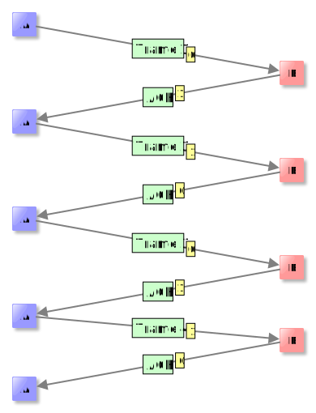

#Sécurisation des transmissions
## Le protocole du bit alterné

Nous allons ici voir un modèle de *contrôle de perte de données* appelé *protocole du bit alterné*.

Ce protocole a (ou plutôt avait car il a été remplacé par un protocole plus performant) lieu au sein de la couche 2 
(couche lien) et permet de vérifier que les trames d'un ordinateur A sont bien reçues par un ordinateur B.

{align="right"}

Le principe est très simple, il utilise les *acquittements* et les *flags* :  lorsque A envoie une trame, il attend un
accusé de réception (acquittement, *acknowledgment* en Anglais) de la part de B dans un temps imparti. À ceci s'ajoute 
un bit de contrôle, appelé *flag* en Anglais, qui alterne suivant le modèle suivant:

- la communication commence avec le *flag* à 0, A envoie une première trame avec le *flag*;
- B reçoit la trame et accuse réception en envoyant une trame d'acquittement notée ACK. le *flag* est changé à 1;
- A reçoit ACK avec le flag 1 et envoie donc la deuxième trame avec ce *flag* 1;
- et ainsi de suite : Lorsque A reçoit une trame de B, elle garde la valeur du *flag* pour la prochaine trame qu'elle 
  envoie. B, quant à lui change toujours le *flag* entre le moment où il reçoit et celui ou il émet.		

Ce protocole permet d'éviter la perte de trames dans les cas suivants :

### Perte de trame du côté de A

A envoie la première trame et celle-ci se perd, au bout du temps imparti, B ne reçoit rien.

 

C'est ce qu'on appelle un *timeout* en Anglais.
A renvoie donc sa trame comme si de rien n'était.

### Perte de trame du côté de B

A envoie la première trame et celle-ci arrive à B, qui renvoie un ACK avec un *flag* à 1, et s'attend donc à recevoir 
une prochaine trame avec un *flag* à 1. Cette trame ACK se perd. Donc du point de vue de A, il y a *timeout* et il 
renvoie la même trame avec le *flag* à 0. B se rend compte que quelque chose ne va pas, et renvoie donc l'ACK précédent, 
avec son *flag* à 1. La communication continue normalement.}

Ce protocole présente des insuffisances comme le montre l'exercice suivant

??? note "Exercice : perte d'information"
    
    Analyse le schéma suivant et explique pourquoi il y a perte d'information.

    

## Déroulement d'une communication TCP

On rappelle que TCP est un protocole de la couche 4 (couche transport) dont les caractéristiques principales sont les suivantes :

- il commence par établir une connexion entre les deux machines;
- il découpe les données en paquets;
- il s'assure de la bonne réception des données au moyen d'\textit{accusés de réception};
- il met fin à la connexion.

L'exercice suivant va nous permettre d'examiner une exemple de communication TCP en détail.

??? note "Exercice : une communication TCP en détail"

    Télécharger [ici](ex5.fls) ou étudier directement les trames. L'ordinateur 192.168.2.1 interroge le serveur DNS situé en 192.168.3.1
    afin d'accéder au site `monsite.com`.

	- En mode simulation, faire un clic droit sur 192.168.2.1 et afficher les échanges de données. 
	- Normalement il n'y a encore eu aucune communication réseau donc la fenêtre d'échange est vide.
    Sur le navigateur web installé sur 192.168.2.1, entrer `monsite.com` et observer la fenêtre d'échange de données
    *du point de vue de 192.168.2.1* :

    
			
    On observe 29 trames. Il est possible de cliquer sur chacune d'entre elles pour visualiser son contenu. Voici le 
    contenu de la première : 

    

    Il nous indique que 192.168.2.1 essaie de déterminer l'adresse MAC du routeur. En effet, 192.168.2.1 doit interroger 
    le serveur DNS, situé en 192.168.3.1, pour obtenir l'adresse IP associée à `monsite.com`, et puisque 192.168.3.1
    n'est pas dans le même réseau que 192.168.2.1, celui-ci utilise la passerelle (le routeur).

	La trame suivante est la réponse ARP et la communication se poursuit.

	1. 	Regarder la source, la destination et le contenu des trames 3 et 4. À quoi correspondent-elles ?
	2. 	On s'intéresse au début de la connexion TCP de 192.168.1.2.1 à 192.168.3.1 : ce sont les trames 5,6 et 7, qui constituent ce qu'on appelle en Anglais un *Three-way handshake*. Rechercher ce terme sur Wikipédia et interpréter ensuite les 3 trames.
	3. 	Les trames 8 à 25 constituent l'échange de données en lui-même. Il y a deux grandes étapes. Lesquelles ?
	4. 	Que représentent les trames 26 à 29 ? Détailler le procédé.