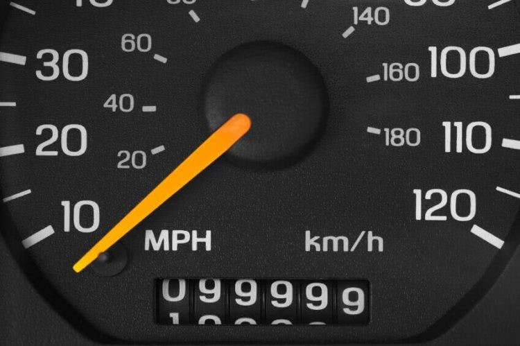
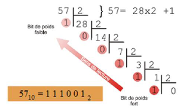

# REPRESENTER LES NOMBRES
## Les bases
Une base désigne la valeur dont les puissances successives interviennent dans l'écriture des nombres dans la numération positionnelle.  
Ex : base 10, base 2 (binaire), base 16 (hexadécimal)  
Base usuelle : base 10  
Bases utilisées en informatique : base 2 et base 16  

!!! example "Exemple d’écriture :"
	(345)10 = 3 x 102 +4 x 101 + 5 x 100  
	(0100110)2 = 0 x 26 + 1 x 25 + 0 x 24 + 0 x 23 + 1 x 22 + 1 x 21 + 0 x 20  
	(345)16 = 3 x 162 + 4 x 161 + 5 x 160  

## Principe d'une base
{align=right width=30%}
Une fois atteint le dernier chiffre possible, on ajoute le premier chiffre à gauche et on recommence.

4 chiffres → 104 valeurs possibles (de 0 à 9999) 

## Le binaire
Pour transférer les données sans ambiguïté (0 absence de signal 1 réception d’un signal).
{align=left}
Binaire à décimal :
(0100110)2 = 0 x 26 + 1 x 25 + 0 x 24 + 0 x 23 + 1 x 22 + 1 x 21 + 0 x 20
= 0 + 32 + 0 + 0 + 4 + 2 + 0 = (38)10
Décimal à binaise :
Le premier bit est le bit de poids fort (MSB) le dernier est le bit de poids faible (LSB)    

## L’hexadécimal
Sert surtout à coder les couleurs.
!!! note "base 16"
	Les chiffres sont 0,1,2,3,4,5,6,7,8,9,A,B,C,D,E et F  
	Où A = 10, B = 11, C = 12, D = 13, E = 14, F = 15

!!! tip "passer de Hexadécimal en décimal :"
	(34F5)16 = 3 x 163 + 4 x 162 + 15x161 + 5x160 =
	3 x 4096 + 4 x 256 + 15 x 16 + 5 x 1 = (13557)10

!!! tip "passer de Décimal en Hexadécimal :"
	  
	Convertir d’abord en binaire : (811)10 = (1100101011)2   
	Grouper par paquet de 4 bits : 0011 0010 1011   
	Convertir chaque paquet :   
	0011 0010 1011  
	00112 = 3   	   
	00102 =2     
	10112 = 11 = B   
	(811)10 = (32B)16  
	 
	

## Capacités de stockage
Pour donner des informations sur les capacités de stockage par exemple, on utilise le kibi-octet, le mibi-octet et le gibi-octet proches du kilo, méga et giga octets.  
1 kibioctet( kio) = 1024octets  
1 mibi-octet = 1 048 576 octets  
1Gibi-octet = 1 073 741 824 octets  

!!! note "nb"
	Les constructeurs profitent parfois de la confusion possible entre ko et kio pour surévaluer les capacités de leurs produits. Par exemple un disque vendu pour 80Go peut faire environ 72Gio alors que le constructeur devraient donner les infos en Gio.