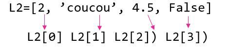
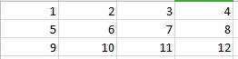

*Les listes et les chaînes de caractères ont un comportement semblable et certaines méthodes communes. Cependant, elles possèdent également des méthodes spécifiques et il conveindra de ne pas les confondre.*

# Chaînes de caratères
  
une chaîne de caractères est une suite de caractères alphanumériques (lettres, chiffres, symboles) et appartient au type `string`.  

## Indexation : se repérer dans la chaîne
Chaque caractère de la chaîne possède une coordonnée. On l'appelle index. On peut le retrouver par rapport à sa position dans la chaîne.

On compte la position (l'index) en partant de la gauche et en démarrant à 0 (ou en démarrant de la droite en commençant par -1).  

```python
chaine='je suis un génie!'
print(chaine [0]) #position 0 1er caractère
print(chaine [6]) # position 6 7ème caractère
print(chaine [-4]) #4eme caractère en commançant par la fin
```
 On peut aussi sélectionner une partie de la chaîne. On appelle cela les `slices`.  
 [index de départ : index de fin (exclus)]

!!! example "Exemples"  
	[2:5] : sélectionne les caractères de la position 2 à la position 4 (inclus)  
 	Si on ne précise pas la fin, c'est que l'on va jusqu'au bout  
 	[2:] : du caractère de position 2 à la fin  
 	Si on ne précise pas l'index de début on démarre au début.  
 	[:7] : du début jusqu'à l'index 6  

## Longueur de la chaîne
On peut utiliser l'instruction `len(chaine)` pour connaitre le nombre de caractères d'une chaîne.  
```python
chaine='Bonjour, comment ca va?'
print(len(chaine))

>>>
23
>>>
```
## Caractère d'échappement
Lorsque l'on écrit une chaîne de caractère on peut utiliser les apostrophes pour encadrer la chaîne. Mais qu'en ai-t-il quand un des caractères d la chaine est un aporstrophe?  
On utilise le caractère d'échappemetn pour signaler à python que ce n'est pas la fin mais juste un caractère comme un autre :
```python
chaine='aujourd\'hui' #ou chaine="auourd'hui"
print(chaine)
```
On peut aussi utiliser des guillemets pour encadrer la chaîne si elle contient un apostrophe ou l'inverse.


## Concaténation
Pour joindre deux chaîne l'une à la suite de l'autre (on parle de concaténation) on utilise simplement l'opération d'addition : 
```python
nom='Dupont'
prenom='Jean'
chaine = nom+prenom
```

!!! caution "Attention"
	 Les autres opérations mathématiques n'auront aucun effet sur une chaîne de carcatères.

## Les opérations sur les chaînes de caractères
**Tester la présence d'un caractère dans la chaîne**  
On peut tester la présence d'un élément dans une chaîne avec `in` qui renvoie `True` ou `False`.  
```python
chaine='Bonjour'
element = 'e'
element in chaine

>>>
False
>>>
```

### Nombre d'occurences
On peut compter le nombre de fois ou une chaîne est présente dans une autre avec la focntion `count()`:
```python
chaine='Bonjour'
chaine.count('o') # compte le nombre de 'o' dans 'bonjour'

>>>
2
>>>
```

### Remplacer des éléments :
On peut remplacer les 'o' par des 'u' par exemples :
```python
chaine='Bonjour'
chaine.replace('o','u')

>>>
Buujuur
>>>
``` 

### Minuscules et majuscules
`chaine.upper()` : met la chaine de caractères en majuscules  
`chaine.lower()` : met la chaine de caractères en minuscules  


D'autres fonctions utilises [ici](https://python.sdv.univ-paris-diderot.fr/10_plus_sur_les_chaines_de_caracteres/)

------------

# les Listes

Les listes en python sont des objets capables de stocker plusieurs objets (même de types différents).
Par exemple :  
```python
# constitués d'objets identiques
L=[1,5,6,19]
#ou d'objets différents
L2=['coucou',25,4.2]
#et même une liste de listes
L3=[[1,5,6,19],['coucou',25,4.2]]
```
## Indexation  
Le principe est le même que pour es chaînes de caractères :  



Le comptge commence à 0 par la gauche ou à -1 par la droite.

!!! note "Slices"
		L[2:6:2] : sélectionne la portion de liste entre l’indice 2 (inclus) et 6 (exclu) avec
		un pas de 2 (optionnel)  
		L[:6] : sélectionne la portion de liste du début à l’élément d’indice 6 (exclu)  
		L[2:] : sélectionne la portion de liste entre l’indice 2 (inclus) jusqu’à la fin  
		L[:] : reprend toute la liste et permet de faire une copie.  
 
## Créer une liste
Créer une liste vide :   
```python
L=[]
```
Créer une liste de 5 '0':  
```python
L=[0]*5
```
Remplir une liste en la parcourant :
```python
Liste=[]
for i in range (0,5):
    Liste[i]=i
print(Liste)

>>>
[0, 1, 2, 3, 4]
>>>
```

### Créer une liste par compréhension :
```python
liste = [i for i in range(0,11) if i%2==0]
```
Cette méthode permet d'écrire en une seule ligne une boucle avec une condition.  
`L=[expression intervalle condition] `  
Ici par exemple on rempli une liste avec les valeurs de i comprises entre 0 et 1 seulement si i est pair.  

## Ajouter un élement dans une liste
La méthode `append()` ajoute un élément dans une liste en l'ajoutant à la fin.  
```python
L=[1,2,'coucou',False]
L.append(3)
print(L)

>>>
[1,2,'coucou',False,3]
```

## Autres fonctions sur les listes

Voici une liste non exhaustive des focntions les plus utiles :<br>
<code>L.sort()</code> : trie la liste dans l'ordre croissant (de ses codes ascii)<br>
<code>L.reverse()</code> : inverse l'ordre des éléments de la liste<br>
<code>L.index(element)</code> : retourne l'index de l'élément dans la liste<br>
<code>L.remove(element)</code> : supprime l'élément de la liste (ne s'applique qu'au premier rencontré)<br>
<code>del(L[2])</code>: supprime l'élément d'index 2<br>
<code>L.insert(index,element)</code> : insère un élément à l'index voulu<br>
<code>min(L) et max(L)</code> : Renvoient le minimum ou le maximum de la liste (code ascii)<br>
<code>Liste_1.extend(Liste_2)</code>: concatène les listes (fonctionnement avec + également<br>

D'autres fonctions [ici](https://docs.python.org/fr/3.6/tutorial/datastructures.htmlhttp://fabrice.sincere.free.fr/qcm/qcm.php?nom=qcm_python3x_1)

----------
# Les tableaux
En python un tableau est une liste de listes. Chaque liste représente en fait une ligne et les index identiques représentent les éléments d'une même colonne.  


Ce tableau peut être représenter ainsi :
```python
Tab=[[1,2,3,4],[5,6,7,8],[9,10,11,12]]
```

## Accéder aux éléments d'un tableau
### Atteindre une ligne
La ligne correspond à une des listes. Par exemple, la première ligne `Tab[0] `correspond à la liste `[1,2,3,4]`.

### Atteindre une case
Dans le tableau ci-dessus on souhaite accéder à l'élément 7. 7 appartient à la deuxième liste de Tab.
`Tab[1]` renvoie donc la liste `[5,6,7,8]`.  
Si on veut le 3e élément de cette liste (index 2) on utilise `[2]` soit `Tab[1][2]`. 

## Atteindre une colonne

Une colonne en python n'est pas identifiable directement. Il s'agit en fait de tous les éléments de meme index de chaque ligne.
On veut afficher la 3e colonne du tableau. Ce sont en fait les éléments d'index 2 de chaque ligne.  
Il va donc falloir parcourir chaque ligne et en extraire l'élément d'index 2.
```python
for ligne in Tab : # pour chaque liste de Tab
    print(ligne[2])
```
Cette instruction affiche sucessivement 3,7 et 11.


## Parcourir un tableau
Pour accéder aux élément d'un tableau un par un il va falloir parcourir chaque ligne et à l'intérieur de chaque ligne parcourir toute les cases :
```pseudocode
pour i allant de 0 à 2:
    pour j allant de 0 à 3:
        action à effectuer pour chaque cellule
    fin pour
fin pour
```
En phython cela donne 
```python
for i in range (3):
    for j in range (3):
        print (Tab[i][j])
```
Lorsque l'on ne connait pas la longueur du tableau (pas le courage de compter, risque de se tromper ou longueur des lignes différentes), on pourra remplacer le 3 par `len(Tab)` qui représente le nombre de lignes (nombre de sous_listes que contient tab) et `len(Tab[i])`(nombre d'éléments de la ligne i).  


## Créer un tableau
On crée un tableau comme une liste, mais il faudra faire deux boucles imbriquées pour remplir chaque case : 
```python
from random import randint
T=[] # on crée un tableau vide
for i in range (5): #notre tableau aura 5 lignes
		T.append([]) # on crée une ligne vide
		for j in range (4) : # 4 colonnes
				T[i].append(randint(0,10)) # on ajoute un nombre aléatoire dans la ième ligne du tableau
print(T)
``` 

