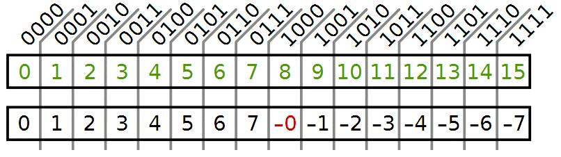
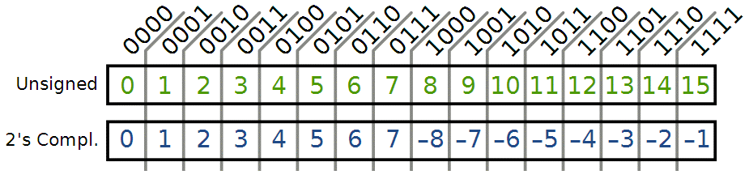
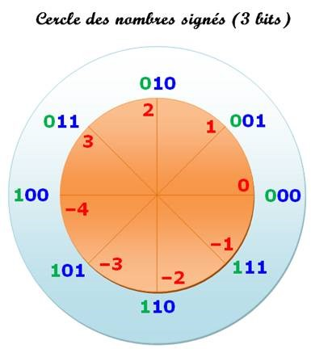
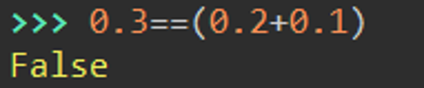
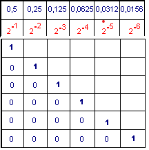

# Nombres réèls et flottants
## Nombres réèls
Pour représenter les nombres négatifs sur n bits, on peut représenter les entiers de $-\dfrac {2^n}{2}$ à $\dfrac {2^n}{2} -1$. Sur 3 bits, au lieu d'aller de 0 à 8 on code les entiers de -4 à 3.  
!!! warning "comment convertir?"
	On pourrait établir un tableau de la sorte :
	
	Mais on aurait deux codage de zéro. ce n'est pas envisageable.

Voici la conversion des réeles sur 3 bits :

### Mais comment obtient-on ces valeurs ?

Pour les nombres positifs, comme vu das le chapitre précédent.
Pour les négatifs :

- Représenter le nombre positif correspondant
- Inverser les 0 et les 1
- ajouter 1

!!! example "exemple pour coder -3 sur 3 bits"
	{width=40%}

	- (3)10 = (011)2   
	- on inverse 100 puis on ajoute 1 : 101    
	- (-3)10  = (101)2  

!!! warning "Et sur 4 bits ?"
	Représenter 3 : 0011  
	Changer les 1 et les 0 : 1100  
	Ajouter 1 :   
	1100 + 1 = 1101  

!!! tip "autre methode"
	Sur 4 bits on a 24 possibilités,  
	 -3 + 24 = 13 en binaire 1101 

!!! success "conversion"
	Un site de conversions [ici](https://fr.planetcalc.com/747/)

## Nombres flottants (à virgule)
On a déà vue que : On a vu : (11010)2 = 24 + 23 + 21
De même : (0,1)2=1x2-1 =0,5  
(0,01)2=1x2-2=0,25  
(0,001)2=1x2-3=0,125  
…  

!!! warning "arrondis"
	Ecrire 1/3 en décimal : 0,3333333333333333…  
	Si on multiplie par 3 : 0,9999999999999999…  
	On n’obtient **JAMAIS** la valeur de départ. C’est une valeur approchée.  
	

!!! tip "méthode"
	
	(0,10)10 ≈ 0,0625 + 0,0312 = 0,09375 = (0,00011)2

!!! success "conversion"
	Un site de conversions [ici](https://fr.planetcalc.com/862/)
