# Traitement de données en tables
## Activité introduction

## Définitions

>Base de données : ensemble d’informations structurées  
>Descripteur : champ prenant une certaine valeur (donnée) par ex Nom, Prenom, …  
>Collection: ensemble de données partageant les mêmes descripteurs par ex contacts partagent tous les descripteurs nom et prenom.  

##Caractéristiques des données
Les données peuvent être de tout type : nombre, entier, chaine de caractère, booléen, …   
<div id="center">
		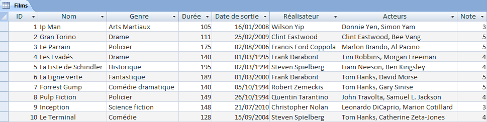
</div>

La collection est l’ensemble des films répertoriés, les descripteurs sont ID (entier), nom (chaine de caractères), genre (chaine de caractères), Durée (entier), Date de sortie (chaine de caractères), Réalisateur (chaine de caractères) et Acteurs (chaine de caractères).
Les données peuvent être obligatoires (nom du film par exemple) ou facultative (durée du film). C’est le créateur de la BDD qui le définit.
Un des champs doit être UNIQUE pour qu’il n’y ait pas de confusion, en général c’est un identifiant nommé ID. Il est auto incrémenté quand on ajouter des éléments dans la BDD.  

## Utilité
Une BDD sert à structurer les données et les trouver facilement. Elle permet de croiser les données avec une autre base et de stocker les informations sur un support permanant.  
Elles permettent de faire des traitements statistiques et adapter les comportements en fonction des résultats (pub ciblée par exemple).  


## Bibliothèque Pandas

### Créer Dataframe
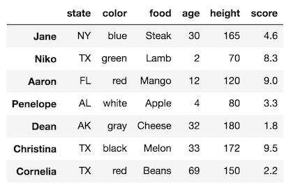{align=left}

On crée un Dataframe à partir d’un tableau existant :

!!! cite "Code"
	```python
	ar = [[1.1, 2, 3.3, 4], [2.7, 10, 5.4, 7], [5.3, 9, 1.5, 15]]
	df = pd.DataFrame(ar, index = ['a1', 'a2', 'a3'], columns = ['A', 'B', 'C', 'D’])
	```


Ou à partir de rien 
!!! cite "code"
	```python
	df=pd.DataFrame([{'A': 1.1, 'B': 2, 'C': 3.3, 'D': 4},    
	{'A': 2.7, 'B': 10, 'C': 5.4, 'D': 7},    
	{'A': 5.3, 'B': 9, 'C': 1.5, 'D': 15}])
	```


Il faudra importer la bibliothèque pandas : `import pandas as pd`  
Importer à partir d’un fichier csv :  
```python
df = pandas.read_csv('myFile.csv', delimiter=",", encoding=’utf’)
```

!!! note "remarque"
	vérifier si le délimiteur est une virgule ou un point virgule. 

###Affichage et tris
Pour afficher des colonnes, on utilise :  
```python
print(df[['A','B']])  ou print (df['A'])
```
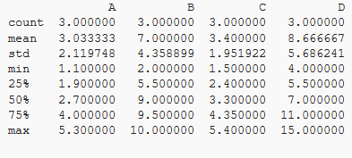{align=left}
`head()`, `tail ()` : affichent les  premières ou dernières lignes (nombre de lignes en argument  par default)
`describe()`: infos statistiques sur le jeu de données Encore plus avec include='all' en paramètre.


**Trier en fonction d'une valeur :**
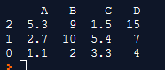{align=left}
```python
df.sort_values(by='A', ascending=False)
```
Affiche le tableau trié en function des valeurs de A décroisssante. Utilisation du slice pour n'avoir que certaines lignes.

**Affichage conditionnel (affiche les valeurs de B quand celle de A est supérieure à 2 :** 
```python
df['B'][df['A']>2] 
```
Affiche les valeurs de A différentes qui apparaissent.  

!!! note "remarque"
	On peut aussi utiliser `numpy`.
	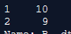{align=left}
	```python
	import numpy
	numpy.unique(df['A'])
	```

La méthode `len` permet de connaitre de nombre de valeurs différentes de A.

## Grouper et compter les valeurs correspondant à une certaine donnée
### Groupby
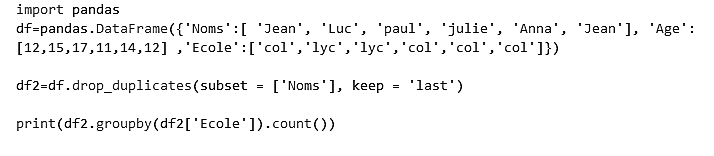
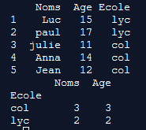

### Opérations

`df.shape` : affiche le nombre de lignes et de colonnes  

Identifier et supprimer les doublons :
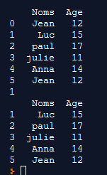{align=right}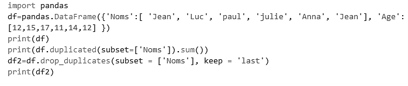{align=left}
      
<br/><br/><br/><br/><br/><br/><br/><br/><br/><br/>
On peut choisir de garder le premier, le dernier

**Calculs divers :**
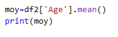{align=right}

-	`mean()`
-	`count()`
-	`min()`
-	`max()`


###Ajouter une colonne calculée :
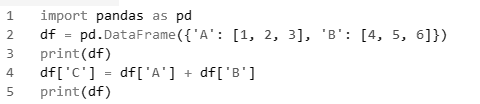{align=left}
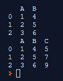{align=right}  

<br/><br/><br/><br/><br/>

##Jointure
```python
tab = ages.merge(professions, left_on="noms", right_on="noms")
```
!!! note "Remarque"
	En inversant ages et professions on obtient une inversions des colonnes dans le résultat


###Documentation
[https://moncoachdata.com/blog/guide-bibliotheque-pandas/](https://moncoachdata.com/blog/guide-bibliotheque-pandas/)  
[http://www.python-simple.com/python-pandas/panda-intro.php](http://www.python-simple.com/python-pandas/panda-intro.php)

